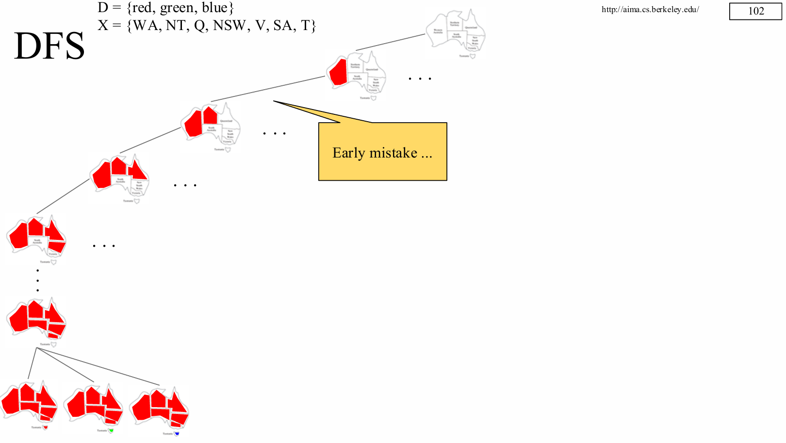

# Constraint Satisfaction Problems 知识梳理
**你看懂了吗？反正我没有**

# 1 约束满足问题 Constraint Satisfaction Problems
## 1.1 CSP 概述
- CSP 使用**因子化表示**来描述状态：
  - 一组变量，每个变量都对应一个值。
- 问题被解决的条件是：每个变量都被赋予一个值，并满足特定的约束。
- CSP 通常可以被更高效地求解：
  - 通过识别违反约束的变量/值组合，能够**大幅削减搜索空间**。

## 1.2 CSP 的形式化定义

一个 CSP 由以下三个组成部分构成：

**变量集合**

\[
X = \{X_1, X_2, \dots, X_n\}
\]

- 表示问题中需要赋值的所有变量。

**值域集合**

\[
D = \{D_1, D_2, \dots, D_n\}
\]

- 每个变量 \(X_i\) 对应一个值域 \(D_i\)，表示该变量可以取的所有可能值。
  \[
  D_i = \{v_1, v_2, \dots, v_k\}
  \]

**约束集合**

\[
C
\]

- 规定变量之间允许的值组合。
- 可以是**一元约束**（单个变量）、**二元约束**（两个变量）或**高阶约束**。

## 1.3 CSP 的状态空间

- 为了求解 CSP，需要定义其状态空间。
- 每个状态由**部分或全部变量的一组赋值**构成：
  \[
  \{X_i = v_i, X_j = v_j, \dots\}
  \]
- 状态空间中包含所有可能的赋值组合。

## 1.4 CSP 的解

**一致性赋值**

- 如果当前赋值**没有违反任何约束**，则称该赋值为**一致的**（Consistent）。

**完全赋值**

- 如果**每个变量都被赋予了一个值**，则称该赋值为**完全的**（Complete）。

**解的定义**

- 一个**解**是**既一致又完全的赋值**。
- 即：所有变量都被赋值，并且所有约束都被满足。


## 1.5 典型 CSP 示例

- **数独**：变量为每个格子，值域为 1–9，约束为行、列、宫格内数字不重复。
- **地图着色**：变量为地区，值域为颜色，约束为相邻地区颜色不同。
- **八皇后**：变量为每列的皇后行位置，约束为皇后互不攻击。

---

# 2 澳大利亚地图着色问题 Australia - Map Coloring
## 2.1 问题定义

变量（Variables）：代表澳大利亚的各个州和领地
X = {WA(西澳), NT(北领地), Q(昆士兰), NSW(新南威尔士), V(维多利亚), SA(南澳), T(塔斯马尼亚)}
值域（Domains）：每个变量可以被赋予的颜色
D = {red(红), green(绿), blue(蓝)}
约束（Constraints）：相邻的区域必须颜色不同
隐式约束：用逻辑关系表示，如 SA != WA（南澳和西澳颜色不同）
显式约束：用合法的颜色组合表示，如 (SA, WA) ∈ {(red, green), (green, red), ...}
**核心目标**
为每个州分配一种颜色，使得所有相邻州的颜色都不相同，同时只用最少的颜色（在这个例子里只用了 3 种颜色）。

## 2.2 约束图（Constraint Graph）
为了更直观地理解问题结构，我们可以把约束满足问题转化为一个约束图。
**节点（Nodes）：** 图中的每个节点对应一个变量（也就是澳大利亚的一个州）
**边（Arcs）：** 边代表两个节点之间存在约束关系（即这两个州是相邻的）
这个图清晰地展示了哪些州之间有相邻约束，其中南澳（SA）是关键节点，它与除塔斯马尼亚（T）之外的所有州都相邻。


## 2.3 求解约束满足问题（Solving CSPs）
我们可以从一个最朴素的方法入手，把它看作一个状态空间搜索问题。
**1. 状态定义**
初始状态：一个空的分配集合 {}，此时没有任何州被赋予颜色
后继函数：选择一个未被赋值的变量，为它分配一个值域中的颜色
目标测试：检查当前的颜色分配是否完整（所有州都有颜色）且一致（所有相邻州的颜色都不同）
**2. 方法说明**
这种朴素的回溯搜索是基础思路，但实际中我们会用更高效的优化技巧，例如：
向前检验（Forward Checking）：在赋值后，立刻从相邻变量的值域中删除冲突的颜色
最少剩余值启发式（MRV）：优先选择当前值域中可选值最少的变量进行赋值
度启发式（Degree Heuristic）：优先选择与其他未赋值变量约束最多的变量（如南澳 SA）

---

# 3 BFS & DFS
## 3.1 广度优先搜索（BFS）
**1. 核心逻辑**
- 分层扩展：从初始状态（无任何颜色分配）出发，逐层为未赋值的州分配颜色。
- 状态树结构：
  - 根节点：空的颜色分配集合。
  - 第一层：仅为第一个州（如西澳 WA）分配红、绿、蓝三种颜色的状态。
  - 第二层：在第一层的基础上，为第二个州（如北领地 NT）分配颜色，生成新的状态。
- 解的位置：所有合法解都出现在搜索树的最底层，因为只有当所有州都被分配颜色后，才能验证是否满足所有约束。

**2. 关键缺陷**
课件中标注 “This calls for DFS :-("，指出 BFS 的核心问题：
- 空间复杂度极高：需要存储每一层的所有状态，对于包含 7 个变量的地图着色问题，状态数量会指数级增长，很快耗尽内存。
- 效率低下：必须扩展到树的最底层才能找到解，对于大规模 CSP 问题不具备实用性。


## 3.2 深度优先搜索（DFS）
**1. 核心逻辑**
- 深度扩展：沿着一条状态路径尽可能深入扩展，直到遇到冲突或找到解。
- 状态路径示例：先为 WA 分配红色，再为 NT 分配红色，接着为 Q 分配红色…… 直到发现相邻州颜色冲突。
- 回溯机制：当遇到冲突时，回退到上一个未赋值的变量，尝试其他颜色。

**2. 关键缺陷**
课件中标注 “Early mistake...”，指出 DFS 的核心问题：
- 早期错误选择的代价高：如果在搜索早期为某个变量选择了不合适的颜色，可能需要深入搜索多层后才发现冲突，导致大量无效计算。
- 纯 DFS 效率低：缺乏启发式引导时，容易陷入无效路径，需要结合优化策略（如最少剩余值启发式、向前检验）提升效率。



---

# 4 回溯搜索（Backtracking Search）
## 4.1 设计思想
**算法定位**
回溯搜索是求解 CSP 的基础算法，它通过针对性的剪枝策略，解决了纯 DFS 盲目探索的低效问题，是后续更高级 CSP 求解算法的核心框架。
**核心设计思想**
课件中提出了两个关键优化思路，大幅提升了搜索效率：
- 单次仅处理一个变量
  - 由于变量的赋值顺序是可交换的（例如先给西澳 WA 赋值红色、再给北领地 NT 赋值绿色，与先给 NT 赋值绿色、再给 WA 赋值红色的结果等价），因此在每个搜索节点上，只需为一个未赋值变量尝试值域中的值。
  - 这一设计避免了对变量赋值顺序的冗余探索，直接缩小了搜索空间。

- 仅保留合法赋值
  - 为变量赋值时，只选择不与已赋值变量冲突的值（例如 WA 已选红色，相邻的 NT 就不能选红色）。
  - 采用增量式目标测试：每一步赋值后立即检查一致性，而非等到所有变量赋值完成后再整体验证，这样可以提前发现冲突并回溯，避免无效的深度探索。

**算法本质**
回溯搜索 = 深度优先搜索（DFS） + 上述两个优化规则
它继承了 DFS“深度优先、回溯剪枝” 的框架，但通过 “单变量聚焦” 和 “合法赋值筛选”，有效避免了纯 DFS 的盲目性。

## 4.2 伪代码
```
function BACKTRACKING-SEARCH(csp) returns a solution or failure
    return BACKTRACK(csp, {})

function BACKTRACK(csp, assignment) returns a solution or failure
    if assignment is complete then return assignment
    var ← SELECT-UNASSIGNED-VARIABLE(csp, assignment)
    for each value in ORDER-DOMAIN-VALUES(csp, var, assignment) do
        if value is consistent with assignment then
            add {var = value} to assignment
            inferences ← INFERENCE(csp, var, assignment)
            if inferences ≠ failure then
                add inferences to csp
                result ← BACKTRACK(csp, assignment)
                if result ≠ failure then return result
                remove inferences from csp
            remove {var = value} from assignment
    return failure

    
```