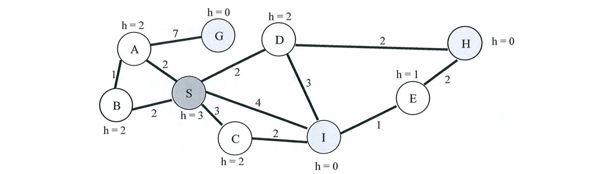

# Section 1
### 1.1
**Original Statement:** A* Search is optimally efficient, meaning no other algorithm can find the optimal solution with fewer expansions.
**Answer:** **True (T)**
**中文解答：** 正确。A* 搜索在给定一致（consistent）的启发式函数时是“最优高效”（optimally efficient）的。这意味着在拥有相同启发式信息的情况下，没有任何其他能够保证找到最优解的搜索算法扩展的节点数会少于 A* 算法（除了在打破平局时的细微差别）。

### 1.2
**Original Statement:** The heuristic function used in A* Search must always be admissible and consistent.
**Answer:** **False (F)**
**中文解答：** 错误。虽然为了保证 A* 搜索能找到**最优解**，我们需要启发式函数在树搜索（Tree Search）中是可接受的（admissible），在图搜索（Graph Search）中是一致的（consistent）。但这并不是说启发式函数“必须总是”（must always be）这样的。如果不满足这些条件，A* 算法依然可以正常运行并给出结果，只是不再保证能找到全局最优解。

### 1.3
**Original Statement:** The time complexity of A* Search is polynomial in the size of the graph.
**Answer:** **False (F)**
**中文解答：** 错误。A* 搜索的时间复杂度通常与解的深度呈指数关系，即 $O(b^d)$（其中 $b$ 是分支因子，$d$ 是最优解的深度）。只有当启发式函数极其精准，能够极大地剪枝时，它才可能接近多项式复杂度，但一般情况下依然是指数级的。

### 1.4
**Original Statement:** Breadth-First Search (BFS) uses more memory compared to Depth-First Search (DFS) because it needs to store all the child nodes at the current level.
**Answer:** **True (T)**
**中文解答：** 正确。广度优先搜索 (BFS) 在搜索过程中需要将当前层级的所有节点以及下一层的节点都存储在边界（frontier/queue）中，其空间复杂度为 $O(b^d)$，呈指数级增长。而深度优先搜索 (DFS) 只需要保存当前路径上的节点，空间复杂度为 $O(bd)$，所需内存远小于 BFS。

### 1.5
**Original Statement:** A* search can be considered as a special case of Greedy Best-First-Search.
**Answer:** **False (F)**
**中文解答：** 错误。A* 搜索和贪婪最佳优先搜索（Greedy Best-First-Search）都是最佳优先搜索（Best-First Search）的特例。贪婪搜索的评估函数为 $f(n) = h(n)$，而 A* 的评估函数为 $f(n) = g(n) + h(n)$。它们是并列的不同算法，A* 不是贪婪搜索的特例（实际上一致代价搜索 Uniform Cost Search 是 A* 在 $h(n)=0$ 时的特例）。

### 1.6
**Original Statement:** In a graph without cycles, Depth-First Search (DFS) can get stuck in an infinite loop if it doesn't mark nodes as visited.
**Answer:** **False (F)**
**中文解答：** 错误。如果一个图**没有环**（without cycles，例如树或者有向无环图 DAG），由于节点之间不存在循环引用的回路，DFS 即使不标记已访问的节点，也会在到达叶子节点或死胡同时自动回溯，绝对不可能陷入无限循环（infinite loop）。无限循环只会发生在有环图中。

### 1.7
**Original Statement:** Depth-First Search (DFS) maintains a queue data structure for storing the nodes to be visited.
**Answer:** **False (F)**
**中文解答：** 错误。深度优先搜索 (DFS) 使用的是**栈（Stack）**数据结构，遵循后进先出（LIFO）原则；而广度优先搜索 (BFS) 使用的才是**队列（Queue）**数据结构，遵循先进先出（FIFO）原则。

### 1.8
**Original Statement:** In CSPs, the degree heuristic selects the variable with the most constraints on remaining variables.
**Answer:** **True (T)**
**中文解答：** 正确。在约束满足问题 (CSP) 中，度启发式（Degree Heuristic）策略是优先选择那些与“剩余未赋值变量”之间约束条件最多（即度最大）的变量进行赋值。这样做的目的是为了尽早发现冲突并减少后续搜索分支。

### 1.9
**Original Statement:** The minimum remaining values (MRV) heuristic in CSPs selects the variable with the most "legal" values left in its domain.
**Answer:** **False (F)**
**中文解答：** 错误。最少剩余值启发式 (MRV, Minimum Remaining Values) 顾名思义，是选择其值域（domain）中剩余合法取值**最少**（fewest/minimum）的变量进行优先赋值，而不是最多（most）。这是一种“最快失败”（fail-first）策略。

### 1.10
**Original Statement:** Alpha-Beta pruning can change the result obtained by the Minimax algorithm.
**Answer:** **False (F)**
**中文解答：** 错误。Alpha-Beta 剪枝的作用仅仅是剪去那些绝对不可能影响最终决策的分支，从而加速搜索过程。它保证返回的结果（即根节点的极大极小值）与纯粹的 Minimax 算法得到的结果**完全相同**，不会改变最终的决策结果。

### 1.11
**Original Statement:** In adversarial search, the search space is typically represented as a game tree.
**Answer:** **True (T)**
**中文解答：** 正确。在对抗搜索（如棋盘游戏 AI 的设计）中，搜索空间通常被建模为一棵博弈树（Game Tree），树中的节点代表游戏状态，边代表玩家或对手所采取的合法动作。

### 1.12
**Original Statement:** The Expectimax algorithm can be used in games that involve elements of chance or randomness.
**Answer:** **True (T)**
**中文解答：** 正确。Expectimax 算法是 Minimax 算法的变体，专门用于处理带有随机性或运气成分的游戏（例如掷骰子、随机发牌）。它通过引入“机会节点”（chance nodes）来计算随机事件的期望值。

### 1.13
**Original Statement:** In an MDP, the transition probabilities are dependent on all previous states.
**Answer:** **False (F)**
**中文解答：** 错误。马尔可夫决策过程 (MDP) 的核心假设就是**马尔可夫性（Markov Property）**，即未来的状态仅取决于**当前状态**和**当前采取的动作**，而与所有过去的历史状态无关。

### 1.14
**Original Statement:** The Bellman equation is used to compute the optimal value function in an MDP.
**Answer:** **True (T)**
**中文解答：** 正确。贝尔曼方程（Bellman Equation）及其最优形式（Bellman Optimality Equation）是马尔可夫决策过程 (MDP) 的基石。它被用于递归地计算在给定策略下的价值函数或求解最优价值函数（Optimal Value Function）。

### 1.15
**Original Statement:** The value iteration algorithm for MDPs requires multiple passes over the state space until the value function converges.
**Answer:** **True (T)**
**中文解答：** 正确。价值迭代（Value Iteration）算法通过对整个状态空间的价值函数进行多次扫描和更新（应用贝尔曼更新规则），直到各状态的价值变化量小于某个极小的阈值，即达到收敛（converges）为止。

### 1.16
**Original Statement:** The Q-value of a state-action pair in an MDP represents the expected return from starting in a given state, taking a specific action, and then following a particular policy.
**Answer:** **True (T)**
**中文解答：** 正确。在 MDP 中，状态-动作对的 Q 值（$Q^\pi(s, a)$）的定义正是：从特定的状态 $s$ 出发，首先采取特定的动作 $a$，然后在未来所有的步骤中严格遵循策略 $\pi$ 所能获得的预期累积回报（Expected Return）。

### 1.17
**Original Statement:** Reinforcement Learning is a type of supervised learning.
**Answer:** **False (F)**
**中文解答：** 错误。强化学习 (Reinforcement Learning) 是机器学习的三大基本范式之一，另外两个是监督学习 (Supervised Learning) 和无监督学习 (Unsupervised Learning)。强化学习是通过试错和奖励信号（Rewards）来学习策略的，不依赖于像监督学习那样带有人工标注正确答案的数据集，因此它不是监督学习的一种。

### 1.18
**Original Statement:** In Reinforcement Learning, off-policy methods can learn from experiences collected using a different policy.
**Answer:** **True (T)**
**中文解答：** 正确。异策略（Off-policy）强化学习的定义就是：算法能够使用由一个策略（行为策略 Behavior Policy，负责收集数据）生成的经验数据，来优化和评估另一个不同的策略（目标策略 Target Policy）。典型的例子是 Q-Learning 算法。

### 1.19
**Original Statement:** A model's performance on the training set is a good indicator of its performance on unseen data.
**Answer:** **False (F)**
**中文解答：** 错误。模型在训练集上的表现**不能**很好地指示其在未见过的数据（unseen data）上的表现。如果模型发生了过拟合（Overfitting），它在训练集上的准确率可能非常高，但在验证集或测试集上的表现却会很差。为了准确评估模型的泛化能力，必须使用独立的测试集。

### 1.20
**Original Statement:** A confusion matrix can be used to calculate the F1 Score.
**Answer:** **True (T)**
**中文解答：** 正确。混淆矩阵（Confusion Matrix）记录了真正例（True Positives, TP）、假正例（False Positives, FP）、真负例（True Negatives, TN）和假负例（False Negatives, FN）。F1 Score 是精确率（Precision）和召回率（Recall）的调和平均数。既然精确率（$TP/(TP+FP)$）和召回率（$TP/(TP+FN)$）都可以直接从混淆矩阵中提取的数值计算得出，那么混淆矩阵自然可以用来计算 F1 Score。

---

# Section 2

Consider the following search problem where S is the start state, and G, H and I are goal states.
*(Graph diagram provided in the image with nodes S, A, B, C, D, E, G, H, I, edge costs, and heuristic values $h$)*


**2.1 (2 pts):** Write down and explain if the provided heuristic is 
(a) admissible, and 
(b) consistent

**中文解析:**
**题目要求：** 判断给定的启发式函数 $h$ 是否是 (a) 可接受的 (admissible)，以及 (b) 一致的 (consistent)，并给出解释。

**解答：**
**(a) Admissible (可接受的): 是 (Yes)**
* **解释：** 一个启发式函数是可接受的，必须满足对于所有节点 $n$，都有 $h(n) \le h^*(n)$，其中 $h^*(n)$ 是从节点 $n$ 到达最近目标节点的**真实最小代价**。
    * 目标节点是 G, H, I。
    * $h^*(S) = \min(S \to I(4), S \to D \to H(4), S \to A \to G(9)) = 4$。$h(S) = 3 \le 4$，成立。
    * $h^*(A) = \min(A \to S \to D \to H(6), A \to G(7)) = 6$。$h(A) = 2 \le 6$，成立。
    * $h^*(B) = \min(B \to S \to I(6), B \to A \to G(8)) = 6$。$h(B) = 2 \le 6$，成立。
    * $h^*(C) = C \to I(2) = 2$。$h(C) = 2 \le 2$，成立。
    * $h^*(D) = D \to H(2) = 2$。$h(D) = 2 \le 2$，成立。
    * $h^*(E) = E \to I(1) = 1$。$h(E) = 1 \le 1$，成立。
    * 目标节点 $h(G)=h(H)=h(I)=0 \le 0$，成立。
* 因为所有节点的 $h(n)$ 都小于或等于其到达目标的真实最优代价，所以该启发式是可接受的。

**(b) Consistent (一致的): 是 (Yes)**
* **解释：** 一个启发式函数是一致的，必须满足对于任意节点 $n$ 及其任意相邻节点 $n'$，都有 $h(n) \le c(n, n') + h(n')$，其中 $c$ 是边代价（即三角不等式成立）。在无向图中，等价于 $|h(n) - h(n')| \le c(n, n')$。
    * 检查所有边：
        * S-A: $|3 - 2| = 1 \le 2$ (成立)
        * S-B: $|3 - 2| = 1 \le 2$ (成立)
        * S-C: $|3 - 2| = 1 \le 3$ (成立)
        * S-D: $|3 - 2| = 1 \le 2$ (成立)
        * S-I: $|3 - 0| = 3 \le 4$ (成立)
        * A-B: $|2 - 2| = 0 \le 1$ (成立)
        * A-G: $|2 - 0| = 2 \le 7$ (成立)
        * D-H: $|2 - 0| = 2 \le 2$ (成立)
        * D-I: $|2 - 0| = 2 \le 3$ (成立)
        * C-I: $|2 - 0| = 2 \le 2$ (成立)
        * I-E: $|0 - 1| = 1 \le 1$ (成立)
        * E-H: $|1 - 0| = 1 \le 2$ (成立)
    * 所有边均满足三角不等式，因此该启发式是一致的。


**2.2 (8 pts):** Assuming that children are added to the frontier in alphabetical order, write down 
(a) the order of explored states, and 
(b) the solution path 
for each of the following search algorithms
(i) BFS-GSA, (ii) DFS-GSA, (iii) UCS-TSA, (iv) A*-GSA

**中文解析:**
**题目要求：** 假设子节点按字母顺序被加入边缘集（Frontier），针对以下四种搜索算法，写出 (a) 探索（即弹出/扩展）节点的顺序，以及 (b) 找到的求解路径。
*(注：GSA = Graph Search Algorithm 图搜索，记录已探索集合；TSA = Tree Search Algorithm 树搜索，不记录已探索集合。假定在节点**被弹出边缘集时**进行目标检测。)*

**(i) BFS-GSA (广度优先图搜索)**
* **逻辑机制：** 使用先进先出 (FIFO) 队列。
* **过程追踪：**
    1.  弹出 **S**。加入 A, B, C, D, I (按字母顺序)。队列: `[A, B, C, D, I]`
    2.  弹出 **A**。加入 G。队列: `[B, C, D, I, G]`
    3.  弹出 **B**。无新节点（A, S已探索）。队列: `[C, D, I, G]`
    4.  弹出 **C**。无新节点（I在队列中）。队列: `[D, I, G]`
    5.  弹出 **D**。加入 H。队列: `[I, G, H]`
    6.  弹出 **I**。I 是目标节点，搜索结束。
* **(a) 探索顺序:** S, A, B, C, D, I
* **(b) 求解路径:** S $\to$ I

**(ii) DFS-GSA (深度优先图搜索)**
* **逻辑机制：** 使用后进先出 (LIFO) 栈。*（注：依据课堂惯例，"按字母顺序扩展"意味着字母靠前的优先弹出，因此入栈时需反向操作使A在栈顶。如果是严格按字母顺序入栈（I在栈顶），则会直接弹出I结束。这里采用考察深度的标准惯例解法）*
* **过程追踪：**
    1.  弹出 **S**。按优先扩展字母小的原则，A应在栈顶。
    2.  弹出 **A**。加入 A 的邻居 B, G。由于 B 字母靠前优先扩展，B应在栈顶。
    3.  弹出 **B**。B 的邻居 A, S 均已探索，回溯。
    4.  弹出 **G**。G 是目标节点，搜索结束。
* **(a) 探索顺序:** S, A, B, G
* **(b) 求解路径:** S $\to$ A $\to$ G

**(iii) UCS-TSA (一致代价树搜索)**
* **逻辑机制：** 使用优先队列，依据累计代价 $g(n)$ 排序。**不维护已探索集合**，意味着可以重复访问节点。遇同等代价时按字母顺序打破平局。
* **过程追踪：**
    1.  弹出 **S**(0)。加入 A(2), B(2), D(2), C(3), I(4)。优先队列: `[A(2), B(2), D(2), C(3), I(4)]`
    2.  弹出 **A**(2)。加入 B(3), S(4), G(9)。队列最前: `[B(2), D(2), B(3), C(3)...]`
    3.  弹出 **B**(2) *(来自S-B)*。加入 A(3), S(4)。队列最前: `[D(2), A(3), B(3), C(3)...]`
    4.  弹出 **D**(2)。加入 H(4), I(5), S(4)。队列最前: `[A(3), B(3), C(3), H(4), I(4)...]`
    5.  弹出 **A**(3) *(来自S-B-A)*。加入 B(4), S(5)... 
    6.  弹出 **B**(3) *(来自S-A-B)*。加入 A(4), S(5)...
    7.  弹出 **C**(3)。加入 I(5)...
    8.  此时代价为4的节点有：A(4), B(4), H(4), I(4), S(4)。按字母顺序，优先弹出 A(4)。
    9.  弹出 **A**(4)。
    10. 弹出 **B**(4)。
    11. 弹出 **H**(4) *(来自S-D-H)*。H 是目标节点，搜索结束。
* **(a) 探索顺序:** S, A, B, D, A, B, C, A, B, H
* **(b) 求解路径:** S $\to$ D $\to$ H

**(iv) $A*-GSA$ ($A*$ 图搜索)**
* **逻辑机制：** 使用优先队列，依据 $f(n) = g(n) + h(n)$ 排序。维护已探索集合。同等 $f$ 值按字母顺序打破平局。
* **过程追踪：**
    1.  弹出 **S** (f=0+3=3)。计算邻居 f 值：A(2+2=4), B(2+2=4), D(2+2=4), I(4+0=4), C(3+2=5)。队列: `[A(4), B(4), D(4), I(4), C(5)]`
    2.  弹出 **A**(4)。加入 G(9+0=9)。邻居 B 的 f=(2+1)+2=5（不优于现有的B(4)，忽略）。队列: `[B(4), D(4), I(4), C(5), G(9)]`
    3.  弹出 **B**(4)。无更优新节点。队列: `[D(4), I(4), C(5), G(9)]`
    4.  弹出 **D**(4)。加入 H(4+0=4)。邻居 I 的 f=(2+3)+0=5（不优于现有的I(4)，忽略）。此时队列中有 H(4) 和 I(4)，按字母顺序 H 在前。队列: `[H(4), I(4), C(5), G(9)]`
    5.  弹出 **H**(4)。H 是目标节点，搜索结束。
* **(a) 探索顺序:** S, A, B, D, H
* **(b) 求解路径:** S $\to$ D $\to$ H

---

# Section 3

Consider the following Python code.

```python
class Graph:
    def __init__(self):
        # 初始化一个空字典来存储图，键为节点，值为邻接节点列表
        self.graph = {}
        
    def add_edge(self, u, v):
        # 如果节点 u 不在图中，为其初始化一个空列表
        if u not in self.graph: self.graph[u] = []
        # 将节点 v 添加到节点 u 的邻接节点列表中，表示一条从 u 指向 v 的有向边
        self.graph[u].append(v)
        
    def r(self, start_node):
        # 初始化一个空集合 v，用于记录已经访问过的节点
        v = set()
        # 调用辅助的递归函数 _r 开始遍历
        self._r(start_node, v)
        
    def _r(self, node, v):
        # 如果当前节点没有被访问过
        if node not in v:
            # 打印当前节点，不换行，以空格分隔
            print(node, end=' ')
            # 将当前节点加入已访问集合 v
            v.add(node)
            # 如果当前节点在图中（即有邻接节点）
            if node in self.graph:
                # 遍历当前节点的所有邻接节点 n
                for n in self.graph[node]: 
                    # 递归调用 _r 访问邻接节点
                    self._r(n, v)
```

**3.1 (4 pts):** Name the algorithm that this code implements.

**中文解析:**
**题目要求：** 写出这段代码实现的算法名称。

**解答：**
Depth-First Search (DFS) / 深度优先搜索。

**解释：** 这段代码通过递归的方式探索图，每次遇到一个未访问的邻接节点，就会直接深入递归去访问该邻接节点及其后续节点，只有当某条路径走不通（所有相邻节点都已访问过）时才回溯。这正是深度优先图搜索 (DFS) 的典型递归实现特征。

**3.2 (4 pts):** Consider the following Python code.
```python
g = Graph()
g.add_edge(0, 1)
g.add_edge(0, 2)
g.add_edge(1, 2)
g.add_edge(2, 0)
g.add_edge(2, 4)
g.add_edge(2, 3)
g.add_edge(2, 1)
g.add_edge(3, 3)
g.add_edge(4, 3)
start_node = 2
g.r(start_node)
```
Draw the graph and write down the output of the program. What does the output represent?

**中文解析:**
**题目要求：** 画出图并写下程序的输出。这个输出代表什么？

**解答：**
* **画图表示 (Graph Diagram):**
  有向图包含节点 0, 1, 2, 3, 4，边如下：
  $0 \to 1$, $0 \to 2$
  $1 \to 2$
  $2 \to 0$, $2 \to 4$, $2 \to 3$, $2 \to 1$
  $3 \to 3$ (自环)
  $4 \to 3$

* **程序的输出 (Output):**
  `2 0 1 4 3 `

* **输出代表什么 (What the output represents):**
  The output represents the sequence of nodes visited during a Depth-First Search (DFS) traversal starting from node 2. / 输出代表了从节点 2 开始进行深度优先搜索（DFS）遍历时访问节点的顺序。

**程序执行过程追踪 (Trace):**
由于 `self.graph` 中的邻接列表顺序完全取决于 `add_edge` 的调用顺序：
* 节点 `2` 的邻接列表：`[0, 4, 3, 1]`。
* 节点 `0` 的邻接列表：`[1, 2]`。
* 节点 `1` 的邻接列表：`[2]`。
* 节点 `4` 的邻接列表：`[3]`。
* 节点 `3` 的邻接列表：`[3]`。

过程如下：
1.  `g.r(2)` -> 调用 `_r(2, {})`
2.  打印 `2 `，标记 2 为已访问。遍历 2 的邻居：`0`, `4`, `3`, `1`。
3.  访问邻居 `0`：调用 `_r(0, {2})`。
    *   打印 `0 `，标记 0 为已访问。遍历 0 的邻居：`1`, `2`。
    *   访问邻居 `1`：调用 `_r(1, {0, 2})`。
        *   打印 `1 `，标记 1 为已访问。遍历 1 的邻居：`2`。
        *   邻居 `2` 已经访问过，跳过。
        *   节点 1 递归返回。
    *   邻居 `2` 已经访问过，跳过。
    *   节点 0 递归返回。
4.  回到节点 2 的邻居遍历，访问邻居 `4`：调用 `_r(4, {0, 1, 2})`。
    *   打印 `4 `，标记 4 为已访问。遍历 4 的邻居：`3`。
    *   访问邻居 `3`：调用 `_r(3, {0, 1, 2, 4})`。
        *   打印 `3 `，标记 3 为已访问。遍历 3 的邻居：`3`。
        *   邻居 `3` 已访问过，跳过。
        *   节点 3 递归返回。
    *   节点 4 递归返回。
5.  回到节点 2 的邻居遍历，访问邻居 `3`。已被访问过，跳过。
6.  回到节点 2 的邻居遍历，访问邻居 `1`。已被访问过，跳过。
7.  节点 2 递归返回，整个搜索过程结束。
最终输出：`2 0 1 4 3 `。

---

# Section 4

Consider a Markov Decision Process (MDP) with three states {S0, S1, S2} and two possible actions {A0, A1} in each state. The agent starts in state S0 and the episode ends when it reaches state S2. Here are the transition probabilities and rewards:
* In state S0, taking action A0 will always lead to state S1 with a reward of +5. Taking action A1 will also always lead to state S1, but with a reward of +3.
* In state S1, taking action A0 will lead back to state S0 with a probability of 0.8 (reward +2) and to state S2 with a probability of 0.2 (reward +10). Taking action A1 will lead to state S2 with a probability of 1.0 (reward +1).
* State S2 is a terminal state.
* The agent uses discount factor $\gamma = 0.9$. Assume the agent has initial Q-values all equal to zero.

**4.1 (2 pts):** If the agent uses Q-learning what will be the updated Q-values after the first episode, assuming the agent starts with action A0 in state S0, then chooses action A0 in state S1, and ends up in state S2?

**中文解析:**
**题目要求：** 如果智能体使用 Q-learning，假设第一回合（episode）中智能体在状态 S0 采取动作 A0，然后在状态 S1 采取动作 A0 并最终到达状态 S2，更新后的 Q 值是多少？

**解答与计算过程：**
*(注：题目未提供学习率 $\alpha$。在基于回合轨迹进行单次采样的标准考试题中，未指明时通常默认 $\alpha = 1$，即每次完全用新样本替换旧估计。Q-learning 更新公式为：$Q(s, a) \leftarrow Q(s, a) + \alpha [r + \gamma \max_{a'} Q(s', a') - Q(s, a)]$。当 $\alpha = 1$ 时，更新简化为 $Q(s, a) \leftarrow r + \gamma \max_{a'} Q(s', a')$)*

初始状态：所有 $Q(s, a) = 0$。

**第一回合 (Episode 1) 轨迹追踪:**
1.  **步骤 1:** 状态 S0，动作 A0。根据题意，必然转移到状态 S1，奖励 $R = +5$。
    *   样本 (Sample) = $R + \gamma \max_{a'} Q(S1, a') = 5 + 0.9 \times \max(Q(S1,A0), Q(S1,A1)) = 5 + 0.9 \times \max(0, 0) = 5$
    *   更新 Q 值：$Q(S0, A0) \leftarrow 5$

2.  **步骤 2:** 状态 S1，动作 A0。根据题意本回合转移到了终端状态 S2，奖励 $R = +10$。
    *   样本 (Sample) = $R + \gamma \max_{a'} Q(S2, a') = 10 + 0.9 \times 0 = 10$  *(注：S2 为终端状态，后续 Q 值为 0)*
    *   更新 Q 值：$Q(S1, A0) \leftarrow 10$

**更新后的 Q 值 (Updated Q-values after Episode 1):**
*   $Q(S0, A0) = 5$
*   $Q(S0, A1) = 0$
*   $Q(S1, A0) = 10$
*   $Q(S1, A1) = 0$

**4.2 (3 pts):** Continuing from question 4.1, what will be the updated Q-values after the second episode, where the agent starts with action A1 in state S0, then chooses action A1 in state S1, and ends up in state S2?

**中文解析:**
**题目要求：** 承接 4.1 题，如果第二回合智能体在状态 S0 采取动作 A1，然后在状态 S1 采取动作 A1 并最终到达状态 S2，第二次更新后的 Q 值是多少？

**解答与计算过程：**
此时我们使用 Episode 1 结束后的 Q 值表作为基础：$Q(S0,A0)=5, Q(S1,A0)=10$，其余为 $0$。

**第二回合 (Episode 2) 轨迹追踪:**
1.  **步骤 1:** 状态 S0，动作 A1。根据题意，必然转移到状态 S1，奖励 $R = +3$。
    *   样本 (Sample) = $R + \gamma \max_{a'} Q(S1, a') = 3 + 0.9 \times \max(Q(S1,A0), Q(S1,A1)) = 3 + 0.9 \times \max(10, 0) = 3 + 0.9 \times 10 = 12$
    *   更新 Q 值：$Q(S0, A1) \leftarrow 12$

2.  **步骤 2:** 状态 S1，动作 A1。根据题意，必然转移到终端状态 S2，奖励 $R = +1$。
    *   样本 (Sample) = $R + \gamma \max_{a'} Q(S2, a') = 1 + 0.9 \times 0 = 1$
    *   更新 Q 值：$Q(S1, A1) \leftarrow 1$

**更新后的 Q 值 (Updated Q-values after Episode 2):**
*   $Q(S0, A0) = 5$
*   **$Q(S0, A1) = 12$**
*   $Q(S1, A0) = 10$
*   **$Q(S1, A1) = 1$**

**4.3 (3 pts):** Continuing from question 4.2, based on the updated Q-values, what will be the agent's next action for each of the states? Assume the agent is employing the Q-learning algorithm with an $\epsilon$-greedy exploration strategy with $\epsilon=0$.

**中文解析:**
**题目要求：** 承接 4.2 题，基于更新后的 Q 值表，对于每个状态，智能体下一步会采取什么动作？假设智能体采用 $\epsilon$-贪婪探索策略，且 $\epsilon=0$。

**解答与计算过程：**
$\epsilon=0$ 意味着智能体完全不进行随机探索，而是采用纯贪婪策略（Greedy Strategy），即在每个状态下只选择当前 Q 值最大的动作：$a = \arg\max_{a} Q(s, a)$。

*   **对于状态 S0 (For State S0):**
    比较 $Q(S0, A0) = 5$ 和 $Q(S0, A1) = 12$。
    因为 $12 > 5$，所以选择动作 **A1**。
*   **对于状态 S1 (For State S1):**
    比较 $Q(S1, A0) = 10$ 和 $Q(S1, A1) = 1$。
    因为 $10 > 1$，所以选择动作 **A0**。
*(注：S2 是终端状态，不需要采取动作)*

**最终答案 (Next action for each state):**
*   State S0: **Action A1**
*   State S1: **Action A0**

---


# Section 5
### Question 5.1
**5.1 (5 pts):** The Perceptron algorithm makes a key assumption about the data before training. What is this assumption and what happens when this assumption is violated?

**中文解析:**
**题目要求：** 说明感知机（Perceptron）算法在训练前对数据做出的关键假设是什么，以及如果该假设被违反会发生什么。

**解答：**
* **关键假设 (Key Assumption)：** 数据必须是**线性可分的 (Linearly Separable)**。这意味着在特征空间中，必然存在至少一个线性的决策边界（在二维中是直线，三维中是平面，高维中是超平面）能够将不同类别的样本完全、正确地分隔开来。
* **违反假设的后果 (Consequences of Violation)：** 如果数据不是线性可分的（例如存在噪声，或者类别分布如同 XOR 问题），感知机算法的权重更新规则将**永远无法收敛 (never converge)**。只要存在分类错误的样本，感知机就会一直尝试调整权重，这会导致算法陷入无休止的震荡或死循环，永远找不到一个最终解。在实际应用中，为了应对非线性可分的数据，通常必须硬性设置一个最大迭代次数（Max Epochs）来强行终止算法。


### Question 5.2
**5.2 (5 pts):** Your Adaline model seems to be overfitting when allowed to train until completion. Can you elaborate on whether early stopping could be a potential solution to this issue?

**中文解析:**
**题目要求：** 当允许 Adaline 模型一直训练直到“完成”（即完全收敛）时，它似乎出现了过拟合现象。详细阐述“早停法 (Early Stopping)”是否可以作为解决这个问题的潜在方案。

**解答：**
**是的，早停法 (Early Stopping) 绝对是解决 Adaline 模型过拟合问题的有效潜在方案。**

**详细解释：**
1.  **Adaline 的训练特点：** Adaline (Adaptive Linear Neuron) 使用连续的线性激活函数输出计算代价函数（通常是均方误差 MSE 或平方和误差 SSE），并通过梯度下降法（Gradient Descent）来最小化这个误差。
2.  **过拟合的产生机制：** 如果允许算法一直训练直到“完成”（即代价函数在训练集上达到极小值），模型可能会强行去拟合训练数据中的随机噪声或异常点。在这个过程中，为了完美迎合所有的训练样本，模型的权重参数往往会变得非常大，导致决策边界变得极其敏感，从而丧失了泛化能力（过拟合）。
3.  **早停法的作用原理：** 早停法是一种简单而有效的**正则化 (Regularization)** 手段。它通过划分出一个独立的验证集（Validation Set），在每一轮（Epoch）训练后监控模型在验证集上的表现。当训练误差还在下降，但**验证集上的误差开始出现反弹（上升）**时，说明模型开始学习训练集特有的噪声了。此时立即“提前停止”训练，可以限制权重参数不过度膨胀，从而得到一个泛化能力最强、不过度拟合的模型状态。

---

# Section 6

Consider the following Python code snippet.

```python
from sklearn import datasets
from sklearn.model_selection import train_test_split
from sklearn import svm
from sklearn.metrics import accuracy_score
from sklearn.preprocessing import StandardScaler

iris = datasets.load_iris()

X_train, X_test, y_train, y_test = train_test_split(iris.data, iris.target, test_size=0.2, random_state=42)

sc = StandardScaler()
X_train = sc.fit_transform(X_train)
X_test = sc.transform(X_test)

clf = svm.SVC(kernel='linear', C=1.0, random_state=42)

clf.fit(X_train, y_train)

y_pred = clf.predict(X_test)

print("Accuracy:", accuracy_score(y_test, y_pred))
```

**6.1 (2 pts):** What model does this code implement?

**题目要求：** 这段代码实现了什么模型？

**解答：**
该代码实现了具有线性核的支持向量机分类器 (Support Vector Machine (SVM) classifier with a linear kernel / Support Vector Classifier (SVC))。从代码 `svm.SVC(kernel='linear', ...)` 可以明确看出。

**6.2 (2 pts):** Explain the purpose of the `StandardScaler` in this code and why is it important in this context?


**题目要求：** 解释这段代码中 `StandardScaler` 的作用，以及为什么在当前上下文（SVM）中它很重要？

**解答：**
*   **作用 (Purpose):** `StandardScaler` 用于对特征进行标准化处理。它通过减去特征的均值并除以标准差，将每个特征的数据缩放到均值为 0，方差为 1 的分布范围内。
*   **重要性 (Importance in this context):** 对于支持向量机 (SVM) 来说，特征缩放至关重要。SVM 的目标是最大化支持向量到决策边界（超平面）的几何距离（Margin）。如果不同特征的取值范围（Scale）差异巨大，那么数值范围大的特征会在距离计算中占据主导地位，导致模型对这些特征过度敏感，从而找到一个次优的、甚至完全偏差的超平面。通过 `StandardScaler` 将所有特征统一到相同的尺度，可以确保每个特征对距离计算的贡献是平等的，使得算法能够更快收敛并找到真正最优的决策边界。

**6.3 (4 pts):** Modify the code to perform hyperparameter tuning using sklearn's `GridSearchCV` function on the parameter `C`. Explain the purpose of this parameter and why it is necessary to hyperparameter tune it. When grading, we will overlook minor syntax mistakes in your code.


**题目要求：** 修改代码，使用 sklearn 的 `GridSearchCV` 函数对参数 `C` 进行超参数调优。解释参数 `C` 的作用以及为什么有必要对其进行超参数调优。

**解答：**
*   **代码修改 (Code Modification):**
```python
from sklearn.model_selection import GridSearchCV
# ... (前面的数据加载和划分代码保持不变) ...

# 1. 定义要调优的超参数 C 的网格
param_grid = {'C': [0.1, 1.0, 10.0, 100.0]}

# 2. 创建 GridSearchCV 对象
# cv=5 表示使用 5 折交叉验证
grid_search = GridSearchCV(svm.SVC(kernel='linear', random_state=42), param_grid, cv=5)

# 3. 在训练集上拟合网格搜索，寻找最佳参数
grid_search.fit(X_train, y_train)

# 4. 获取最佳模型并进行预测
best_clf = grid_search.best_estimator_
y_pred = best_clf.predict(X_test)

# 打印最佳参数和准确率
print("Best Parameters:", grid_search.best_params_)
print("Accuracy:", accuracy_score(y_test, y_pred))
```

*   **参数 C 的作用及调优必要性 (Purpose of C and necessity of tuning):**
    *   **作用：** 在 SVM 中，参数 `C` 是**正则化参数 (Regularization parameter)** 或**惩罚系数 (Penalty parameter)**。它控制着“最大化分类间隔 (Margin)”和“最小化训练误差（分类违规）”之间的权衡。
        *   **较小的 C 值：** 容忍更多的分类错误，鼓励得到一个更宽的间隔（Soft Margin），模型更加简单，不容易过拟合，但可能会欠拟合。
        *   **较大的 C 值：** 对分类错误的惩罚极重，迫使模型尽量将所有训练数据都正确分类，导致间隔变窄（Hard Margin），模型变得复杂，容易过拟合。
    *   **调优的必要性：** 因为最佳的 `C` 值是高度依赖于具体数据集的。没有任何一个预设的 `C` 值可以完美适配所有数据分布。通过超参数调优（如网格搜索加交叉验证），我们可以系统地测试多个 `C` 值，从而找到在未见数据上泛化能力最强的那一个，避免模型出现严重的欠拟合或过拟合。

**6.3 (4 pts):** The provided model is sensitive to outliers. Explain why, suggest and implement in the code a robust method for handling outliers in the dataset before training the model.

**中文解析:**
**题目要求：** 提供的模型（线性核 SVM）对异常值（outliers）很敏感。解释原因，建议并在代码中实现一种在训练模型之前处理数据集中异常值的鲁棒（稳健）方法。

**解答：**
*   **为什么对异常值敏感 (Why sensitive to outliers):** 
    SVM 构建决策边界（超平面）时，完全依赖于距离边界最近的那几个数据点，即**支持向量 (Support Vectors)**。如果数据集中存在异常值，且该异常值恰好位于分类边界附近或深入了对方类别区域，SVM（尤其是 C 值较大时）为了不惜一切代价将这个异常值分类正确，会大幅度扭曲或拉扯超平面的位置和倾斜度。因为异常值具有极高的杠杆作用（Leverage），一个极端的点就能摧毁整个模型对正常数据的分类能力。

*   **建议的鲁棒方法 (Suggested robust method):** 
    使用 **`RobustScaler`** 代替 `StandardScaler`。
    `StandardScaler` 在标准化时使用了均值（Mean）和方差（Variance），这两个统计量本身对异常值非常敏感。而 `RobustScaler` 则是通过减去**中位数 (Median)** 并除以**四分位距 (IQR, Interquartile Range)** 来缩放数据。因为中位数和四分位距具有很强的抗噪性，所以即使存在极端异常值，大部分正常数据也能被合理地缩放，减少异常值对 SVM 距离计算的恶劣影响。

*   **代码实现 (Code implementation):**
```python
# 将原本引入 StandardScaler 的地方修改为引入 RobustScaler
# from sklearn.preprocessing import StandardScaler
from sklearn.preprocessing import RobustScaler

# ... (数据加载和划分保持不变) ...

# 使用 RobustScaler 替换 StandardScaler
sc = RobustScaler()
X_train = sc.fit_transform(X_train)
X_test = sc.transform(X_test)

# ... (后续的模型训练和预测代码保持不变) ...
```

---

### Question 7.1

**7.1 (4 pts):** Provide an example of four hyperparameters in a Random Forest that you would consider tuning.

**中文解析:**
**题目要求：** 列举出在随机森林 (Random Forest) 模型中，你会考虑进行调优的四个超参数。

**解答：**
在随机森林中，有多个关键的超参数可以用来控制模型的复杂度和防止过拟合。以下是四个最常考虑调优的超参数：
1.  **`n_estimators` (决策树的数量):** 森林中构建的决策树的总数。通常树越多，模型的方差越小，性能越稳定，但计算成本也会随之增加。
2.  **`max_depth` (树的最大深度):** 控制每棵决策树可以生长的最大层数。限制深度可以有效地防止单棵树过拟合（降低高方差），但设置过浅会导致欠拟合（高偏差）。
3.  **`min_samples_split` (内部节点再划分所需最小样本数):** 如果一个内部节点的样本量少于这个阈值，它就不会再继续向下分裂。增大这个值可以约束树的生长，防止过拟合。
4.  **`max_features` (寻找最佳分割时考虑的最大特征数):** 在每个节点分裂时，随机抽取候选特征的数量。较小的 `max_features` 可以增加森林中各棵树之间的多样性（降低树之间的相关性），从而有效降低整个森林的方差。
*(其他可接受的答案包括：`min_samples_leaf` 叶节点最小样本数, `bootstrap` 是否使用有放回抽样等。)*

---

### Question 7.2
**Original English Text:**
**7.2 (4 pts):** Random search for hyperparameter tuning is a method where random combinations of the hyperparameters are used to find the best solution for the built model. Discuss the use of grid search and random search for hyperparameter tuning. What are the advantages and disadvantages of each method?

**中文解析:**
**题目要求：** 讨论网格搜索 (Grid Search) 和随机搜索 (Random Search) 在超参数调优中的应用，并分别说明这两种方法的优缺点。

**解答：**
**网格搜索 (Grid Search):**
* **应用原理：** 穷举搜索。开发者预先定义一个包含超参数候选值的“网格”（字典），算法会遍历这些参数的所有可能组合，并在交叉验证中评估每一种组合的表现，最终选出最优解。
* **优点 (Advantages)：** * **全面性：** 只要最优组合包含在预设的网格范围内，就必定能找到全局最优解（针对该离散搜索空间）。
    * **简单直观：** 容易理解和实现，适合超参数数量较少且取值范围明确的情况。
* **缺点 (Disadvantages)：** * **维度灾难：** 计算成本极高。随着超参数数量的增加，组合数呈指数级爆炸，非常耗时。
    * **低效：** 对于对模型性能影响不大的“次要超参数”，网格搜索依然会白白浪费大量算力去穷举其组合。

**随机搜索 (Random Search):**
* **应用原理：** 开发者为每个超参数定义一个统计分布（或离散列表），算法在指定的迭代次数内，从这些分布中随机采样出参数组合进行验证。
* **优点 (Advantages)：** * **高效率：** 在高维空间（多个超参数）中表现更好。它不需要遍历所有组合，能够用更少的计算时间找到非常接近最优解的参数。
    * **更好地探索重要参数：** 研究表明，并非所有超参数都同等重要。随机搜索能够为那些真正影响性能的重要参数探索更多不同的具体数值，而不是像网格搜索那样局限于几个固定的点。
* **缺点 (Disadvantages)：** * **无法保证绝对最优：** 因为是随机采样，它不能绝对保证找到搜索空间内的最佳参数组合，结果具有一定的随机性。

---

### Question 7.3
**7.3 (4 pts):** Consider that you are working with a highly imbalanced binary classification task. You decide to use an ensemble of different classifiers including Logistic Regression, Support Vector Machines (SVM), and a Random Forest Classifier to improve prediction performance. Explain how cross-validation and hyperparameter tuning can be used in conjunction with each other to achieve a better bias-variance trade-off with your ensemble model.

**中文解析:**
**题目要求：** 假设你正在处理一个高度不平衡的二分类任务。你决定使用逻辑回归、SVM 和随机森林的集成模型来提升预测性能。解释如何将交叉验证和超参数调优结合使用，从而在你的集成模型中实现更好的偏差-方差权衡 (bias-variance trade-off)。

**解答：**
在高度不平衡的数据集上构建集成模型时，将交叉验证 (CV) 与超参数调优结合使用是实现最佳偏差-方差权衡的关键，具体体现在以下几个层面：

1.  **使用分层交叉验证 (Stratified Cross-Validation) 提供稳健评估：**
    * 由于数据“高度不平衡”，常规的交叉验证可能会导致某些折 (fold) 中完全没有少数类样本。必须使用 **分层 K 折交叉验证 (Stratified K-Fold CV)**，以确保每一折中正负样本的比例与整个数据集保持一致。
    * 交叉验证通过在不同的训练/验证集划分上平均模型性能，降低了性能评估的**方差 (Variance)**，确保我们选择的超参数不会仅仅是对某一次特定的数据划分过拟合。

2.  **选择正确的评估指标驱动调优：**
    * 在 CV 的内部循环中进行超参数调优时，绝对不能使用准确率 (Accuracy)。必须优化对不平衡数据敏感的指标，如 **F1-Score, ROC-AUC 或 Precision-Recall AUC**。以这些指标作为反馈信号，可以指导调优过程找到既不偏袒多数类（低偏差）又能稳定识别少数类（低方差）的参数。

3.  **调节各基准模型的偏差-方差权衡：**
    * **调优与 CV 结合：** 我们使用诸如 `GridSearchCV` 或 `RandomizedSearchCV` 为集成的每个基准模型寻找最佳参数。
    * 对于 **随机森林 (高方差模型)**：我们可以调优 `max_depth`（调小）或 `min_samples_leaf`（调大）来增加一些偏差，以大幅降低方差，防止对不平衡的多数类过拟合。
    * 对于 **SVM 和逻辑回归 (高偏差模型)**：我们可以调优正则化参数 `C`。同时，针对不平衡问题，极其重要的一点是**调优类别权重 (class_weights='balanced')** 参数。通过加大少数类错分的惩罚，降低模型对少数类的预测偏差 (Bias)。

4.  **集成层面的方差抑制：**
    * 当我们通过 CV + 调优得到了各个性能强大且兼具多样性的独立基准分类器后，将它们集成（例如通过软投票 Soft Voting 或堆叠 Stacking）。
    * 即使单个基准模型在处理不平衡数据时仍存在一定的方差，集成方法（尤其是 Random Forest 本身以及整体的集成架构）可以通过平均各个模型的预测，进一步“平滑”决策边界，显著降低整体集成的**最终预测方差**，从而达到全局最优的偏差-方差权衡。
