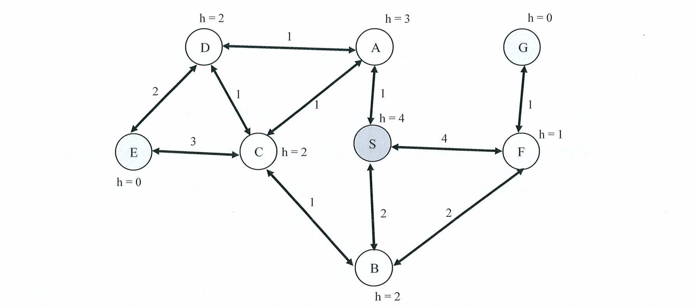

# Question 1 - 40 pts total

### 1.1
**English:** When using A* Search, a heuristic that is closer to the actual cost will generally result in fewer node expansions compared to a heuristic that underestimates the costs more significantly.
**Options:** True / False
**Answer:** **True**
**中文解答:** 在 A* 搜索中，如果一个启发式函数 $h(n)$ 越接近真实的代价 $h^*(n)$（且满足可采纳性，即不产生高估），我们就说这个启发式函数越“紧（tight）”或占优（dominates）。相比于严重低估代价的启发式函数，更紧的启发式函数能提供更准确的引导，从而显著减少不必要的节点扩展数量。

### 1.2
**English:** If two heuristics are consistent, A* Search will explore the same number of nodes regardless of which one is used.
**Options:** True / False
**Answer:** **False**
**中文解答:** 即使两个启发式函数都是一致的（consistent），它们提供的信息量可能不同。例如，启发式函数 $h_1$ 的值在所有节点上都大于等于一致的 $h_2$ 的值，那么 $h_1$ 会比 $h_2$ 提供更好的剪枝效果，使用 $h_1$ 的 A* 搜索扩展的节点数通常会少于使用 $h_2$ 扩展的节点数。

### 1.3
**English:** The computational complexity of A* Search is consistently polynomial relative to the size of the graph.
**Options:** True / False
**Answer:** **False**
**中文解答:** A* 搜索在最坏情况下的时间复杂度是指数级的（通常为 $O(b^d)$，其中 $b$ 为分支因子，$d$ 为解的深度）。只有在极少数非常理想的情况下（例如启发式函数的误差呈对数级增长），它的时间复杂度才可能降低，但通常绝不是始终保持多项式时间复杂度的。

### 1.4
**English:** In A* Search, if the heuristic function h(n) satisfies the condition h(n) <= d(n, p) + h(p) for every node n and every successor p of n, where d(n, p) is the cost from n to p, then the heuristic is guaranteed to be consistent.
**Options:** True / False
**Answer:** **True**
**中文解答:** 这正是“一致性（Consistency）”或“单调性（Monotonicity）”的标准定义公式。它类似于几何中的三角不等式：当前节点到目标的估计代价，不能大于到达相邻后继节点的实际代价加上后继节点到目标的估计代价。满足此条件的启发式一定是一致的。

### 1.5
**English:** Breadth-First Search (BFS) is implemented using a priority queue to manage the frontier of nodes.
**Options:** True / False
**Answer:** **False**
**中文解答:** 广度优先搜索（BFS）通常使用普通的**先进先出队列（FIFO Queue）**来实现前沿节点的管理。只有统一代价搜索（Uniform Cost Search）和 A* 搜索等考虑了路径代价的算法，才会使用优先队列（Priority Queue）来弹出当前代价最小的节点。

### 1.6
**English:** BFS is an optimal algorithm for searching in graphs with uniform edge costs.
**Options:** True / False
**Answer:** **True**
**中文解答:** 当图中所有边的代价相同时（即 uniform edge costs，无权图），路径的代价仅仅取决于深度（层数）。BFS 总是按深度逐层扩展，因此找到的第一个目标节点必定在最浅的层，也就是保证了路径代价最小。因此在这种情况下，BFS 是最优的。

### 1.7
**English:** Depth-First Search (DFS) is guaranteed to find the shortest path in an unweighted graph.
**Options:** True / False
**Answer:** **False**
**中文解答:** 深度优先搜索（DFS）的策略是“一条路走到黑”，它一旦找到一条通往目标节点的路径就会返回，完全不考虑该路径是否是最短的。即使图是无权的，DFS 也有可能返回一条极度绕远的路径。保证无权图最短路径的算法是 BFS。

### 1.8
**English:** DFS can be used effectively to solve puzzles with a large state space due to its low memory requirements compared to BFS.
**Options:** True / False
**Answer:** **True**
**中文解答:** DFS 的空间复杂度是 $O(bm)$（$b$ 为分支因子，$m$ 为最大深度），只需要保存当前路径上的节点。相比之下，BFS 的空间复杂度是 $O(b^d)$，呈指数级增长。因此，面对极其庞大的状态空间且内存受限时，DFS（特别是结合深度限制的迭代加深深度优先搜索 IDS）是非常有效的替代方案。

### 1.9
**English:** Local search algorithms are generally more memory efficient than global search algorithms because they do not need to maintain a search tree or graph.
**Options:** True / False
**Answer:** **True**
**中文解答:** 局部搜索算法（如爬山法、模拟退火算法）属于“只关注当下”的算法。它们在内存中通常只维护一个当前状态（或者少量几个状态），而不像全局搜索算法（如 BFS、A*）需要将已经探索过的节点和前沿边界保存在内存中，因此局部搜索具有极高的内存效率，通常空间复杂度为常数级 $O(1)$。

### 1.10
**English:** Minimax is an adversarial search algorithm that ensures a winning strategy, regardless of the opponent's level of skill.
**Options:** True / False
**Answer:** **False**
**中文解答:** Minimax 算法确实能针对假设**完美发挥（最优）**的对手计算出当前能达到的最佳策略，但它并不能“确保获胜”。如果初始局面本身就是一个必败的死局，或者由于搜索深度的限制无法看到最终结果，Minimax 也无力回天。它只能保证在最坏情况下让你输得不那么惨，或者抓住对手的失误，但无法无视局面凭空创造“必胜”。

### 1.11
**English:** The computational complexity of adversarial search algorithms does not depend on the depth of the search tree.
**Options:** True / False
**Answer:** **False**
**中文解答:** 对抗搜索算法（如标准的 Minimax）的时间复杂度为 $O(b^m)$，其中 $b$ 是每次移动的分支因子，$m$ 是搜索树的深度。可以看出，随着深度的增加，计算量呈指数级爆炸，因此它极其依赖于搜索树的深度。

### 1.12
**English:** Expectimax search is designed to perform better than minimax in environments with uncertainty and randomness.
**Options:** True / False
**Answer:** **True**
**中文解答:** Expectimax（期望极小极大）算法正是为了处理随机性而设计的。它引入了“机会节点（chance nodes）”，能够通过计算各种可能结果的期望效用（Expected Utility）来评估决策，非常适合处理带有随机元素（如掷骰子、抽牌）的环境。而 Minimax 只能处理确定性的对抗环境。

### 1.13
**English:** Expectimax search guarantees that the resulting strategy will be optimal against any adversary.
**Options:** True / False
**Answer:** **False**
**中文解答:** Expectimax 假设的是环境或对手的行为遵循某种概率分布（例如随机或者次优选择）。如果面对的是一个真正的、极其智能且具有对抗性的完美对手（Adversary），期望值最大化策略可能会显得过于冒险，因为它可能没有考虑到对手总是会做出让你最难受的最优解。在这种对抗情况下，Minimax 策略才是防守上的最优解。

### 1.14
**English:** The effectiveness of alpha-beta pruning depends on the order in which nodes are evaluated.
**Options:** True / False
**Answer:** **True**
**中文解答:** Alpha-Beta 剪枝的效果高度依赖于子节点的探索顺序。如果算法每次都能优先探索到“最好的”子节点，那么剪枝会非常频繁，时间复杂度可以大幅降低至 $O(b^{m/2})$；但如果最差的情况（总是最后探索到最佳节点），那么完全不会发生任何剪枝，退化回原生的 Minimax $O(b^m)$。

### 1.15
**English:** Alpha-beta pruning requires significantly more memory compared to the standard minimax algorithm.
**Options:** True / False
**Answer:** **False**
**中文解答:** Alpha-Beta 剪枝仅仅是在标准 Minimax 深度优先搜索的过程中，额外传递并维护了两个数值（$\alpha$ 和 $\beta$）。它不需要存储额外的搜索树结构或大量状态，因此其内存消耗和标准的 Minimax 算法基本完全一样，都是 $O(bm)$，不需要显著增大的内存。

### 1.16
**English:** Backtracking search for CSPs is an example of a global search algorithm.
**Options:** True / False
**Answer:** **True**
**中文解答:** 在约束满足问题（CSP）中，回溯搜索（Backtracking Search）属于一种系统性的完整搜索算法（Global / Systematic Search）。它是建立在深度优先搜索基础上的，系统地探索变量赋值空间，在遇到冲突时回退，以寻找满足所有约束的完整全局解。这与从一个完整的可能存在冲突的状态开始随机调整的局部搜索（Local Search）截然不同。

### 1.17
**English:** Constraint propagation techniques, such as arc consistency, guarantee a solution to the CSP if one exists.
**Options:** True / False
**Answer:** **False**
**中文解答:** 约束传播（如弧一致性 AC-3）的主要作用是通过剔除不合法的值来缩小变量的候选域，从而提前剪枝。但是，即便网络达到了完全的弧一致性，也并不代表问题就一定有解，或者能直接得出解。通常仍然需要将约束传播与回溯搜索结合起来，才能最终找到 CSP 的解或证实无解。

### 1.18
**English:** Applying the MRV heuristic can help reduce the branching factor in the search process of CSPs.
**Options:** True / False
**Answer:** **True**
**中文解答:** MRV（Minimum Remaining Values，最少剩余值）启发式也被称为“最受限变量”启发式。它在每一步优先选择当前可用合法赋值最少的变量进行赋值。这样做的直接效果就是让当前搜索树节点产生的分支数（即分支因子）变得最小，有助于快速发现死胡同并及早回溯。

### 1.19
**English:** AC-3 checks and enforces consistency between every pair of variables that share a constraint.
**Options:** True / False
**Answer:** **True**
**中文解答:** AC-3 算法（Arc Consistency Algorithm 3）的核心逻辑就是维护和处理一个包含图中所有“弧”（即共享约束的变量对）的队列。它会检查并强制约束图中相邻变量节点之间的弧一致性，如果某个变量的域被缩小，它会将相关的弧重新放回队列检查，以确保所有具有约束关系的变量对最终都保持一致。

### 1.20
**English:** The AC-3 algorithm has a quadratic time complexity in terms of the number of variables.
**Options:** True / False
**Answer:** **False**
**中文解答:** AC-3 算法的时间复杂度不仅与变量数量有关，还严重依赖于变量的定义域大小。其标准最坏时间复杂度为 $O(cd^3)$，其中 $c$ 是约束（边）的数量（最坏情况下约束数与变量数 $n$ 的关系是 $O(n^2)$），$d$ 是变量定义域的最大大小。如果不考虑定义域 $d$ 的三次方影响，单说它是关于变量数量的二次复杂度是不严谨且错误的。


---

# Question 2 - 12 pts total

**English:**
Consider the following search problem where S is the start state, and G, and E are goal states.
(Graph details are provided in the image: nodes S, A, B, C, D, E, F, G with respective heuristics and edge costs.)



Assuming that children are added to the frontier in alphabetical order, write down
(a) the order of explored states, and
(b) the solution path (if any)
for each of the following search algorithms:
(i) BFS-GSA, (ii) DFS-GSA, (iii) UCS-TSA, (iv) A*-TSA


### 中文详细解答与分析

在开始具体算法之前，我们先梳理一下图的信息（默认双向箭头的边为无向边，单向箭头为有向边）：
* **启发式函数 (Heuristics):** $h(S)=4, h(A)=3, h(B)=2, h(C)=2, h(D)=2, h(F)=1, h(E)=0, h(G)=0$ （E和G为目标状态）
* **边的代价 (Edge Costs):** * S相连: S-A(1), S-B(2), S-F(4)
    * A相连: A-S(1), A-C(1), A-D(1)
    * B相连: B-S(2), B-C(1), B-F(2)
    * C相连: C-A(1), C-D(1), C $\rightarrow$ E(3)
    * D相连: D-A(1), D-C(1), D $\rightarrow$ E(2)
    * F相连: F-S(4), F-B(2), F-G(1)

**注意约定：** 题目要求子节点按字母顺序加入边缘集（Frontier）。为了符合大多数AI课程（如标准教科书AIMA）关于“按字母顺序打破平局”的惯例，在BFS和DFS中，这意味着我们**优先扩展字母表靠前的节点**。

---

#### (i) BFS-GSA (Breadth-First Search - Graph Search Algorithm)
广度优先搜索使用先进先出队列（FIFO Queue），并且 GSA（图搜索）会维护一个 `explored`（已探索）集合，避免重复扩展。
* **过程追踪：**
    1. 弹出 S，`explored = {S}`。加入子节点 A, B, F。Frontier: `[A, B, F]`
    2. 弹出 A，`explored = {S, A}`。A 的子节点 S, C, D。S 已探索，加入 C, D。Frontier: `[B, F, C, D]`
    3. 弹出 B，`explored = {S, A, B}`。B 的子节点 S, C, F。S 已探索，C, F 已在 Frontier 中，不加入新节点。Frontier: `[F, C, D]`
    4. 弹出 F，`explored = {S, A, B, F}`。F 的子节点 S, B, G。S, B 已探索，加入 G。Frontier: `[C, D, G]`
    5. 弹出 C，`explored = {S, A, B, F, C}`。C 的子节点 A, D, E。A 已探索，D 在 Frontier 中，加入 E。Frontier: `[D, G, E]`
    6. 弹出 D，`explored = {S, A, B, F, C, D}`。D 的子节点 A, C, E。A, C 已探索，E 在 Frontier 中，不加入新节点。Frontier: `[G, E]`
    7. 弹出 G，是目标状态，搜索结束！
* **(a) Order of explored states:** `S, A, B, F, C, D, G`
* **(b) Solution path:** `S -> F -> G`

#### (ii) DFS-GSA (Depth-First Search - Graph Search Algorithm)
深度优先搜索使用后进先出栈（LIFO Stack），GSA 维护 `explored` 集合。按字母顺序扩展意味着每次在多个可选分支中，优先深入字母最靠前的节点。
* **过程追踪：**
    1. 弹出 S，`explored = {S}`。子节点 A, B, F，优先选择 A。
    2. 弹出 A，`explored = {S, A}`。子节点 C, D（S已探索），优先选择 C。
    3. 弹出 C，`explored = {S, A, C}`。子节点 D, E（A已探索），优先选择 D。
    4. 弹出 D，`explored = {S, A, C, D}`。子节点 E（A, C已探索）。
    5. 弹出 E，是目标状态，搜索结束！
* **(a) Order of explored states:** `S, A, C, D, E`
* **(b) Solution path:** `S -> A -> C -> D -> E`

#### (iii) UCS-TSA (Uniform Cost Search - Tree Search Algorithm)
一致代价搜索基于实际累积代价 $g(n)$ 排序的优先队列。**TSA（树搜索）不维护已探索集合**，因此会产生大量重复状态的扩展。遇到 $g(n)$ 相同的节点，按字母顺序优先弹出。
* **过程追踪（按代价值 $g$ 升序弹出）：**
    * **$g=0$**: 弹出 `S(0)`。
    * **$g=1$**: 弹出 `A(1)` (来自 S-A)。
    * **$g=2$**: 队列中有 `B(2)`, `C(2)`(来自A), `D(2)`(来自A), `S(2)`(来自A)。按字母顺序依次弹出：`B`, `C`, `D`, `S`。
    * **$g=3$**: 上一步中 $g=2$ 的节点产生了许多 $g=3$ 的子节点。包括3个 `A(3)`，2个 `C(3)`，1个 `D(3)`。按字母顺序全部依次弹出：`A`, `A`, `A`, `C`, `C`, `D`。
    * **$g=4$**: 目前生成并存在队列中且 $g=4$ 的节点有：3个 `A(4)`，1个 `B(4)`，4个 `C(4)`，5个 `D(4)`，以及目标节点 `E(4)`(来自S-A-D-E)。按字母顺序，在弹出 `E` 之前，必须先弹出所有的 A, B, C, D。
    * 依次弹出：`A(x3)`, `B`, `C(x4)`, `D(x5)`，最后弹出 `E(4)`。发现是目标，结束！
* **(a) Order of explored states:** `S, A, B, C, D, S, A, A, A, C, C, D, A, A, A, B, C, C, C, C, D, D, D, D, D, E` *(注：由于是树搜索，未作剪枝，导致状态呈指数级重复扩展)*
* **(b) Solution path:** `S -> A -> D -> E` (总代价为4)

#### (iv) A*-TSA (A* Tree Search Algorithm)
A* 搜索基于 $f(n) = g(n) + h(n)$ 排序的优先队列。虽然是树搜索，但优秀的启发式函数会极大程度减少无用的扩展。
* **过程追踪：**
    1.  弹出 **S**: $g=0, h=4 \implies f=4$。
        * 生成: A($g=1, h=3 \implies f=4$), B($g=2, h=2 \implies f=4$), F($g=4, h=1 \implies f=5$)
    2.  队列中最小 $f=4$ 有 A 和 B。按字母顺序弹出 **A**。
        * 生成: S($f=6$), C($g=2, h=2 \implies f=4$), D($g=2, h=2 \implies f=4$)
    3.  队列中最小 $f=4$ 有 B, C, D。按字母顺序弹出 **B**。
        * 生成: C($f=5$), F($f=5$), S($f=8$)
    4.  队列中最小 $f=4$ 有 C, D。按字母顺序弹出 **C** (来自 A)。
        * 生成: A($f=6$), D($f=5$), E($g=5, h=0 \implies f=5$)
    5.  队列中最小 $f=4$ 仅剩 **D** (来自 A)。
        * 生成: A($f=6$), C($f=5$), E($g=4, h=0 \implies f=4$)
    6.  队列中最小 $f=4$ 是新生成的 **E** (由S->A->D->E路径生成)。弹出 **E**，发现是目标状态，搜索结束！
* **(a) Order of explored states:** `S, A, B, C, D, E`
* **(b) Solution path:** `S -> A -> D -> E`

---

# 试卷题目与解答解析 (Question 3 - 10 pts total)

**English:**
Consider the following Python code.
```python
from collections import deque

def solve(prob):
    # Initialize the queue with all directed edges (arcs) in the CSP constraint graph
    queue = deque([(fr, to) for fr in prob['v'] for to in prob['v'] if fr != to])
    while queue:
        (fr, to) = queue.popleft() # Pop an arc (fr, to) to check for consistency
        if helper(prob, fr, to): # If the domain of 'fr' is reduced (helper returns True)
            if len(prob['d'][fr]) == 0: return False # If the domain is empty, the CSP has no solution
            for X in prob['v']:
                # If 'fr' domain changed, we must re-check all neighbors X pointing to 'fr'
                if X != fr and X != to: queue.append((X, fr))
    return True

def helper(prob, fr, to):
    r = False
    to_remove = []
    # For every value 'x' in the current domain of the variable 'fr'
    for x in prob['d'][fr]:
        # Check if there exists ANY value 'y' in the domain of 'to' that satisfies the constraint
        if not any(prob['c'](fr, x, to, y) for y in prob['d'][to]): 
            to_remove.append(x) # If no such 'y' exists, 'x' violates arc consistency and must be removed
    for x in to_remove:
        prob['d'][fr].remove(x) # Remove the inconsistent value
        r = True # Flag indicating that the domain of 'fr' has been modified
    return r

prob = { 'v': ['A', 'B', 'C'], # Variables
         'd': {'A': [3], 'B': [1, 2, 3, 4, 5], 'C': [2]}, # Domains
         'c': lambda X, x, Y, y: x != y } # Constraints (variables must have different values)

print(prob['d'])
solve(prob)
print(prob['d'])
```

### 3.1 [4 pts]: Name the algorithm that this code implements.
**Answer:** **AC-3 (Arc Consistency Algorithm #3)**
**中文解答:** 该代码实现的是**AC-3（弧一致性算法）**。它用于约束满足问题（CSPs）中，通过检查并强制网络中所有共享约束的变量节点对（弧）之间的一致性，提前剔除变量定义域中不符合约束的值，从而有效减小搜索空间。

### 3.2 [6 pts]: Write down the output of the program above and explain what it represents.
**Answer & Explanation:**
The output of the program is:
```text
{'A': [3], 'B': [1, 2, 3, 4, 5], 'C': [2]}
{'A': [3], 'B': [1, 4, 5], 'C': [2]}
```
**Explanation:** 
It represents the domains of the variables before and after enforcing arc consistency. 
- The first line prints the **initial domains** of variables A, B, and C.
- The second line prints the **arc-consistent domains** after the AC-3 algorithm finishes. Since `A` is fixed to 3 and `C` is fixed to 2, and the constraint is that all connected variables must not equal each other (`x != y`), the values `3` and `2` are successfully pruned from `B`'s domain, leaving `B` with `[1, 4, 5]`.

**中文解答:**
该程序的输出为上述两行字典内容。
**解释:** 它代表了在执行弧一致性算法之前和之后的**变量定义域（Domains）**。
- 第一行打印的是变量 A、B、C 的**初始定义域**。
- 第二行打印的是经过 AC-3 算法处理后，达到**弧一致性的最终定义域**。因为根据约束条件（任意相连变量取值不能相同 `x != y`），且变量 `A` 被唯一确定为 `3`，变量 `C` 被唯一确定为 `2`。因此，从变量 `B` 的定义域中合法地剔除了与 `A` 和 `C` 冲突的值 `3` 和 `2`，最终 `B` 的定义域缩减为 `[1, 4, 5]`。

---

# 试卷题目与解答解析 (Question 4 - 12 pts total)

**English:**
Consider a robot navigating a small grid world, as depicted below:

| A | B | C |
| :---: | :---: | :---: |
| **D** | **E** | **F** |
| **G** | **H** | **I** |

The robot can move in four directions: North (N), South (S), East (E), and West (W). If it tries to move into a wall, it stays in its current cell. The grid cells C, F, and I are terminal states. When the robot reaches these cells, the episode ends.

Rewards: Moving into a terminal state C gives +10, F gives +5, and I gives -10 points. A move that results in staying in the same cell incurs a reward of -1 (due to bumping into a wall), and any other move incurs a reward of -0.1.

Transition probabilities:
* There is an 80% chance the robot moves in the intended direction.
* There is a 10% chance the robot veers to the left of the intended direction.
* There is a 10% chance the robot veers to the right of the intended direction.
* If the robot's movement is blocked by a wall, it stays in the same location.

Let states have a value 10 initially, except for terminal states which have a value of 0.

Calculate (with an accuracy of two decimal places) the Q value of state B for moving east. Assume a discount factor, $\gamma$ (gamma), of 0.9. If you make any other assumptions not stated above, write them down. Show your work.

---

### 中文详细解答与分析

**核心计算公式 (马尔可夫决策过程的 Bellman 更新公式):**
计算特定状态-动作对 $(s, a)$ 的 $Q$ 值公式如下：
$$Q(s, a) = \sum_{s'} P(s' | s, a) \cdot [R(s, a, s') + \gamma \cdot V(s')]$$

**已知条件分析：**
* **当前状态 $s$**: B
* **采取动作 $a$**: 向东 (East)
* **折扣因子 $\gamma$**: $0.9$
* **初始状态价值 $V(s)$**: 题目告知，除了终止状态 (C, F, I) 价值为 0，其他所有网格的初始价值都为 10。因此 $V(B)=10$, $V(E)=10$, $V(C)=0$。

**可能的状态转移及详细计算：**
当机器人在状态 **B** 尝试**向东 (East)** 移动时，由于环境具有随机性，会产生三种不同的结果分支：

**1. 成功按预期方向移动 (向东 / East)**
* **概率 $P$:** $80\%$ ($0.8$)
* **转移结果:** 从 B 成功移动到右侧的 C ($s' = C$)。
* **获得奖励 $R$:** C 是终止状态，题目规定进入 C 的奖励是 $+10$。
* **下一个状态的价值 $V(C)$:** 终止状态价值为 $0$。
* **该分支计算:** $0.8 \times [10 + (0.9 \times 0)] = 0.8 \times 10 = \mathbf{8.0}$

**2. 发生偏移，向预期的左侧移动 (向北 / North)**
* **概率 $P$:** $10\%$ ($0.1$)
* **转移结果:** 机器人试图从 B 向上（北）移动，但 B 的上方是迷宫边界（墙壁），所以机器人撞墙并停留在原地 ($s' = B$)。
* **获得奖励 $R$:** 撞墙并停留在原地的奖励是 $-1$。
* **下一个状态的价值 $V(B)$:** 非终止状态，初始价值为 $10$。
* **该分支计算:** $0.1 \times [-1 + (0.9 \times 10)] = 0.1 \times [-1 + 9] = 0.1 \times 8 = \mathbf{0.8}$

**3. 发生偏移，向预期的右侧移动 (向南 / South)**
* **概率 $P$:** $10\%$ ($0.1$)
* **转移结果:** 机器人从 B 向下（南）移动，成功进入 E ($s' = E$)。
* **获得奖励 $R$:** 属于普通移动，奖励是 $-0.1$。
* **下一个状态的价值 $V(E)$:** 非终止状态，初始价值为 $10$。
* **该分支计算:** $0.1 \times [-0.1 + (0.9 \times 10)] = 0.1 \times [-0.1 + 9] = 0.1 \times 8.9 = \mathbf{0.89}$

**最终 Q 值求和：**
将上述三种可能情况的期望加总，得到最终的 Q 值：
$$Q(B, \text{East}) = 8.0 + 0.8 + 0.89 = \mathbf{9.69}$$

**最终答案：**
状态 B 执行向东动作的 Q 值为 **9.69**。

---


# 试卷题目与解答解析 (Question 6 - 14 pts total)


### 6.1: Consider the following optimization problem that we discussed in class.

$$\underset{w, \xi^{(i)}}{\arg \min} \quad \frac{1}{2} \|w\|^2 + C \left( \sum_i \xi^{(i)} \right)$$

#### 6.1.1 [3 pts]: Name the classification algorithm that employs this optimization problem.
**English:** Name the classification algorithm that employs this optimization problem.
**Answer:** **Soft Margin Support Vector Machine (软间隔支持向量机)**
**中文解答:** 这个优化问题属于**软间隔支持向量机 (Soft Margin SVM)**。
* 第一项 $\frac{1}{2} \|w\|^2$ 是正则化项，目的是为了最大化分类的几何间隔（Margin）。
* 第二项 $C \sum_i \xi^{(i)}$ 是惩罚项，用于容忍一定的分类错误。常数 $C$ 是惩罚参数，用于在“最大化间隔”和“最小化分类错误”之间进行权衡。

#### 6.1.2 [5 pts]: What is $\xi$ in this optimization problem? Explain and draw a figure.
**English:** What is $\xi$ in this optimization problem? Explain and draw a figure.
**Answer & Explanation:** **中文解答:** * **概念解释:** 在该优化问题中，$\xi$ (读作 Xi) 代表**松弛变量 (Slack Variables)**。由于现实中的数据往往不是线性可分的，松弛变量的引入允许个别数据点违反严格的分类间隔规则（即允许某些点出现在间隔边界内部，甚至被错误分类）。
    * 如果数据点在正确的间隔边界之外（完美分类），则 $\xi^{(i)} = 0$。
    * 如果数据点穿过了它自己类别的间隔边界，但在超平面正确的一侧，则 $0 < \xi^{(i)} < 1$。
    * 如果数据点在超平面的错误一侧（即被错误分类），则 $\xi^{(i)} \ge 1$。
* **画图说明 (由于纯文本限制，提供绘图描述):** 你可以画一个二维平面图：
    1. 画一条实线作为**决策边界/超平面**（$w^T x + b = 0$）。
    2. 在决策边界两侧平行画两条虚线作为**间隔边界**（$w^T x + b = 1$ 和 $w^T x + b = -1$）。
    3. 画一些正确分类且位于虚线外的点（这些点 $\xi = 0$）。
    4. 画一个点越过了虚线，但未越过实线。标记其到虚线的距离即为该点的 $\xi$ 值（此时 $0 < \xi < 1$）。
    5. 画一个点越过了实线（被错分到另一类区域）。标记其到它本该处于的虚线边界的距离为该点的 $\xi$ 值（此时 $\xi > 1$）。

---

### 6.2 [3 pts]: How does the Random Forest algorithm estimate the importance of a feature?
**English:** How does the Random Forest algorithm estimate the importance of a feature?
* A) By measuring the average gain in accuracy brought by each feature across all trees in the forest when the feature is randomly shuffled.
* B) By counting the number of nodes in a single decision tree that use a particular feature to make a decision.
* C) By calculating the correlation between the feature and the target variable before building the trees.
* D) By determining the total reduction of the criterion brought by each feature throughout the construction of the trees in the forest.

**Answer:** **D**
**中文解答:**
* **正确选项 D 的解释:** 选项 D 描述的是**基尼重要性 (Gini Importance)** 或**平均不纯度减少 (Mean Decrease Impurity, MDI)**。在构建随机森林的过程中，每次节点分裂都会基于某个特征使节点的不纯度（如 Gini 系数或信息熵）降低。一个特征在森林中所有树里所带来的不纯度减少量的总和（或平均值），就代表了该特征的重要性。这是大多数机器学习库（如 scikit-learn）默认计算特征重要性的机制。
* **错误选项 A 的解释:** 选项 A 描述的是**排列重要性 (Permutation Importance / Mean Decrease Accuracy)**。虽然这也是一种评估特征重要性的方法（通常利用包外数据 OOB 测试），但题目问的是“算法如何(默认)估计”，且 D 的描述更直接对应了森林“构建过程(throughout the construction)”中的内在度量机制。在单选题语境下，D 描述了基于分裂准则减少量的核心机制。
* **错误选项 B 的解释:** 仅仅计算在单棵树或森林中被用作分裂节点的次数是不准确的。因为不同节点包含的样本数量不同，带来的不纯度改善程度也大相径庭。
* **错误选项 C 的解释:** 计算特征与目标变量的先验相关性属于特征选择中的“过滤法 (Filter Method)”，发生在建树之前，这并不是随机森林算法自身评估重要性的机制。

---

### 6.3 [3 pts]: Which parameter in a Random Forest model can help prevent overfitting by limiting the size of the decision trees?
**English:** Which parameter in a Random Forest model can help prevent overfitting by limiting the size of the decision trees?
* A) `max_features`
* B) `n_estimators`
* C) `max_depth`
* D) `bootstrap`

**Answer:** **C**
**中文解答:**
* **正确选项 C 的解释:** `max_depth` 用于设置森林中每一棵决策树的最大深度。通过限制树向下生长的层数，直接限制了树的“尺寸 (size)”，迫使模型变得更简单，从而有效防止模型去过度拟合训练数据中的噪声（过拟合）。
* **错误选项 A 的解释:** `max_features` 控制在寻找最佳节点分割时考虑的最大特征数量。这增加了树与树之间的随机性和差异性，确实有助于缓解过拟合，但它并没有直接“限制决策树的尺寸”。
* **错误选项 B 的解释:** `n_estimators` 指的是森林中决策树的数量。增加树的数量通常可以降低模型的方差，提高泛化能力，但它不控制单棵树的大小。
* **错误选项 D 的解释:** `bootstrap` 指的是是否采用有放回抽样来构建每棵树的训练集。它引入了数据的随机性，是构建随机森林的基础机制之一，但与限制树的尺寸无关。