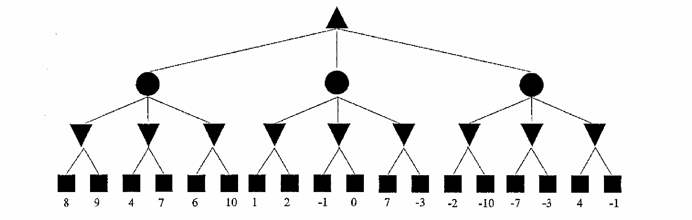

# COMP74042026 MAY 主观题预测

# Section 1 搜索算法

## 预测题 1.1：Uniform Cost Search (GSA) — 搜索路径 [15 pts]

### 题目

The following Python function `ucs_graph_search` aims to implement the Uniform Cost Search algorithm (Graph Search version) to find the lowest-cost path in a weighted graph, as discussed in the lecture slides.

Each node label is a single character. A path is represented as a string of node labels, e.g. `"SAG"`. The function returns a tuple `(cost, path)`.

Determine the missing lines of code indicated by `# --- BLANK X ---`. Fill in exactly 3 lines to correctly implement the UCS graph search logic.

```python
from heapq import heappush, heappop

def ucs_graph_search(graph, start, goal):
    frontier = []
    heappush(frontier, (0, start))
    explored = set()
    while frontier:
        node = heappop(frontier)
        if node[1].endswith(goal):
            return node
        if node[1][-1] not in explored:
            # --- BLANK 1 ---
            for child in graph[node[1][-1]]:
                # --- BLANK 2 ---
                # --- BLANK 3 ---
    return None

weighted_graph = {
    'S': [(1, 'A'), (4, 'B')],
    'A': [(2, 'B'), (5, 'G')],
    'B': [(2, 'G')],
    'G': []
}

result = ucs_graph_search(weighted_graph, 'S', 'G')
print(f"Cost: {result[0]}, Path: {result[1]}")
# Expected Output:
# Cost: 5, Path: SABG
```

### 题目中文解析

这道题考查的是图搜索版 UCS（Uniform Cost Search，一致代价搜索）的核心框架。UCS 使用**优先队列（最小堆）**按**累积路径代价**从小到大扩展节点，保证第一次到达目标时就是最优路径。

与 BFS 的区别在于：BFS 用 FIFO 队列（`deque`），UCS 用最小堆（`heapq`）；BFS 不关心边权，UCS 按边权累加排序。

三个空分别对应 UCS-GSA 的三个核心动作：

* `BLANK 1`：将当前节点标记为已探索，写 `explored.add(node[1][-1])`。这是图搜索的核心——避免重复扩展同一节点。
* `BLANK 2`：计算子节点的新累积代价和新路径。新代价 = 当前代价 `node[0]` + 边代价 `child[0]`；新路径 = 当前路径 `node[1]` + 子节点名 `child[1]`。需要构造新的元组，写 `new_node = (node[0] + child[0], node[1] + child[1])`。
* `BLANK 3`：将新节点压入优先队列，写 `heappush(frontier, new_node)`。

**示例图手动推演：**

```text
图结构（带权）:
S --1--> A --2--> B --2--> G
S --4--> B       A --5--> G

从 S 出发，UCS 按代价从小到大扩展：
1. 初始：frontier = [(0, "S")]
2. 弹出 (0, "S")，扩展 S → 加入 (1, "SA"), (4, "SB")
3. 弹出 (1, "SA")，扩展 A → 加入 (3, "SAB"), (6, "SAG")
4. 弹出 (3, "SAB")，扩展 B → 加入 (5, "SABG")
5. 弹出 (4, "SB")，B 已探索，跳过
6. 弹出 (5, "SABG")，到达 G，返回 (5, "SABG")

最终输出：Cost: 5, Path: SABG
```

### Blank 答案

```python
# --- BLANK 1 ---
explored.add(node[1][-1])

# --- BLANK 2 ---
new_node = (node[0] + child[0], node[1] + child[1])

# --- BLANK 3 ---
heappush(frontier, new_node)
```

### 补全后完整代码（含中文注释）

```python
from heapq import heappush, heappop


def ucs_graph_search(graph, start, goal):
    # 初始化优先队列（最小堆），元组格式为 (累积代价, 路径字符串)
    frontier = []
    # 起点代价为 0，路径为起始节点本身
    heappush(frontier, (0, start))

    # 已探索集合：记录已经被扩展过的节点，避免重复扩展
    explored = set()

    # 只要优先队列不为空，就继续搜索
    while frontier:
        # 弹出当前累积代价最小的节点
        node = heappop(frontier)

        # 目标测试：如果路径末尾是目标节点，直接返回 (代价, 路径)
        if node[1].endswith(goal):
            return node

        # 图搜索核心：只扩展尚未探索过的节点
        if node[1][-1] not in explored:
            # 原 BLANK 1：将当前节点标记为已探索
            explored.add(node[1][-1])

            # 遍历当前节点的所有邻接子节点
            # graph 中子节点格式为 (边代价, 节点名)
            for child in graph[node[1][-1]]:
                # 原 BLANK 2：构造新节点
                # 新累积代价 = 当前代价 + 边代价
                # 新路径 = 当前路径 + 子节点名
                new_node = (node[0] + child[0], node[1] + child[1])

                # 原 BLANK 3：将新节点压入优先队列
                heappush(frontier, new_node)

    # 搜索完毕仍未找到目标，返回 None
    return None


# 示例带权图
weighted_graph = {
    'S': [(1, 'A'), (4, 'B')],
    'A': [(2, 'B'), (5, 'G')],
    'B': [(2, 'G')],
    'G': []
}

result = ucs_graph_search(weighted_graph, 'S', 'G')
print(f"Cost: {result[0]}, Path: {result[1]}")
# 输出：Cost: 5, Path: SABG
```

---

## 预测题 1.2：Greedy Best-First Search (TSA) — 搜索路径 [15 pts]

### 题目

The following Python function `greedy_tree_search` aims to implement the Greedy Best-First Search algorithm (Tree Search version). This algorithm always expands the node that appears closest to the goal according to a heuristic function `h`.

Each node label is a single character. A path is represented as a string of node labels. The function returns a tuple `(h_value, path)`.

Determine the missing lines of code indicated by `# --- BLANK X ---`. Fill in exactly 3 lines to correctly implement the Greedy tree search logic.

```python
from heapq import heappush, heappop

def greedy_tree_search(graph, h, start, goal):
    frontier = []
    # --- BLANK 1 ---
    while frontier:
        node = heappop(frontier)
        if node[1].endswith(goal):
            return node
        for child in graph[node[1][-1]]:
            # --- BLANK 2 ---
            # --- BLANK 3 ---
    return None

example_graph = {
    'S': [(3, 'A'), (1, 'B')],
    'A': [(2, 'G')],
    'B': [(4, 'A'), (6, 'G')],
    'G': []
}

h = {'S': 6, 'A': 2, 'B': 4, 'G': 0}

result = greedy_tree_search(example_graph, h, 'S', 'G')
print(f"h: {result[0]}, Path: {result[1]}")
# Expected Output:
# h: 0, Path: SAG
```

### 题目中文解析

这道题考查的是树搜索版 Greedy Best-First Search（贪婪最佳优先搜索）。Greedy 搜索的排序依据**只看启发式值 h(n)**，完全忽略已花费的实际路径代价 g(n)。

与 UCS 的关键区别：
* UCS 排序依据：`g(n)`（已花费的累积代价）
* Greedy 排序依据：`h(n)`（到目标的估计距离）
* A* 排序依据：`f(n) = g(n) + h(n)`

三个空分别对应：

* `BLANK 1`：将起始节点压入优先队列，排序依据是 `h[start]`。写 `heappush(frontier, (h[start], start))`。
* `BLANK 2`：计算子节点的优先级。Greedy 搜索中优先级就是子节点自身的启发式值 `h[child[1]]`，与边代价无关。构造新路径。写 `new_node = (h[child[1]], node[1] + child[1])`。
* `BLANK 3`：将新节点压入优先队列。写 `heappush(frontier, new_node)`。

**手动推演：**

```text
启发式: h(S)=6, h(A)=2, h(B)=4, h(G)=0

1. 初始：frontier = [(6, "S")]
2. 弹出 (6, "S")，扩展 S → 加入 (2, "SA"), (4, "SB")
   注意：排序按 h 值，不看边代价！
3. 弹出 (2, "SA")，扩展 A → 加入 (0, "SAG")
4. 弹出 (0, "SAG")，到达 G，返回 (0, "SAG")

输出：h: 0, Path: SAG
```

注意：虽然 S→A 的边代价是 3，S→B 只有 1，但 Greedy 不看边代价，只看 h 值。h(A)=2 < h(B)=4，所以优先扩展 A。

### Blank 答案

```python
# --- BLANK 1 ---
heappush(frontier, (h[start], start))

# --- BLANK 2 ---
new_node = (h[child[1]], node[1] + child[1])

# --- BLANK 3 ---
heappush(frontier, new_node)
```

### 补全后完整代码（含中文注释）

```python
from heapq import heappush, heappop


def greedy_tree_search(graph, h, start, goal):
    # 初始化优先队列
    frontier = []

    # 原 BLANK 1：压入起始节点
    # Greedy 搜索的排序依据只有启发式值 h(n)，不考虑已有代价
    heappush(frontier, (h[start], start))

    # 当优先队列不为空时循环
    while frontier:
        # 弹出 h(n) 最小的节点（看起来离目标最近的）
        node = heappop(frontier)

        # 目标测试
        if node[1].endswith(goal):
            return node

        # 遍历当前节点的所有邻接子节点
        # graph 中子节点格式为 (边代价, 节点名)，但 Greedy 不使用边代价
        for child in graph[node[1][-1]]:
            # 原 BLANK 2：构造新节点
            # 优先级 = 子节点的启发式值 h[child[1]]
            # 路径 = 当前路径 + 子节点名
            new_node = (h[child[1]], node[1] + child[1])

            # 原 BLANK 3：压入优先队列
            heappush(frontier, new_node)

    return None


# 示例带权图（Greedy 不使用边权，但图的格式与课件一致）
example_graph = {
    'S': [(3, 'A'), (1, 'B')],
    'A': [(2, 'G')],
    'B': [(4, 'A'), (6, 'G')],
    'G': []
}

# 启发式函数表
h = {'S': 6, 'A': 2, 'B': 4, 'G': 0}

result = greedy_tree_search(example_graph, h, 'S', 'G')
print(f"h: {result[0]}, Path: {result[1]}")
# 输出：h: 0, Path: SAG
```

---

## 预测题 1.3：A* Search (TSA) — 搜索路径 [15 pts]

### 题目

The following Python function `a_star_tree_search` aims to implement the A* Search algorithm (Tree Search version). A* combines the actual path cost `g(n)` and the heuristic estimate `h(n)` to determine the expansion order, using `f(n) = g(n) + h(n)`.

Each node label is a single character. A path is represented as a string of node labels. The function returns a tuple `(f_value, path)`.

Determine the missing lines of code indicated by `# --- BLANK X ---`. Fill in exactly 3 lines to correctly implement the A* tree search logic.

```python
from heapq import heappush, heappop

def a_star_tree_search(graph, h, start, goal):
    frontier = []
    # --- BLANK 1 ---
    while frontier:
        node = heappop(frontier)
        if node[1].endswith(goal):
            return node
        for child in graph[node[1][-1]]:
            # --- BLANK 2 ---
            # --- BLANK 3 ---
    return None

example_graph = {
    'S': [(1, 'A'), (4, 'B')],
    'A': [(2, 'B'), (5, 'G')],
    'B': [(2, 'G')],
    'G': []
}

h = {'S': 7, 'A': 4, 'B': 2, 'G': 0}

result = a_star_tree_search(example_graph, h, 'S', 'G')
print(f"f: {result[0]}, Path: {result[1]}")
# Expected Output:
# f: 5, Path: SABG
```

### 题目中文解析

这道题考查的是 A* 树搜索算法的代码实现。A* 的核心在于它的评估函数 `f(n) = g(n) + h(n)`，综合考虑了**已花费的实际代价**和**到目标的估计代价**。

**A* 代码的核心难点**在于：优先队列中存储的是 `f(n)` 而不是 `g(n)`，因此在计算子节点的 `f` 值时，需要先从当前节点的 `f(n)` 中"减掉"当前节点的 `h` 值以还原出 `g(n)`，再加上边代价和子节点的 `h` 值。

公式推导：
```text
当前节点：node[0] = f(n) = g(n) + h(n)
还原 g(n) = node[0] - h[node[1][-1]]
子节点 g(n') = g(n) + child[0]（边代价）
子节点 f(n') = g(n') + h[child[1]]
            = node[0] - h[node[1][-1]] + child[0] + h[child[1]]
即：       = node[0] + child[0] - h[node[1][-1]] + h[child[1]]
```

三个空分别对应：

* `BLANK 1`：压入起始节点。初始时 g(start)=0，所以 f(start)=h[start]。写 `heappush(frontier, (h[start], start))`。
* `BLANK 2`：计算子节点的 f 值。写 `new_f = node[0] + child[0] - h[node[1][-1]] + h[child[1]]`。
* `BLANK 3`：将新节点压入优先队列。写 `heappush(frontier, (new_f, node[1] + child[1]))`。

**手动推演：**

```text
启发式: h(S)=7, h(A)=4, h(B)=2, h(G)=0

1. 初始：frontier = [(7, "S")]
   f(S) = g(S)+h(S) = 0+7 = 7

2. 弹出 (7, "S")，扩展 S 的两个子节点：
   子节点 A: f = 7 + 1 - h(S) + h(A) = 7 + 1 - 7 + 4 = 5  → (5, "SA")
   子节点 B: f = 7 + 4 - h(S) + h(B) = 7 + 4 - 7 + 2 = 6  → (6, "SB")
   frontier = [(5, "SA"), (6, "SB")]

3. 弹出 (5, "SA")，扩展 A 的两个子节点：
   子节点 B: f = 5 + 2 - h(A) + h(B) = 5 + 2 - 4 + 2 = 5  → (5, "SAB")
   子节点 G: f = 5 + 5 - h(A) + h(G) = 5 + 5 - 4 + 0 = 6  → (6, "SAG")
   frontier = [(5, "SAB"), (6, "SB"), (6, "SAG")]

4. 弹出 (5, "SAB")，扩展 B 的子节点：
   子节点 G: f = 5 + 2 - h(B) + h(G) = 5 + 2 - 2 + 0 = 5  → (5, "SABG")
   frontier = [(5, "SABG"), (6, "SB"), (6, "SAG")]

5. 弹出 (5, "SABG")，到达 G，返回 (5, "SABG")

验证: g(SABG) = 1 + 2 + 2 = 5，f = 5 + h(G) = 5 + 0 = 5 ✓
输出：f: 5, Path: SABG
```

### Blank 答案

```python
# --- BLANK 1 ---
heappush(frontier, (h[start], start))

# --- BLANK 2 ---
new_f = node[0] + child[0] - h[node[1][-1]] + h[child[1]]

# --- BLANK 3 ---
heappush(frontier, (new_f, node[1] + child[1]))
```

### 补全后完整代码（含中文注释）

```python
from heapq import heappush, heappop


def a_star_tree_search(graph, h, start, goal):
    # 初始化优先队列
    frontier = []

    # 原 BLANK 1：压入起始节点
    # A* 的排序依据是 f(n) = g(n) + h(n)
    # 起点 g=0，所以 f(start) = 0 + h[start] = h[start]
    heappush(frontier, (h[start], start))

    # 当优先队列不为空时循环
    while frontier:
        # 弹出 f(n) 最小的节点
        # node[0] = f(n) = g(n) + h(n)
        # node[1] = 路径字符串
        node = heappop(frontier)

        # 目标测试
        if node[1].endswith(goal):
            return node

        # 遍历当前节点的所有邻接子节点
        for child in graph[node[1][-1]]:
            # 原 BLANK 2：计算子节点的 f 值
            # 【核心推导】
            # 已知: node[0] = g(当前) + h(当前)
            # 还原: g(当前) = node[0] - h[node[1][-1]]
            # 子节点: g(子) = g(当前) + child[0]（边代价）
            # 子节点: f(子) = g(子) + h(子)
            #       = node[0] - h[node[1][-1]] + child[0] + h[child[1]]
            new_f = node[0] + child[0] - h[node[1][-1]] + h[child[1]]

            # 原 BLANK 3：将子节点压入优先队列
            heappush(frontier, (new_f, node[1] + child[1]))

    return None


# 示例带权图
example_graph = {
    'S': [(1, 'A'), (4, 'B')],
    'A': [(2, 'B'), (5, 'G')],
    'B': [(2, 'G')],
    'G': []
}

# 启发式函数表（可验证该启发式是可采纳且一致的）
h = {'S': 7, 'A': 4, 'B': 2, 'G': 0}

result = a_star_tree_search(example_graph, h, 'S', 'G')
print(f"f: {result[0]}, Path: {result[1]}")
# 输出：f: 5, Path: SABG
```

---

## 三种算法对比总结

| 算法 | 排序依据 | 优先队列中存储的值 | 是否使用边权 | 是否使用启发式 |
|:---|:---|:---|:---|:---|
| **UCS** | g(n) 累积代价 | `node[0] = g(n)` | ✅ 是 | ❌ 否 |
| **Greedy** | h(n) 启发式 | `node[0] = h(n)` | ❌ 否 | ✅ 是 |
| **A*** | f(n) = g(n)+h(n) | `node[0] = f(n)` | ✅ 是 | ✅ 是 |

**代码层面的核心区别（压入优先队列时）：**

```python
# UCS：代价 = 累积路径代价
heappush(frontier, (node[0] + child[0], node[1] + child[1]))

# Greedy：代价 = 子节点的启发式值（与 g 无关）
heappush(frontier, (h[child[1]], node[1] + child[1]))

# A*：代价 = f(n') = g(n') + h(n')，通过巧妙变换避免单独存 g
heappush(frontier, (node[0] + child[0] - h[node[1][-1]] + h[child[1]], node[1] + child[1]))
```

---
# Section 2
## 预测题 ：Q-Learning Bug Fix [15 pts]

> **出题思路分析**：
> - 2025MAY Section4：错误在**环境转移函数**（状态跳转逻辑写反）— 2 处 bug
> - 2025DEC Section4：错误在 **TD 更新公式**（`q_table[state, :]` 应为 `q_table[next_state, :]`）— 1 处 bug
> - 2026 预测：综合前两年，预计出 **2 处 bug**，分别在 **epsilon-greedy 逻辑** 和 **TD 更新公式** 中

### 题目

The following Python code attempts to implement the Q-Learning algorithm for a simple grid corridor environment. The agent starts at state 0 and wants to reach the goal state 4. State 3 is a "trap" that gives a strong negative reward. Actions are 0 (move left) and 1 (move right).

There are **two bugs** that prevent the algorithm from learning the correct Q-values. Identify the buggy lines of code and fix the bugs in the space provided below by providing the corrected lines of code that should replace the buggy lines.

```python
import numpy as np
import random

NUM_STATES = 5        # States 0, 1, 2, 3, 4
NUM_ACTIONS = 2       # 0: Left, 1: Right
START_STATE = 0
GOAL_STATE = 4
TRAP_STATE = 3
TERMINAL_STATES = [GOAL_STATE]

LEARNING_RATE = 0.1
DISCOUNT_FACTOR = 0.9
NUM_EPISODES = 500
EPSILON = 0.2

q_table = np.zeros((NUM_STATES, NUM_ACTIONS))

def step(state, action):
    if state in TERMINAL_STATES:
        return state, 0
    if action == 0:
        next_state = max(0, state - 1)
    else:
        next_state = min(NUM_STATES - 1, state + 1)
    if next_state == GOAL_STATE:
        reward = 10
    elif next_state == TRAP_STATE:
        reward = -10
    else:
        reward = -1
    return next_state, reward

print("Starting Training...")
for episode in range(NUM_EPISODES):
    state = START_STATE
    done = False
    while not done:
        if random.random() < EPSILON:
            action = int(np.argmax(q_table[state, :]))   # Line A
        else:
            action = random.randint(0, NUM_ACTIONS - 1)   # Line B
        next_state, reward = step(state, action)
        max_next_q = np.max(q_table[next_state, :])
        td_target = reward + DISCOUNT_FACTOR * max_next_q
        q_table[state, action] = q_table[state, action] + LEARNING_RATE * td_target   # Line C
        state = next_state
        if state in TERMINAL_STATES:
            done = True

print("Training finished.")
print("Learned Q-table (rounded):")
print(np.round(q_table, 2))
```

### 题目中文解析

这道题在 Q-Learning 代码中埋了 **两处 bug**，分别考查两个核心知识点：

#### Bug 1：epsilon-greedy 的探索与利用写反了（Line A & Line B）

Q-Learning 的 epsilon-greedy 策略规定：
- 以 **ε 的概率随机选择动作**（探索 Exploration）
- 以 **(1 - ε) 的概率选择当前 Q 值最大的动作**（利用 Exploitation）

正确的逻辑应该是：

```python
if random.random() < EPSILON:
    action = random.randint(0, NUM_ACTIONS - 1)   # 探索：随机选动作
else:
    action = int(np.argmax(q_table[state, :]))     # 利用：选 Q 值最大的动作
```

但原代码中 **Line A** 和 **Line B** 把两个分支的内容对调了：
- `< EPSILON` 时执行了 `argmax`（利用），应该是随机（探索）
- `else` 时执行了 `random`（探索），应该是 `argmax`（利用）

这会导致智能体有 80% 的概率随机乱走（因为 ε=0.2，else 分支占 80%），只有 20% 的概率利用已知最优动作。探索比例远超正常水平，Q 值更新缓慢且不稳定。

#### Bug 2：TD 更新跳过了 td_error 的计算（Line C）

Q-Learning 的标准更新公式是：

```text
Q(s, a) ← Q(s, a) + α × [r + γ × max_a' Q(s', a') - Q(s, a)]
                                    ↑ td_target ↑       ↑ 当前估计 ↑
                           ↑————————————— td_error ——————————————↑
```

展开为代码应该是：

```python
td_target = reward + DISCOUNT_FACTOR * max_next_q
td_error = td_target - q_table[state, action]           # ← 缺少这一行！
q_table[state, action] = q_table[state, action] + LEARNING_RATE * td_error
```

但原代码的 **Line C** 直接把 `td_target` 当成了 `td_error` 来用：

```python
q_table[state, action] = q_table[state, action] + LEARNING_RATE * td_target   # 错误！
```

这相当于把更新公式变成了：`Q(s,a) ← Q(s,a) + α × [r + γ × max Q(s',a')]`。

问题在于没有减去 `Q(s,a)` 自身，导致：
- 当 Q 值已经接近正确值时，仍然会继续被大幅推高（因为 td_target 本身不会趋近于 0）
- Q 值会越来越大直到发散，永远无法收敛

### Buggy Lines 与修正答案

原 buggy lines：

```python
# Line A（错误）：以 epsilon 概率利用，应该是探索
action = int(np.argmax(q_table[state, :]))

# Line B（错误）：以 1-epsilon 概率探索，应该是利用
action = random.randint(0, NUM_ACTIONS - 1)

# Line C（错误）：直接用 td_target 更新，跳过了 td_error 计算
q_table[state, action] = q_table[state, action] + LEARNING_RATE * td_target
```

应替换为：

```python
# Line A（修正）：以 epsilon 概率随机探索
action = random.randint(0, NUM_ACTIONS - 1)

# Line B（修正）：以 1-epsilon 概率选 Q 值最大的动作（利用）
action = int(np.argmax(q_table[state, :]))

# Line C（修正）：先计算 td_error，再用 td_error 更新
td_error = td_target - q_table[state, action]
q_table[state, action] = q_table[state, action] + LEARNING_RATE * td_error
```

### 修改后的完整代码（含中文注释，并标注原 BUG 位置）

```python
import numpy as np
import random


# 环境规模：一共有 5 个状态，编号为 0, 1, 2, 3, 4。
NUM_STATES = 5
NUM_ACTIONS = 2       # 0: 向左, 1: 向右

# 起点、目标和陷阱。
START_STATE = 0
GOAL_STATE = 4
TRAP_STATE = 3

# 终止状态：到达目标后 episode 结束。
TERMINAL_STATES = [GOAL_STATE]

# Q-Learning 超参数。
LEARNING_RATE = 0.1
DISCOUNT_FACTOR = 0.9
NUM_EPISODES = 500
EPSILON = 0.2

# 初始化 Q 表为全零。
q_table = np.zeros((NUM_STATES, NUM_ACTIONS))


def step(state, action):
    """模拟环境的一步转移。"""
    # 终止状态不再移动。
    if state in TERMINAL_STATES:
        return state, 0

    # 根据动作计算下一状态，不超出边界。
    if action == 0:
        next_state = max(0, state - 1)
    else:
        next_state = min(NUM_STATES - 1, state + 1)

    # 根据到达的状态给出即时奖励。
    if next_state == GOAL_STATE:
        reward = 10
    elif next_state == TRAP_STATE:
        reward = -10
    else:
        reward = -1

    return next_state, reward


print("Starting Training...")

for episode in range(NUM_EPISODES):
    state = START_STATE
    done = False

    while not done:
        # 【原 BUG 1 位置】epsilon-greedy 动作选择。
        # 原代码把探索和利用写反了：
        #   原 Line A: if random.random() < EPSILON → argmax（应为 random）
        #   原 Line B: else → random（应为 argmax）
        # 修正后：以 EPSILON 概率随机探索，以 1-EPSILON 概率利用最优动作。
        if random.random() < EPSILON:
            action = random.randint(0, NUM_ACTIONS - 1)    # 探索
        else:
            action = int(np.argmax(q_table[state, :]))     # 利用

        # 与环境交互一步。
        next_state, reward = step(state, action)

        # 计算下一状态的最大 Q 值。
        max_next_q = np.max(q_table[next_state, :])

        # 计算 TD target。
        td_target = reward + DISCOUNT_FACTOR * max_next_q

        # 【原 BUG 2 位置】计算 TD error 并更新 Q 值。
        # 原 Line C 直接用 td_target 乘以学习率来更新 Q 值，
        # 跳过了 td_error 的计算（即没有减去当前 Q 值），导致 Q 值发散。
        # 修正：先算 td_error = td_target - Q(s,a)，再用 td_error 更新。
        td_error = td_target - q_table[state, action]
        q_table[state, action] = q_table[state, action] + LEARNING_RATE * td_error

        # 状态前进。
        state = next_state

        # 判断是否到达终止状态。
        if state in TERMINAL_STATES:
            done = True

print("Training finished.")
print("Learned Q-table (rounded):")
print(np.round(q_table, 2))
```

---

## 补充：Q-Learning 纠错题常见挖坑位置总结

结合 2025MAY、2025DEC 以及本预测题，Q-Learning 代码纠错可能出现的 bug 类型汇总：

| 挖坑位置 | 错误方式 | 出过的年份 |
|:---|:---|:---|
| **环境转移函数** | 状态跳转逻辑写错（跳过状态、方向反转） | 2025 MAY |
| **max_next_q 取错状态** | 用 `q_table[state, :]` 而非 `q_table[next_state, :]` | 2025 DEC |
| **epsilon-greedy 写反** | 探索和利用的 if/else 分支对调 | **2026 预测** |
| **td_error 缺失** | 直接用 `td_target` 代替 `td_error` 更新 | **2026 预测** |
| **学习率符号/位置错** | `- LEARNING_RATE` 或括号位置不对 | 可能出题 |
| **折扣因子遗漏** | `td_target = reward + max_next_q`（漏乘 γ） | 可能出题 |
| **终止状态未特判** | 终止状态应有 `max_next_q = 0`，但代码没处理 | 可能出题 |
| **状态未前进** | 缺少 `state = next_state`，agent 始终停在原地 | 可能出题 |

---

## 历年考点回顾

> - **2025MAY Section5**：考的是 **Policy Evaluation**（固定策略下的 Bellman expectation update），给定固定策略 π，计算 Vk+1(S0)。**不是** Policy Iteration（策略迭代包含评估+改进两步交替），而是 Policy Evaluation（只做评估这一步）。
> - **2025DEC Section5**：考的是 **Q-Learning TD 手动计算**，给定确定性环境的 episode 轨迹，逐步代入 Q-learning 更新公式计算 Q 值。
> - **2026 预测**：可能考 **Value Iteration**（贝尔曼最优更新，取 max）或继续考 **Q-Learning TD 计算**。以下各出一道。

---

# Section 3
## 预测题 3.1：Value Iteration 手动计算 [20 pts]

### 题目

Consider the following Markov Decision Process (MDP):

- **States:** {S0, S1, S2}
- **Actions:** {A0, A1}
- **Discount Factor (γ):** 0.5
- **Transition Probabilities and Rewards:**
  - From **S0**:
    - Action A0: To S1 with probability 1.0, Reward = +2
    - Action A1: To S2 with probability 1.0, Reward = +1
  - From **S1**:
    - Action A0: To S0 with probability 1.0, Reward = +1
    - Action A1: To S2 with probability 1.0, Reward = +3
  - **S2** is a terminal state (all actions stay in S2 with Reward = 0).

- **Initial Value Estimates:**
  - V0(S0) = 0, V0(S1) = 0, V0(S2) = 0

#### 5.1 [8 pts]

Perform **one iteration** of Value Iteration. Using the Bellman optimality update, compute V1(S0) and V1(S1). Show your work.

#### 5.2 [4 pts]

Based on V1 from 5.1, perform a **second iteration** of Value Iteration. Compute V2(S0) and V2(S1). Show your work.

#### 5.3 [4 pts]

Based on V2 from 5.2, extract the current **optimal policy** π*(s) for each non-terminal state S0 and S1. For each state, state which action the agent should take and explain why.

#### 5.4 [4 pts]

Suppose instead of Value Iteration, we use **Policy Evaluation** with a fixed policy π(S0) = A0, π(S1) = A1. Using V0(S0) = 0, V0(S1) = 0, compute V1(S0) under this fixed policy. Explain how this differs from Value Iteration.

---

### 中文详细解答

#### 核心公式区分

本题的核心是区分 **Value Iteration** 和 **Policy Evaluation** 两种更新方式：

**Value Iteration（贝尔曼最优更新）— 取 max：**

```text
Vk+1(s) = max_a [ Σ_s' T(s, a, s') × (R(s, a, s') + γ × Vk(s')) ]
```

**Policy Evaluation（贝尔曼期望更新）— 固定策略，不取 max：**

```text
Vk+1(s) = Σ_s' T(s, π(s), s') × (R(s, π(s), s') + γ × Vk(s'))
```

#### 5.1 第一轮 Value Iteration：计算 V1(S0) 和 V1(S1)

**计算 V1(S0)：**

S0 有两个动作可选，需要分别计算每个动作的 Q 值，然后取 max。

```text
Q(S0, A0) = 1.0 × [2 + 0.5 × V0(S1)]
          = 1.0 × [2 + 0.5 × 0]
          = 2

Q(S0, A1) = 1.0 × [1 + 0.5 × V0(S2)]
          = 1.0 × [1 + 0.5 × 0]
          = 1

V1(S0) = max(Q(S0,A0), Q(S0,A1)) = max(2, 1) = 2
```

**计算 V1(S1)：**

```text
Q(S1, A0) = 1.0 × [1 + 0.5 × V0(S0)]
          = 1.0 × [1 + 0.5 × 0]
          = 1

Q(S1, A1) = 1.0 × [3 + 0.5 × V0(S2)]
          = 1.0 × [3 + 0.5 × 0]
          = 3

V1(S1) = max(Q(S1,A0), Q(S1,A1)) = max(1, 3) = 3
```

**第一轮结果：**

```text
V1(S0) = 2,  V1(S1) = 3,  V1(S2) = 0
```

#### 5.2 第二轮 Value Iteration：计算 V2(S0) 和 V2(S1)

用 V1 的结果来计算 V2。

**计算 V2(S0)：**

```text
Q(S0, A0) = 1.0 × [2 + 0.5 × V1(S1)]
          = 2 + 0.5 × 3
          = 2 + 1.5
          = 3.5

Q(S0, A1) = 1.0 × [1 + 0.5 × V1(S2)]
          = 1 + 0.5 × 0
          = 1

V2(S0) = max(3.5, 1) = 3.5
```

**计算 V2(S1)：**

```text
Q(S1, A0) = 1.0 × [1 + 0.5 × V1(S0)]
          = 1 + 0.5 × 2
          = 1 + 1
          = 2

Q(S1, A1) = 1.0 × [3 + 0.5 × V1(S2)]
          = 3 + 0.5 × 0
          = 3

V2(S1) = max(2, 3) = 3
```

**第二轮结果：**

```text
V2(S0) = 3.5,  V2(S1) = 3,  V2(S2) = 0
```

#### 5.3 基于 V2 提取最优策略

在每个状态下，选择使 Q 值最大的动作：

**S0：**

```text
Q(S0, A0) = 3.5（走向 S1，收获高价值）
Q(S0, A1) = 1  （走向终止状态 S2）
→ π*(S0) = A0
理由：A0 的 Q 值 3.5 > A1 的 Q 值 1，选择 A0 能获得更高的期望回报。
```

**S1：**

```text
Q(S1, A0) = 2  （回到 S0）
Q(S1, A1) = 3  （走向终止状态 S2，直接拿 +3）
→ π*(S1) = A1
理由：A1 的 Q 值 3 > A0 的 Q 值 2，选择 A1 能获得更高的期望回报。
```

**最终最优策略：**

```text
π*(S0) = A0
π*(S1) = A1
```

#### 5.4 Policy Evaluation vs. Value Iteration

题目给定固定策略 π(S0) = A0, π(S1) = A1，用 Policy Evaluation 计算 V1(S0)。

**Policy Evaluation 只看策略指定的动作，不取 max：**

```text
V1(S0) = T(S0, A0, S1) × [R(S0, A0, S1) + γ × V0(S1)]
       = 1.0 × [2 + 0.5 × 0]
       = 2
```

**与 Value Iteration 的比较：**

| 方面 | Value Iteration | Policy Evaluation |
|:---|:---|:---|
| **公式** | Vk+1(s) = **max_a** [...] | Vk+1(s) = Σ T(s, **π(s)**, s') × [...] |
| **是否取 max** | ✅ 是，遍历所有动作取最大 | ❌ 否，只看固定策略指定的动作 |
| **目标** | 直接求最优价值函数 V* | 评估给定策略 π 下的价值函数 Vπ |
| **本例 V1(S0)** | 2（碰巧一样，因为 max 恰好选了 A0） | 2 |
| **何时不同** | 当最优动作 ≠ 固定策略的动作时 | 结果一般比 VI 差或相等 |

在本例中，恰好固定策略 π(S0) = A0 就是 S0 的最优动作，所以 V1(S0) 的值相同。但如果固定策略是 π(S0) = A1，那么 Policy Evaluation 得到 V1(S0) = 1，而 Value Iteration 仍然得到 V1(S0) = 2。

---

## 预测题 3.2：Q-Learning TD 手动计算 [20 pts]

### 题目

Consider a Markov Decision Process (MDP) with five states {S0, S1, S2, S3, S4} and two possible actions {Left, Right} in each non-terminal state. The agent starts in state S0, and an episode ends when it reaches the terminal state S4. The transition dynamics and rewards are **deterministic**:

* **In state S0:**
  * Left: stays in S0, Reward = -1
  * Right: moves to S1, Reward = +1
* **In state S1:**
  * Left: moves to S0, Reward = -1
  * Right: moves to S2, Reward = +2
* **In state S2:**
  * Left: moves to S1, Reward = -1
  * Right: moves to S3, Reward = -5
* **In state S3:**
  * Left: moves to S2, Reward = -1
  * Right: moves to S4, Reward = +10
* **State S4 is a terminal state.**

The agent uses Q-learning with:
* discount factor γ = 0.9
* learning rate α = 0.5
* initial Q-values Q(s, a) = 0 for all state-action pairs

Q-values for the terminal state S4 remain 0 and are not updated.

#### 6.1 [8 pts]

In the **first episode**, the agent takes the following trajectory:

* S0 → Right → S1 (reward +1)
* S1 → Right → S2 (reward +2)
* S2 → Right → S3 (reward -5)
* S3 → Right → S4 (reward +10)

Compute the Q-values for all updated state-action pairs after this episode. Show your work for each step.

#### 6.2 [8 pts]

Continuing from the Q-values obtained in 6.1, the **second episode** proceeds as:

* S0 → Right → S1 (reward +1)
* S1 → Right → S2 (reward +2)
* S2 → Left → S1 (reward -1)
* S1 → Right → S2 (reward +2)
* S2 → Right → S3 (reward -5)
* S3 → Right → S4 (reward +10)

Compute the updated Q-values after this second episode.

#### 6.3 [4 pts]

Based on the Q-values after 6.2, if the agent follows a purely greedy policy (ε = 0), state the action the agent would choose in each non-terminal state S0–S3.

---

### 中文详细解答

**Q-learning 更新公式：**

```text
Q(s, a) ← Q(s, a) + α × [r + γ × max_a' Q(s', a') - Q(s, a)]
```

本题 α = 0.5，γ = 0.9。初始所有 Q 值为 0。

#### 6.1 第一轮 episode

**第一步：S0 → Right → S1，r = +1**

```text
max Q(S1, a') = max(Q(S1,L), Q(S1,R)) = max(0, 0) = 0

Q(S0, R) = 0 + 0.5 × [1 + 0.9 × 0 - 0]
         = 0.5 × 1
         = 0.5
```

**第二步：S1 → Right → S2，r = +2**

```text
max Q(S2, a') = max(0, 0) = 0

Q(S1, R) = 0 + 0.5 × [2 + 0.9 × 0 - 0]
         = 0.5 × 2
         = 1
```

**第三步：S2 → Right → S3，r = -5**

```text
max Q(S3, a') = max(0, 0) = 0

Q(S2, R) = 0 + 0.5 × [-5 + 0.9 × 0 - 0]
         = 0.5 × (-5)
         = -2.5
```

**第四步：S3 → Right → S4（终止），r = +10**

```text
max Q(S4, a') = 0（终止状态）

Q(S3, R) = 0 + 0.5 × [10 + 0.9 × 0 - 0]
         = 0.5 × 10
         = 5
```

**第一轮 episode 后 Q 值汇总：**

| 状态 | Q(s, Left) | Q(s, Right) |
|:---|:---|:---|
| S0 | 0 | **0.5** |
| S1 | 0 | **1** |
| S2 | 0 | **-2.5** |
| S3 | 0 | **5** |

#### 6.2 第二轮 episode

从 6.1 的 Q 值继续更新。

**第一步：S0 → Right → S1，r = +1**

```text
max Q(S1, a') = max(0, 1) = 1

Q(S0, R) = 0.5 + 0.5 × [1 + 0.9 × 1 - 0.5]
         = 0.5 + 0.5 × [1 + 0.9 - 0.5]
         = 0.5 + 0.5 × 1.4
         = 0.5 + 0.7
         = 1.2
```

**第二步：S1 → Right → S2，r = +2**

```text
max Q(S2, a') = max(0, -2.5) = 0

Q(S1, R) = 1 + 0.5 × [2 + 0.9 × 0 - 1]
         = 1 + 0.5 × [2 + 0 - 1]
         = 1 + 0.5 × 1
         = 1.5
```

**第三步：S2 → Left → S1，r = -1**

```text
max Q(S1, a') = max(0, 1.5) = 1.5
注意：这里用的是刚才更新后的 Q(S1, R) = 1.5

Q(S2, L) = 0 + 0.5 × [-1 + 0.9 × 1.5 - 0]
         = 0.5 × [-1 + 1.35]
         = 0.5 × 0.35
         = 0.175
```

**第四步：S1 → Right → S2，r = +2**

```text
max Q(S2, a') = max(0.175, -2.5) = 0.175

Q(S1, R) = 1.5 + 0.5 × [2 + 0.9 × 0.175 - 1.5]
         = 1.5 + 0.5 × [2 + 0.1575 - 1.5]
         = 1.5 + 0.5 × 0.6575
         = 1.5 + 0.32875
         = 1.82875
```

**第五步：S2 → Right → S3，r = -5**

```text
max Q(S3, a') = max(0, 5) = 5

Q(S2, R) = -2.5 + 0.5 × [-5 + 0.9 × 5 - (-2.5)]
         = -2.5 + 0.5 × [-5 + 4.5 + 2.5]
         = -2.5 + 0.5 × 2
         = -2.5 + 1
         = -1.5
```

**第六步：S3 → Right → S4（终止），r = +10**

```text
max Q(S4, a') = 0

Q(S3, R) = 5 + 0.5 × [10 + 0.9 × 0 - 5]
         = 5 + 0.5 × 5
         = 5 + 2.5
         = 7.5
```

**第二轮 episode 后 Q 值汇总：**

| 状态 | Q(s, Left) | Q(s, Right) |
|:---|:---|:---|
| S0 | 0 | **1.2** |
| S1 | 0 | **1.82875** |
| S2 | **0.175** | **-1.5** |
| S3 | 0 | **7.5** |

#### 6.3 贪心策略提取（ε = 0）

在每个状态下选 Q 值最大的动作：

```text
S0: Q(S0, L) = 0,     Q(S0, R) = 1.2      → 选 Right
S1: Q(S1, L) = 0,     Q(S1, R) = 1.82875  → 选 Right
S2: Q(S2, L) = 0.175, Q(S2, R) = -1.5     → 选 Left
S3: Q(S3, L) = 0,     Q(S3, R) = 7.5      → 选 Right
```

**注意 S2 的策略：** 尽管 S2 向右可以经 S3 最终到达目标获得 +10，但由于经过 S3 时先要承受 -5 的惩罚，而目前 Q(S2, R) = -1.5 仍然是负值。相反，Q(S2, L) = 0.175 > 0，说明智能体暂时更倾向于向左回到 S1。随着更多 episode 的训练，S3 → S4 的高回报信息会逐步通过 TD 传播回来，最终 Q(S2, R) 也会变为正值。

**最终贪心策略：**

```text
π(S0) = Right
π(S1) = Right
π(S2) = Left   ← 注意：训练不充分时的暂时策略
π(S3) = Right
```

---

## Value Iteration vs. Policy Evaluation vs. Q-Learning 计算要点对比

| 对比维度 | Value Iteration | Policy Evaluation | Q-Learning |
|:---|:---|:---|:---|
| **更新对象** | V(s) | V(s) | Q(s, a) |
| **是否取 max** | ✅ max over actions | ❌ 只看固定策略 | ✅ max over next-state actions |
| **是否需要模型** | ✅ 需要 T 和 R | ✅ 需要 T 和 R | ❌ 无模型，靠经验 |
| **更新公式** | V(s) ← max_a Σ T×[R+γV(s')] | V(s) ← Σ T(s,π(s),s')×[R+γV(s')] | Q(s,a) ← Q(s,a)+α[r+γ·maxQ(s',a')-Q(s,a)] |
| **考试关键陷阱** | 忘记取 max / 用错动作 | 误用 max（应该只看 π） | td_error 忘减 Q(s,a) / state vs next_state |

---

## 历年 ML 考点回顾

> - **2023MAY Section4**：考了 Decision Tree — **Gini Impurity** 计算 + Information Gain
> - **2025MAY Section6**：考了 **KNN** — 欧氏距离 + K=3 多数投票
> - **2025DEC Section2**：选择题涉及 DT / SVM / KNN 概念
> - **2026 预测**：
>   - **DT 用 Misclassification Error**（2023 已考 Gini，需要覆盖另一种不纯度）
>   - **SVM 计算题**（从未在大题中出过，今年可能性高）

---

# Section 4

## 预测题 4.1：Decision Tree — Misclassification Error + 特征选择 [10 pts]

### 题目

You are building a decision tree to classify whether a student will pass (P) or fail (F) a course. The dataset contains 20 students with two binary features.

**Root node data (before any split):**

| Class | Count |
|:---|---:|
| Pass (P) | 12 |
| Fail (F) | 8 |
| **Total** | **20** |

**Feature A splits the data as:**

| | Pass (P) | Fail (F) | Total |
|:---|---:|---:|---:|
| A = Yes (Left) | 10 | 2 | 12 |
| A = No (Right) | 2 | 6 | 8 |

**Feature B splits the data as:**

| | Pass (P) | Fail (F) | Total |
|:---|---:|---:|---:|
| B = Yes (Left) | 8 | 4 | 12 |
| B = No (Right) | 4 | 4 | 8 |

#### 7.1 [3 pts]

Compute the **Misclassification Error** of the root node (before any split).

Recall that Misclassification Error is defined as:

$$E(t) = 1 - \max_i \, p(i|t)$$

#### 7.2 [4 pts]

Using **Misclassification Error** as the impurity measure, compute the **Information Gain** (impurity reduction) for Feature A and Feature B. Which feature should be selected for the first split?

Recall:

$$IG(D_p, f) = I(D_p) - \frac{N_{left}}{N_p} I(D_{left}) - \frac{N_{right}}{N_p} I(D_{right})$$

#### 7.3 [3 pts]

Now compute the **Gini Impurity** of the root node and the **Gini-based Information Gain** for Feature A. Compare the result with 7.2. Would the choice of best feature change?

---

### 中文详细解答

#### 7.1 根节点的 Misclassification Error

根节点有 20 个样本：P = 12，F = 8。

```text
p(P) = 12/20 = 0.6
p(F) = 8/20  = 0.4

E(root) = 1 - max(0.6, 0.4)
        = 1 - 0.6
        = 0.4
```

**答案：E(root) = 0.4**

#### 7.2 两个特征的 Information Gain（基于 Misclassification Error）

**Feature A 的分裂：**

左子节点（A=Yes）：P=10, F=2, 总计=12

```text
p(P) = 10/12 ≈ 0.833,  p(F) = 2/12 ≈ 0.167
E(left) = 1 - max(0.833, 0.167) = 1 - 0.833 = 0.167
```

右子节点（A=No）：P=2, F=6, 总计=8

```text
p(P) = 2/8 = 0.25,  p(F) = 6/8 = 0.75
E(right) = 1 - max(0.25, 0.75) = 1 - 0.75 = 0.25
```

Feature A 的 Information Gain：

```text
IG(A) = E(root) - (N_left/N_total) × E(left) - (N_right/N_total) × E(right)
      = 0.4 - (12/20) × 0.167 - (8/20) × 0.25
      = 0.4 - 0.6 × 0.167 - 0.4 × 0.25
      = 0.4 - 0.1 - 0.1
      = 0.2
```

**Feature B 的分裂：**

左子节点（B=Yes）：P=8, F=4, 总计=12

```text
p(P) = 8/12 ≈ 0.667,  p(F) = 4/12 ≈ 0.333
E(left) = 1 - max(0.667, 0.333) = 1 - 0.667 = 0.333
```

右子节点（B=No）：P=4, F=4, 总计=8

```text
p(P) = 4/8 = 0.5,  p(F) = 4/8 = 0.5
E(right) = 1 - max(0.5, 0.5) = 1 - 0.5 = 0.5
```

Feature B 的 Information Gain：

```text
IG(B) = 0.4 - (12/20) × 0.333 - (8/20) × 0.5
      = 0.4 - 0.6 × 0.333 - 0.4 × 0.5
      = 0.4 - 0.2 - 0.2
      = 0.0
```

**结论：IG(A) = 0.2 > IG(B) = 0.0，应选择 Feature A 进行第一次分裂。**

Feature B 的 IG = 0 说明按 B 分裂后，加权平均不纯度没有任何降低，B 对分类几乎没有帮助。

#### 7.3 Gini Impurity 对比

**根节点的 Gini Impurity：**

```text
Gini(root) = 1 - (p(P)² + p(F)²)
           = 1 - (0.6² + 0.4²)
           = 1 - (0.36 + 0.16)
           = 1 - 0.52
           = 0.48
```

**Feature A 的 Gini-based IG：**

左子节点（A=Yes）：

```text
Gini(left) = 1 - ((10/12)² + (2/12)²)
           = 1 - (100/144 + 4/144)
           = 1 - 104/144
           = 40/144
           ≈ 0.278
```

右子节点（A=No）：

```text
Gini(right) = 1 - ((2/8)² + (6/8)²)
            = 1 - (4/64 + 36/64)
            = 1 - 40/64
            = 24/64
            = 0.375
```

Gini-based Information Gain：

```text
IG_Gini(A) = 0.48 - (12/20) × 0.278 - (8/20) × 0.375
           = 0.48 - 0.6 × 0.278 - 0.4 × 0.375
           = 0.48 - 0.167 - 0.15
           = 0.163
```

**对比结果：**

| 度量 | IG(Feature A) | IG(Feature B) | 最佳特征 |
|:---|:---|:---|:---|
| Misclassification Error | 0.2 | 0.0 | Feature A |
| Gini Impurity | 0.163 | (可计算) | Feature A |

两种不纯度度量在本例中都会选择 Feature A。虽然具体数值不同，但**特征选择的结论一致**。在实际中，Gini 和 Misclassification Error 的选择结论大多数情况下是一致的，但 Gini 对类别概率的变化更敏感（因为是二次函数），理论上更优。

---

## 预测题 4.2：SVM — 间隔、支持向量与核技巧 [10 pts]

### 题目

Consider the following 2D training dataset with two classes (+ and −):

| Point | X1 | X2 | Class |
|:---|---:|---:|:---|
| A | 1 | 2 | + |
| B | 2 | 3 | + |
| C | 3 | 3 | + |
| D | 5 | 1 | − |
| E | 6 | 2 | − |
| F | 7 | 3 | − |

Assume we train a **linear hard-margin SVM** on this dataset.

#### 8.1 [3 pts]

By inspection, identify which points are most likely the **support vectors**. Explain your reasoning.

#### 8.2 [4 pts]

Suppose the trained SVM decision boundary is the line:

$$w_1 x_1 + w_2 x_2 + b = 0$$

Given that the decision boundary passes through the midpoint of the two closest points from opposite classes, and is perpendicular to the line connecting them, determine the equation of the decision boundary. Show your work.

#### 8.3 [3 pts]

Now suppose we add a new training point G = (4, 2) with class +. Explain whether a **hard-margin linear SVM** can still be successfully trained. If not, describe two techniques to handle this situation.

---

### 中文详细解答

#### 8.1 识别支持向量

**支持向量是距离决策边界最近的训练样本点。**

观察数据点的分布：
- 正类 (+) 的点：A(1,2), B(2,3), C(3,3) → 集中在左侧
- 负类 (−) 的点：D(5,1), E(6,2), F(7,3) → 集中在右侧

两类之间最近的点对是 **C(3,3)** 和 **D(5,1)**。

计算各正类点到最近负类点的距离：

```text
d(C, D) = sqrt((5-3)² + (1-3)²) = sqrt(4+4) = sqrt(8) ≈ 2.83
d(B, D) = sqrt((5-2)² + (1-3)²) = sqrt(9+4) = sqrt(13) ≈ 3.61
d(A, D) = sqrt((5-1)² + (1-2)²) = sqrt(16+1) = sqrt(17) ≈ 4.12
```

**支持向量最可能是 C(3,3) 和 D(5,1)**，因为它们是距离对方类别最近的点，位于间隔边界上。

（注：严格的支持向量需要通过优化求解确定，但在简单的线性可分二维情况下，通过观察最近点对可以合理推断。）

#### 8.2 决策边界方程

**第一步：找两个支持向量的连线方向**

C = (3, 3)，D = (5, 1)

连线方向向量：

```text
CD = D - C = (5-3, 1-3) = (2, -2)
```

**第二步：决策边界垂直于 CD**

决策边界的法向量就是 CD 的方向，即 **w = (2, -2)**（或简化为 (1, -1)）。

所以决策边界方程形式为：

```text
1 × x1 + (-1) × x2 + b = 0
即：x1 - x2 + b = 0
```

**第三步：决策边界过两个支持向量的中点**

中点 M：

```text
M = ((3+5)/2, (3+1)/2) = (4, 2)
```

代入方程：

```text
4 - 2 + b = 0
b = -2
```

**决策边界方程：**

```text
x1 - x2 - 2 = 0
即：x1 - x2 = 2
```

**验证：**

```text
正类点：
A(1,2): 1-2-2 = -3 < 0 ✓（正类侧）
B(2,3): 2-3-2 = -3 < 0 ✓
C(3,3): 3-3-2 = -2 < 0 ✓

负类点：
D(5,1): 5-1-2 = 2 > 0 ✓（负类侧）
E(6,2): 6-2-2 = 2 > 0 ✓
F(7,3): 7-3-2 = 2 > 0 ✓
```

所有点被正确分类，且支持向量 C 和 D 到决策边界的距离相等。

**间隔宽度计算：**

```text
margin = 2 / ||w|| = 2 / sqrt(1² + (-1)²) = 2 / sqrt(2) = sqrt(2) ≈ 1.414
```

#### 8.3 加入新点后的分析

新点 G = (4, 2)，Class = +。

检查 G 是否在决策边界的正确一侧：

```text
f(G) = 4 - 2 - 2 = 0
```

G 恰好**落在决策边界上**！这意味着 G 是一个正类点但它在间隔内部（甚至在边界上），违反了硬间隔约束（hard-margin 要求所有训练样本必须严格位于间隔之外）。

**结论：硬间隔线性 SVM 无法成功训练。** 因为数据在加入 G 后不再严格线性可分（G 的位置使得不存在一个能将所有正类和负类完美分开且保持正间隔的超平面）。

**两种解决方案：**

1. **软间隔 SVM (Soft-margin SVM)**：引入松弛变量 ξ，允许少量样本违反间隔约束。通过正则化参数 C 控制对误分类的惩罚力度。C 越大，对错误分类的容忍度越低（越接近硬间隔）；C 越小，容许更宽的间隔但可能有更多误分类。

2. **核技巧 (Kernel Trick)**：使用非线性核函数（如 RBF 高斯核、多项式核）将数据隐式映射到更高维的特征空间。在高维空间中，原本线性不可分的数据可能变得线性可分，从而找到一个高维超平面来分开两类。

---

## ML 历年考点覆盖总结

| 算法 | 考过的题型 | 本次预测 |
|:---|:---|:---|
| **KNN** | 2025MAY：欧氏距离 + 多数投票 | 已有范例，不再重复 |
| **Decision Tree** | 2023MAY：Gini Impurity + Information Gain | **预测题7：Misclassification Error + Gini 对比** |
| **SVM** | 仅选择题概念考查 | **预测题8：支持向量识别 + 决策边界 + 核技巧** |
| **Logistic Regression** | 2023MAY Section6：混淆矩阵概念 | 概念简单，大题概率低 |

---

# Section 9

## 试卷题目与解答解析 (Game Tree & Expectiminimax Pruning)

**题目大意:**
图中展示了一个完整的一款简单游戏的博弈树。假设叶子节点按从左到右的顺序进行评估。机会节点（圆形）的子节点概率均等（即每个分支概率为 1/3）。
* **第0层（根节点，向上的三角形）:** Max 节点。
* **第1层（圆形）:** 机会节点 (Chance nodes)，取子节点期望值。
* **第2层（向下的三角形）:** Min 节点。
* **第3层（方形）:** 叶子节点，提供具体的数值。



### **解答 (i): Write all values of the tree next to their nodes and indicate the best move at the root.**

**(中文解答)**
我们需要自底向上（Bottom-up）计算每个节点的值：

1.  **计算 Min 节点（向下三角形，取子节点最小值）:**
    * **左侧分支的三个 Min 节点:** $\min(8, 9) = 8$, $\min(4, 7) = 4$, $\min(6, 10) = 6$
    * **中间分支的三个 Min 节点:** $\min(1, 2) = 1$, $\min(-1, 0) = -1$, $\min(7, -3) = -3$
    * **右侧分支的三个 Min 节点:** $\min(-2, -10) = -10$, $\min(-7, -3) = -7$, $\min(4, -1) = -1$

2.  **计算机会节点（圆形，取子节点期望值，概率各为 1/3）:**
    * **左侧机会节点:** $(8 + 4 + 6) / 3 = 18 / 3 = \mathbf{6}$
    * **中间机会节点:** $(1 - 1 - 3) / 3 = -3 / 3 = \mathbf{-1}$
    * **右侧机会节点:** $(-10 - 7 - 1) / 3 = -18 / 3 = \mathbf{-6}$

3.  **计算 Root 节点（向上三角形，取子节点最大值）:**
    * Root 节点的值为 $\max(6, -1, -6) = \mathbf{6}$

**结论:**
* 树的最终值为 **$6$**。
* **最佳移动 (Best move) 是最左侧的分支 (The left branch)**，因为它能带来最大的期望收益 (6)。


### **解答 (ii): Explain how these bounds might enable some leaf nodes to be pruned. Circle the branches that need not be evaluated.**

**(中文解答)**
当叶子节点的值被限制在 $[+10, -10]$ 之间时，我们可以利用这个全局上限（Upper Bound $U = +10$）来对带有机会节点的博弈树进行剪枝（Expectiminimax Pruning 或 Star2 剪枝）。

**剪枝原理 (Pruning Logic):**
在评估某个机会节点时，如果我们已经评估了部分子节点，我们可以计算该机会节点所能达到的**最大可能期望值**。如果这个最大可能期望值已经小于或等于目前在 Max 节点处已知的最佳选择（即 $\alpha$ 值），那么该机会节点剩下的分支就可以被剪枝，因为无论剩下的节点值是多少，都不会改变 Max 节点的最终决策。

* 当前已知的最佳值（探索完左侧分支后）: **$\alpha = 6$**
* 全局最大值上限: **$U = 10$**

**按从左到右评估的剪枝过程解析：**

1.  **左侧分支 (Left Branch):** 完全评估，Root 节点得知其保底收益 $\alpha = 6$。

2.  **中间分支 (Middle Branch):**
    * 评估第一个 Min 节点（叶子 1, 2），其值为 $\min(1, 2) = 1$。
    * 此时中间机会节点的最大可能期望值为 $(1 + 10 + 10) / 3 = 7$。因为 $7 > 6$，必须继续评估。
    * 评估第二个 Min 节点的**第一个叶子节点 `-1`**。此时我们知道第二个 Min 节点的值必然 **$\le -1$**。
    * 此时中间机会节点的最大可能期望值降为: $\frac{1 + (-1) + 10}{3} = \frac{10}{3} \approx 3.33$。
    * 由于最大可能期望值 **$3.33 < 6$**，中间分支无论如何都不可能超过左侧分支。
    * **剪枝 (Pruned):** 第二个 Min 节点下的叶子节点 `0`，以及整个第三个 Min 节点及其叶子节点 `7` 和 `-3`。

3.  **右侧分支 (Right Branch):**
    * 评估第一个 Min 节点的**第一个叶子节点 `-2`**。此时我们知道该 Min 节点的值必然 **$\le -2$**。
    * 此时右侧机会节点的最大可能期望值为: $\frac{-2 + 10 + 10}{3} = \frac{18}{3} = 6$。
    * 在标准的 Alpha-Beta 逻辑中，当期望值的上限 $\le \alpha$ (即 $6 \le 6$) 时，它不可能成为严格更好的选择，因此可以停止评估直接剪枝。（*注：即使要求严格小于才剪枝，只要再评估下一个节点 `-10`，上限就会降到 $3.33 < 6$，此时剩下的两个 Min 节点依然会被全部剪枝。基于标准 $\le$ 剪枝策略，遇到 -2 即可触发剪枝。*）
    * **剪枝 (Pruned):** 第一个 Min 节点下的叶子节点 `-10`，以及整个第二和第三个 Min 节点及其所有叶子节点 (`-7, -3, 4, -1`)。

**需要在图上圈出（不需要评估）的分支/叶子节点汇总：**
* **中间部分:** 叶子节点 `0` 的分支；通向叶子节点 `7` 和 `-3` 的父分支（及其自身）。
* **右侧部分:** 叶子节点 `-10` 的分支；通向叶子节点 `-7`, `-3`, `4`, `-1` 的两个父分支（及其自身）。