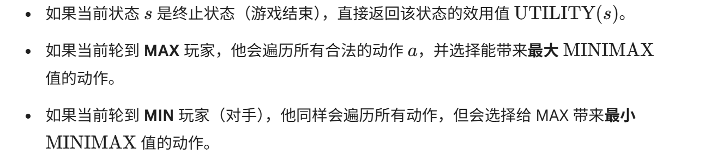
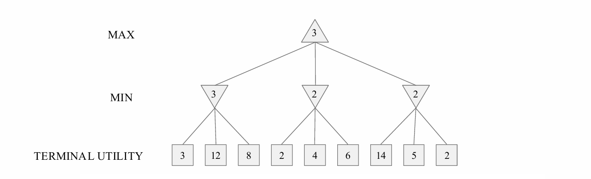
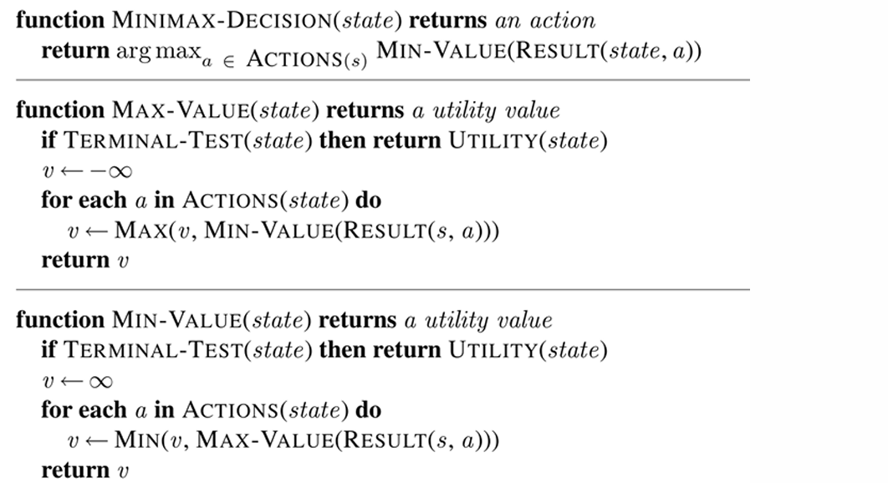
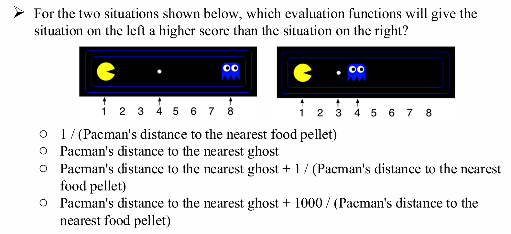
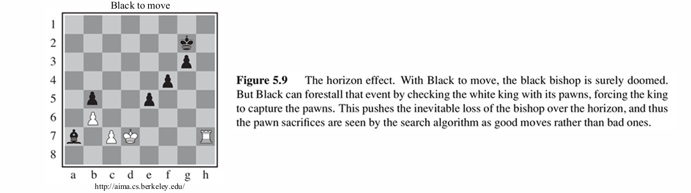
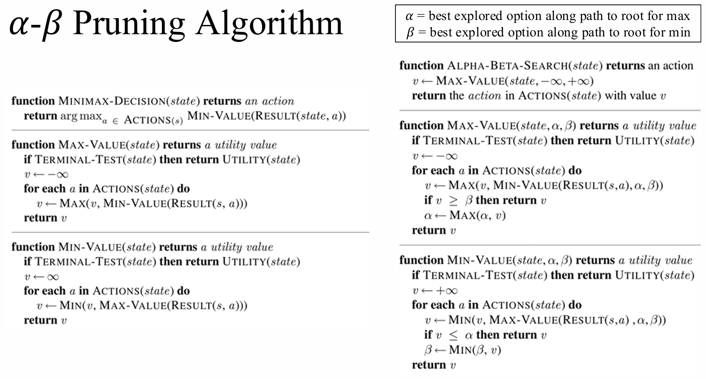
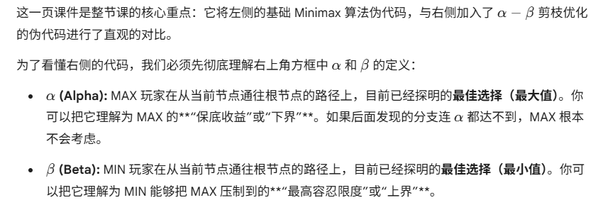
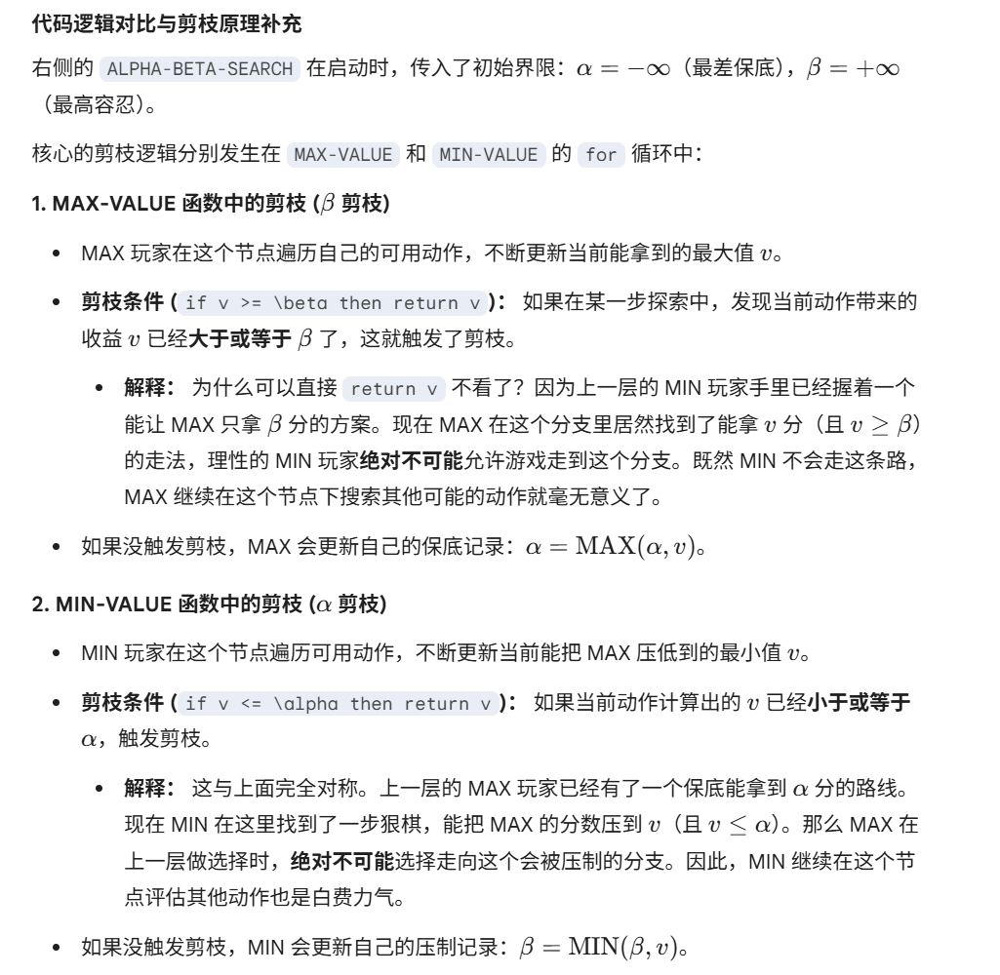

# Adversarial Search 知识梳理

# 1 对抗搜索 (Adversarial Search)
## 1.1 基础概念
### 核心定义
- 一种**多智能体竞争环境**下的搜索方法
### 核心特点
1. 我们需要在"其他智能体也在针对我们做规划"的世界中提前进行规划
2. 智能体之间的**目标存在冲突**（并非绝对冲突）
### 典型应用场景
- 国际象棋、双陆棋、井字棋等零和博弈游戏

## 1.2 博弈的形式化定义 (Game Definition)
一个博弈可以通过以下7个要素完整定义：
| 符号/函数 | 含义 |
|-----------|------|
| `s` | 状态 (States)：博弈过程中所有可能的局面 |
| `s0` | 初始状态 (Initial state)：博弈开始时的状态 |
| `Player(s)` | 玩家函数：定义在状态`s`下轮到哪个玩家行动 |
| `Actions(s)` | 动作函数：返回状态`s`下所有合法移动的集合 |
| `Result(s,a)` | 结果函数：定义在状态`s`下执行动作`a`后得到的新状态 |
| `TerminalTest(s)` | 终端测试函数：当博弈结束时返回`True`，否则返回`False` |
| `Utility(s,p)` | 效用函数：定义玩家`p`在终端状态`s`下获得的最终数值收益 |

## 1.3 博弈树 (Game Tree)
- 可以基于上述博弈定义构建出博弈树
- 博弈树的**节点**代表博弈状态
- 博弈树的**边**代表玩家的移动（动作）

---

# 2 极小极大搜索 (Minimax Search) 

## 2.1 Minimax搜索核心特性
1. 本质是一种**状态空间搜索树**
2. 博弈双方**轮流交替行动**
3. 核心目标：计算每个节点的**极小极大值 (minimax value)**
   - 定义：在对抗**理性（最优）对手**时，当前玩家能够获得的**最佳可实现效用**

## 2.2 Minimax递归公式
$$
\text{MINIMAX}(s) =
\begin{cases}
\text{UTILITY}(s) & \text{if } \text{TERMINAL-TEST}(s) \\
\max_{a \in \text{Actions}(s)} \text{MINIMAX}(\text{RESULT}(s,a)) & \text{if } \text{PLAYER}(s) = \text{MAX} \\
\min_{a \in \text{Actions}(s)} \text{MINIMAX}(\text{RESULT}(s,a)) & \text{if } \text{PLAYER}(s) = \text{MIN}
\end{cases}
$$

**最优策略 (Optimal strategy):** 该算法能够得出针对完美对手的最优策略，确保在对手不犯错的情况下获得最大可能的保底收益。

## 2.3 Minimax计算示例（三层博弈树）

### 树结构
- 顶层：MAX玩家节点（根节点）
- 中间层：MIN玩家节点（共3个）
- 底层：终端节点（共9个，标注了最终效用值）

### 计算过程（自底向上）
1. **MIN层计算**：每个MIN节点选择子节点中的**最小值**
   - 第一个MIN节点：min(3,12,8) = 3
   - 第二个MIN节点：min(2,4,6) = 2
   - 第三个MIN节点：min(14,5,2) = 2
2. **MAX层计算**：根节点（MAX）选择子节点中的**最大值**
   - 根节点：max(3,2,2) = 3
3. 最终结论：MAX玩家的最优策略是选择第一个MIN分支，可保证获得至少3的效用

## 2.4 算法整体架构

### 顶层决策函数：MINIMAX-DECISION(state)
- **输入**：当前博弈状态`state`
- **输出**：MAX玩家应采取的最优行动`action`
- **核心逻辑**：
  - 根节点永远是MAX玩家的回合
  - 对每个可能的行动，计算执行后MIN玩家回合的效用值
  - 选择能让MIN玩家返回值**最大**的那个行动（arg max操作）

### MAX玩家值计算函数：MAX-VALUE(state)
- **输入**：当前博弈状态`state`
- **输出**：该状态下MAX玩家能获得的**最大**效用值
- **执行流程**：
1. 终止条件：如果是终端状态，直接返回该状态的效用值`UTILITY(state)`
2. 初始化最大效用`v`为**负无穷**（表示初始时没有任何收益）
3. 遍历所有合法行动：
   - 递归调用`MIN-VALUE`（因为下一个轮到MIN玩家行动）
   - 不断更新`v`为当前最大值
4. 返回该节点的最终最大效用值

### MIN玩家值计算函数：MIN-VALUE(state)
- **输入**：当前博弈状态`state`
- **输出**：该状态下MIN玩家能让MAX玩家获得的**最小**效用值
- **执行流程**：
1. 终止条件：如果是终端状态，直接返回该状态的效用值`UTILITY(state)`
2. 初始化最小效用`v`为**正无穷**（表示初始时没有任何损失）
3. 遍历所有合法行动：
   - 递归调用`MAX-VALUE`（因为下一个轮到MAX玩家行动）
   - 不断更新`v`为当前最小值
4. 返回该节点的最终最小效用值

## 2.5 MinMax的关键性质

### 最优性
**核心结论**
- ❌ Minimax **不会** 导致"绝对最优玩法"
- ✅ Minimax **会** 导致"最优策略"
  - 精确定义：**仅在对手采取完美（最优）玩法时，该策略是最优的**
  - 本质：Minimax是一种**保守型策略**，它假设对手会做出对自己最不利的选择

### 核心性质总结
| 性质 | 答案与详细说明 |
|------|----------------|
| **完备性(Complete?)** | ✅ 是 对于**有限博弈树**，Minimax一定能找到解 |
| **最优性(Optimal?)** | ✅ 条件最优 仅当对手也采取最优策略时，Minimax对MAX玩家是最优的 |
| **时间复杂度** | **O(b^m)** - b：博弈树的平均分支数 - m：博弈树的最大深度 （指数级复杂度，这是Minimax最大的局限性） |
| **空间复杂度** | **O(bm)** Minimax采用**完整的深度优先搜索(DFS)** 遍历博弈树，仅需要保存当前路径上的所有节点 |

## 2.6 评估函数
### 核心定位
- 专门用于**深度受限搜索(Depth-limited Search)** 中，为**非终端节点**打分的函数
- 本质：对从给定局面开始的博弈**期望效用**的估计值
- 解决的问题：复杂博弈（如国际象棋、围棋）的完整博弈树无法遍历，必须截断搜索，用评估值代替真实的极小极大值

### 理想评估函数
- 理想情况下，评估函数`Eval(s)`应该等于该位置的**真实极小极大值**
- 博弈程序的性能**强烈依赖于评估函数的质量**，评估函数越接近真实极小极大值，程序水平越高

### 评估函数的通用数学形式
评估函数通常表示为**特征的线性加权和**：
$$
\text{Eval}(s) = w_1f_1(s) + w_2f_2(s) + \dots + w_nf_n(s)
$$
- $f_i(s)$：描述局面$s$的第$i$个特征（如棋子数量、位置优势等）
- $w_i$：对应特征的权重，表示该特征对局面优劣的影响程度

### 经典测验：吃豆人(Pacman)评估函数分析
#### 题目
判断以下哪个评估函数会给**左边的局面**比**右边的局面**更高的分数

#### 四个选项逐一计算验证
1. **选项1：$1 / (\text{Pacman到最近食物的距离})$**
   - 左边得分：$1/3 \approx 0.333$
   - 右边得分：$1/2 = 0.5$
   - 结果：$0.333 < 0.5$ → ❌ 不符合

2. **选项2：$\text{Pacman到最近幽灵的距离}$**
   - 左边得分：$7$
   - 右边得分：$3$
   - 结果：$7 > 3$ → ✅ 符合

3. **选项3：$\text{Pacman到最近幽灵的距离} + 1/(\text{Pacman到最近食物的距离})$**
   - 左边得分：$7 + 1/3 \approx 7.333$
   - 右边得分：$3 + 1/2 = 3.5$
   - 结果：$7.333 > 3.5$ → ✅ 符合

4. **选项4：$\text{Pacman到最近幽灵的距离} + 1000/(\text{Pacman到最近食物的距离})$**
   - 左边得分：$7 + 1000/3 \approx 340.333$
   - 右边得分：$3 + 1000/2 = 503$
   - 结果：$340.333 < 503$ → ❌ 不符合

#### 测验结论
- **正确答案：选项2和选项3**
- 关键启示：评估函数的权重设计至关重要，不同的权重会完全改变对局面优劣的判断

## 2.8 深度的重要性(Depth Matters)
### 核心前提
- **所有评估函数本质上都是不完美的**：它们只是对真实极小极大值的近似估计，必然存在误差

### 深度与评估函数质量的关系
- 评估函数在博弈树中**埋得越深**（即搜索深度越大），其质量对最终决策的影响就越小
- 原理：更深的搜索能让我们看到更接近终端状态的局面，评估误差被放大的程度显著降低，搜索本身可以在很大程度上弥补评估函数的不足

### 核心权衡问题
- 这是博弈AI设计中**特征复杂度**与**计算复杂度**之间的经典权衡
- 选择：是投入更多资源设计更复杂、更准确的评估函数，还是将计算资源用于增加搜索深度
- 实践结论：在大多数情况下，**增加搜索深度带来的性能提升比优化评估函数更显著**

## 2.9 地平线效应(Horizon Effect)
### 问题本质
- 这是**深度受限搜索**固有的致命缺陷
- 定义：当对手存在一个会造成严重损失且**最终不可避免**的行动时，由于搜索深度的限制，算法无法看到这个"地平线"之外的必然灾难

### 典型错误行为
- 算法会盲目采用**拖延战术**，试图暂时避免这个损失
- 但这种拖延不仅无法改变最终的坏结果，反而往往会导致**更严重的损失**

### 经典示例

在国际象棋中：
1. 你的皇后在5步后必然会被对手吃掉（这是不可避免的）
2. 如果你的搜索深度只有4步，你看不到这个最终结果
3. 算法可能会选择先送一个兵来拖延一步，让皇后被吃的时间推迟到第6步（超出搜索深度）
4. 最终结果：你不仅还是丢了皇后，还额外多丢了一个兵

### 解决思路
- 增加搜索深度（最直接但计算成本高）
- 使用**静态搜索(Quiescence Search)**：在常规搜索结束后，对存在激烈对抗（如吃子、将军）的局面继续搜索，直到局面平静下来
- 采用**迭代加深搜索**结合剪枝技术，在有限时间内尽可能提高有效搜索深度

# 3 博弈树剪枝(Game Tree Pruning)
## 3.1 α-β剪枝的动机与核心思想
### 剪枝的核心问题
- 问题：是否可以**不遍历博弈树的每一个节点**，就能计算出正确的极小极大值？
- 答案：✅ 可以
- 解决方案：**α-β剪枝(α-β Pruning)算法**

### α-β剪枝核心思想
- 利用已经计算出的部分节点值，**提前排除**那些不可能影响最终极小极大值的分支
- 本质：在不改变最终极小极大值的前提下，大幅减少需要计算的节点数量

## 3.2 α-β剪枝算法规则
### 1. Min节点剪枝规则
- 对于任意一个Min节点`n`：
  1. 在遍历`n`的子节点过程中，`n`的当前值只会**不断减小或保持不变**（因为Min玩家总是选择最小值）
  2. 定义`m`为：从根节点到当前路径上，**Max玩家在任何选择点已经能保证获得的最好值**（即α值）
  3. 剪枝触发条件：如果`n`的当前值**小于**`m`
     - 含义：即使继续遍历`n`的其他子节点，`n`的值只会变得更小，不可能超过`m`
     - 结果：Max玩家绝对不会选择走到`n`这个分支
     - 动作：**立即停止遍历`n`的剩余子节点**，直接剪枝

### 2. Max节点剪枝规则
- 对于任意一个Max节点`n`：
  1. 在遍历`n`的子节点过程中，`n`的当前值只会**不断增大或保持不变**（因为Max玩家总是选择最大值）
  2. 定义`β`为：从根节点到当前路径上，**Min玩家在任何选择点已经能保证获得的最好值**（即Min能让Max得到的最差值）
  3. 剪枝触发条件：如果`n`的当前值**大于**`β`
     - 含义：即使继续遍历`n`的其他子节点，`n`的值只会变得更大，不可能小于`β`
     - 结果：Min玩家绝对不会选择走到`n`这个分支
     - 动作：**立即停止遍历`n`的剩余子节点**，直接剪枝

## 3.3 α-β剪枝关键性质
### 根节点值的绝对正确性
α-β剪枝**不会改变**最终计算出的极小极大值，和完整Minimax搜索的结果完全一致
### 效率提升：
   - 最好情况（节点按最优顺序排列）：时间复杂度从O(b^m)降低到O(b^(m/2))，相当于搜索深度翻倍
   - 平均情况：能剪去约一半的节点

### 中间节点值的局限性
- ❌ 剪枝后，**中间节点的值可能是错误的/不完整的**
- 原因：剪枝会跳过部分子节点的计算，导致中间节点没有得到完整的极小极大值
- 重要后果：**简单版本的α-β剪枝不适合直接用于动作选择**
  - 我们无法确定哪个子动作对应根节点的正确极小极大值
  - 实际应用中需要对顶层动作单独处理，确保能选出正确的最优动作

### α-β剪枝效率的关键
#### 核心结论
- α-β剪枝的**有效性高度依赖于状态的检查顺序**
- 剪枝效果差异极大：从几乎不剪枝（最坏顺序）到剪去约一半的节点（最优顺序）

#### 最优策略
- **排序决定效率 (highly dependent on the order in which states are examined):** 剪枝能剪掉多少分支，完全取决于你发现“好选项”的速度。如果你运气很差，每次都最后才评估到最好的走法，那么几乎不会触发任何剪枝，算法的耗时会退化得和普通 Minimax 一样长。
- **优先探索最优解 (examine first the successors that are likely best):** 为了最大化剪枝效率，AI 在展开一个节点的子动作时，不应该随机顺序展开，而应该利用启发式评估函数先给动作排个序，把看起来最厉害的杀招（比如吃子的动作、将军的动作）放在最前面优先搜索。这样可以极快地拉高 $\alpha$ 或压低 $\beta$，从而大面积砍掉后续的平庸分支。

#### 时间复杂度对比（必背）
| 算法 | 时间复杂度（需检查的节点数） | 等效有效搜索深度 |
|------|------------------------------|------------------|
| 完整Minimax搜索 | $O(b^m)$ | $m$ |
| α-β剪枝（最优移动顺序） | $O(b^{m/2})$ | $2m$ |

- 最坏情况：如果子节点按最坏顺序排列（最优节点最后检查），α-β剪枝将无法剪去任何节点，时间复杂度退化为$O(b^m)$，与完整Minimax相同
- 实际应用中，通常使用启发式方法进行移动排序（如国际象棋中优先检查吃子、将军等动作），以接近最优的剪枝效果

## 3.4 算法介绍

