# Constraint Satisfaction Problems 知识梳理
**你看懂了吗？反正我没有**

# 1 约束满足问题 Constraint Satisfaction Problems
## 1.1 CSP 概述
- CSP 使用**因子化表示**来描述状态：
  - 一组变量，每个变量都对应一个值。
- 问题被解决的条件是：每个变量都被赋予一个值，并满足特定的约束。
- CSP 通常可以被更高效地求解：
  - 通过识别违反约束的变量/值组合，能够**大幅削减搜索空间**。

## 1.2 CSP 的形式化定义

一个 CSP 由以下三个组成部分构成：

**变量集合**

\[
X = \{X_1, X_2, \dots, X_n\}
\]

- 表示问题中需要赋值的所有变量。

**值域集合**

\[
D = \{D_1, D_2, \dots, D_n\}
\]

- 每个变量 \(X_i\) 对应一个值域 \(D_i\)，表示该变量可以取的所有可能值。
  \[
  D_i = \{v_1, v_2, \dots, v_k\}
  \]

**约束集合**

\[
C
\]

- 规定变量之间允许的值组合。
- 可以是**一元约束**（单个变量）、**二元约束**（两个变量）或**高阶约束**。

## 1.3 CSP 的状态空间

- 为了求解 CSP，需要定义其状态空间。
- 每个状态由**部分或全部变量的一组赋值**构成：
  \[
  \{X_i = v_i, X_j = v_j, \dots\}
  \]
- 状态空间中包含所有可能的赋值组合。

## 1.4 CSP 的解

**一致性赋值**

- 如果当前赋值**没有违反任何约束**，则称该赋值为**一致的**（Consistent）。

**完全赋值**

- 如果**每个变量都被赋予了一个值**，则称该赋值为**完全的**（Complete）。

**解的定义**

- 一个**解**是**既一致又完全的赋值**。
- 即：所有变量都被赋值，并且所有约束都被满足。


## 1.5 典型 CSP 示例

- **数独**：变量为每个格子，值域为 1–9，约束为行、列、宫格内数字不重复。
- **地图着色**：变量为地区，值域为颜色，约束为相邻地区颜色不同。
- **八皇后**：变量为每列的皇后行位置，约束为皇后互不攻击。

---

# 2 澳大利亚地图着色问题 Australia - Map Coloring
## 2.1 问题定义

变量（Variables）：代表澳大利亚的各个州和领地
X = {WA(西澳), NT(北领地), Q(昆士兰), NSW(新南威尔士), V(维多利亚), SA(南澳), T(塔斯马尼亚)}
值域（Domains）：每个变量可以被赋予的颜色
D = {red(红), green(绿), blue(蓝)}
约束（Constraints）：相邻的区域必须颜色不同
隐式约束：用逻辑关系表示，如 SA != WA（南澳和西澳颜色不同）
显式约束：用合法的颜色组合表示，如 (SA, WA) ∈ {(red, green), (green, red), ...}
**核心目标**
为每个州分配一种颜色，使得所有相邻州的颜色都不相同，同时只用最少的颜色（在这个例子里只用了 3 种颜色）。

## 2.2 约束图（Constraint Graph）
为了更直观地理解问题结构，我们可以把约束满足问题转化为一个约束图。
**节点（Nodes）：** 图中的每个节点对应一个变量（也就是澳大利亚的一个州）
**边（Arcs）：** 边代表两个节点之间存在约束关系（即这两个州是相邻的）
这个图清晰地展示了哪些州之间有相邻约束，其中南澳（SA）是关键节点，它与除塔斯马尼亚（T）之外的所有州都相邻。
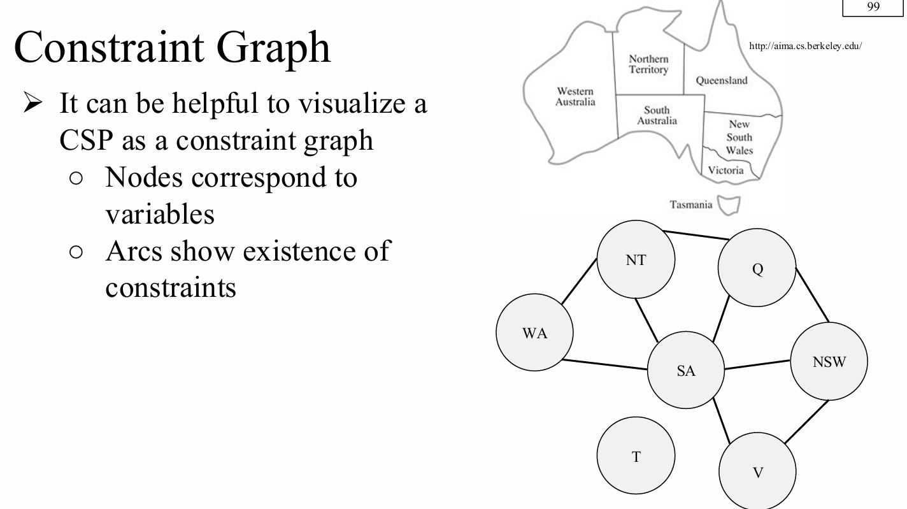

## 2.3 求解约束满足问题（Solving CSPs）
我们可以从一个最朴素的方法入手，把它看作一个状态空间搜索问题。
**1. 状态定义**
初始状态：一个空的分配集合 {}，此时没有任何州被赋予颜色
后继函数：选择一个未被赋值的变量，为它分配一个值域中的颜色
目标测试：检查当前的颜色分配是否完整（所有州都有颜色）且一致（所有相邻州的颜色都不同）
**2. 方法说明**
这种朴素的回溯搜索是基础思路，但实际中我们会用更高效的优化技巧，例如：
向前检验（Forward Checking）：在赋值后，立刻从相邻变量的值域中删除冲突的颜色
最少剩余值启发式（MRV）：优先选择当前值域中可选值最少的变量进行赋值
度启发式（Degree Heuristic）：优先选择与其他未赋值变量约束最多的变量（如南澳 SA）

---

# 3 BFS & DFS
## 3.1 广度优先搜索（BFS）
**1. 核心逻辑**
- 分层扩展：从初始状态（无任何颜色分配）出发，逐层为未赋值的州分配颜色。
- 状态树结构：
  - 根节点：空的颜色分配集合。
  - 第一层：仅为第一个州（如西澳 WA）分配红、绿、蓝三种颜色的状态。
  - 第二层：在第一层的基础上，为第二个州（如北领地 NT）分配颜色，生成新的状态。
- 解的位置：所有合法解都出现在搜索树的最底层，因为只有当所有州都被分配颜色后，才能验证是否满足所有约束。

**2. 关键缺陷**
课件中标注 “This calls for DFS :-("，指出 BFS 的核心问题：
- 空间复杂度极高：需要存储每一层的所有状态，对于包含 7 个变量的地图着色问题，状态数量会指数级增长，很快耗尽内存。
- 效率低下：必须扩展到树的最底层才能找到解，对于大规模 CSP 问题不具备实用性。

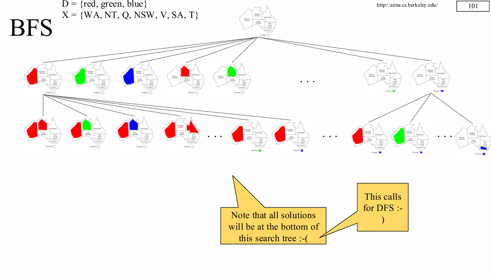

## 3.2 深度优先搜索（DFS）
**1. 核心逻辑**
- 深度扩展：沿着一条状态路径尽可能深入扩展，直到遇到冲突或找到解。
- 状态路径示例：先为 WA 分配红色，再为 NT 分配红色，接着为 Q 分配红色…… 直到发现相邻州颜色冲突。
- 回溯机制：当遇到冲突时，回退到上一个未赋值的变量，尝试其他颜色。

**2. 关键缺陷**
课件中标注 “Early mistake...”，指出 DFS 的核心问题：
- 早期错误选择的代价高：如果在搜索早期为某个变量选择了不合适的颜色，可能需要深入搜索多层后才发现冲突，导致大量无效计算。
- 纯 DFS 效率低：缺乏启发式引导时，容易陷入无效路径，需要结合优化策略（如最少剩余值启发式、向前检验）提升效率。


---

# 4 回溯搜索（Backtracking Search）
## 4.1 设计思想
**算法定位**
回溯搜索是求解 CSP 的基础算法，它通过针对性的剪枝策略，解决了纯 DFS 盲目探索的低效问题，是后续更高级 CSP 求解算法的核心框架。
**核心设计思想**
课件中提出了两个关键优化思路，大幅提升了搜索效率：
- 单次仅处理一个变量
  - 由于变量的赋值顺序是可交换的（例如先给西澳 WA 赋值红色、再给北领地 NT 赋值绿色，与先给 NT 赋值绿色、再给 WA 赋值红色的结果等价），因此在每个搜索节点上，只需为一个未赋值变量尝试值域中的值。
  - 这一设计避免了对变量赋值顺序的冗余探索，直接缩小了搜索空间。

- 仅保留合法赋值
  - 为变量赋值时，只选择不与已赋值变量冲突的值（例如 WA 已选红色，相邻的 NT 就不能选红色）。
  - 采用增量式目标测试：每一步赋值后立即检查一致性，而非等到所有变量赋值完成后再整体验证，这样可以提前发现冲突并回溯，避免无效的深度探索。

**算法本质**
回溯搜索 = 深度优先搜索（DFS） + 上述两个优化规则
它继承了 DFS“深度优先、回溯剪枝” 的框架，但通过 “单变量聚焦” 和 “合法赋值筛选”，有效避免了纯 DFS 的盲目性。

## 4.2 伪代码
```
function BACKTRACKING-SEARCH(csp) returns a solution or failure
    return BACKTRACK(csp, {})

function BACKTRACK(csp, assignment) returns a solution or failure
    if assignment is complete then return assignment
    var ← SELECT-UNASSIGNED-VARIABLE(csp, assignment)
    for each value in ORDER-DOMAIN-VALUES(csp, var, assignment) do
        if value is consistent with assignment then
            add {var = value} to assignment
            inferences ← INFERENCE(csp, var, assignment)
            if inferences ≠ failure then
                add inferences to csp
                result ← BACKTRACK(csp, assignment)
                if result ≠ failure then return result
                remove inferences from csp
            remove {var = value} from assignment
    return failure
```

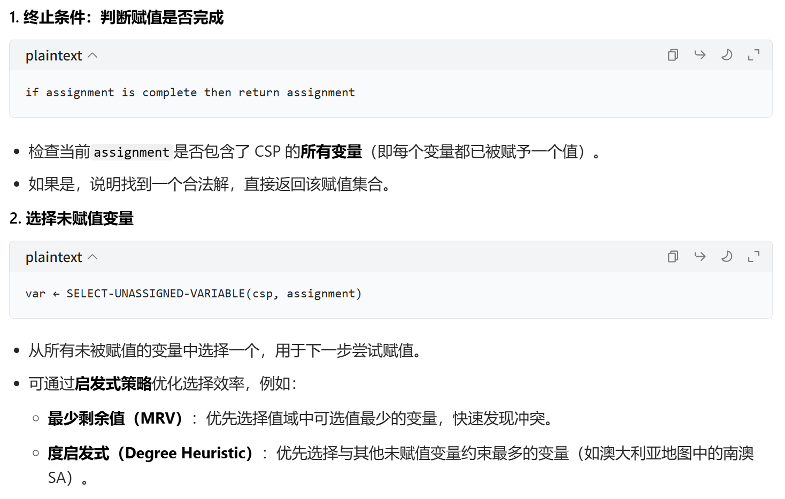
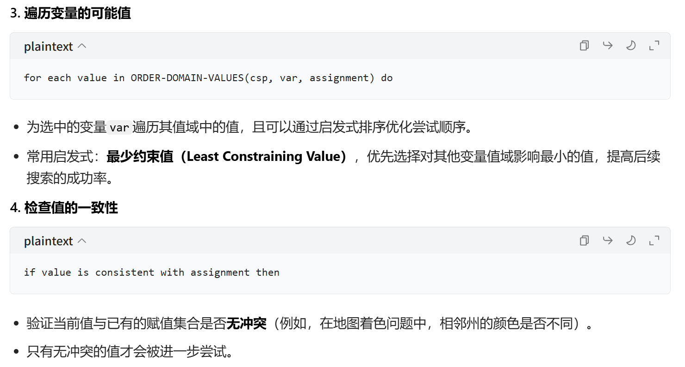
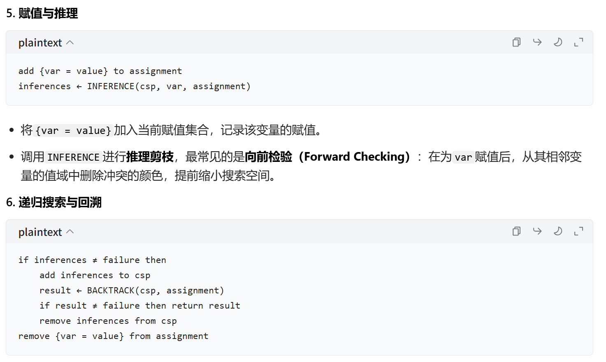
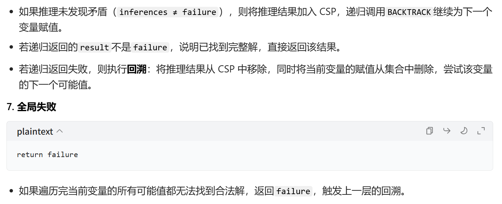

## 4.3 澳大利亚地图着色实例讲解
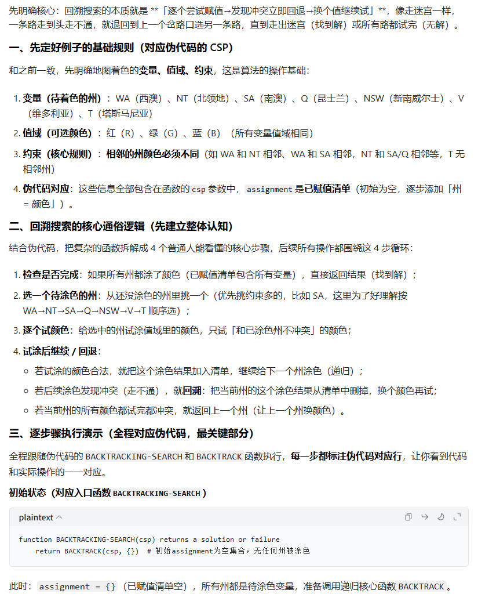
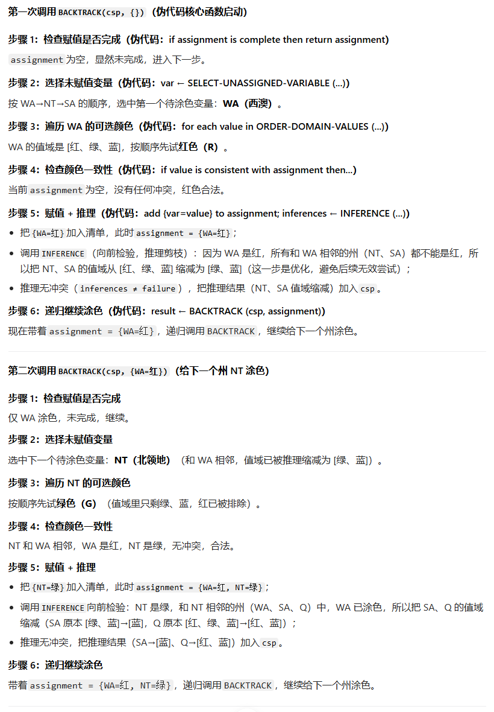
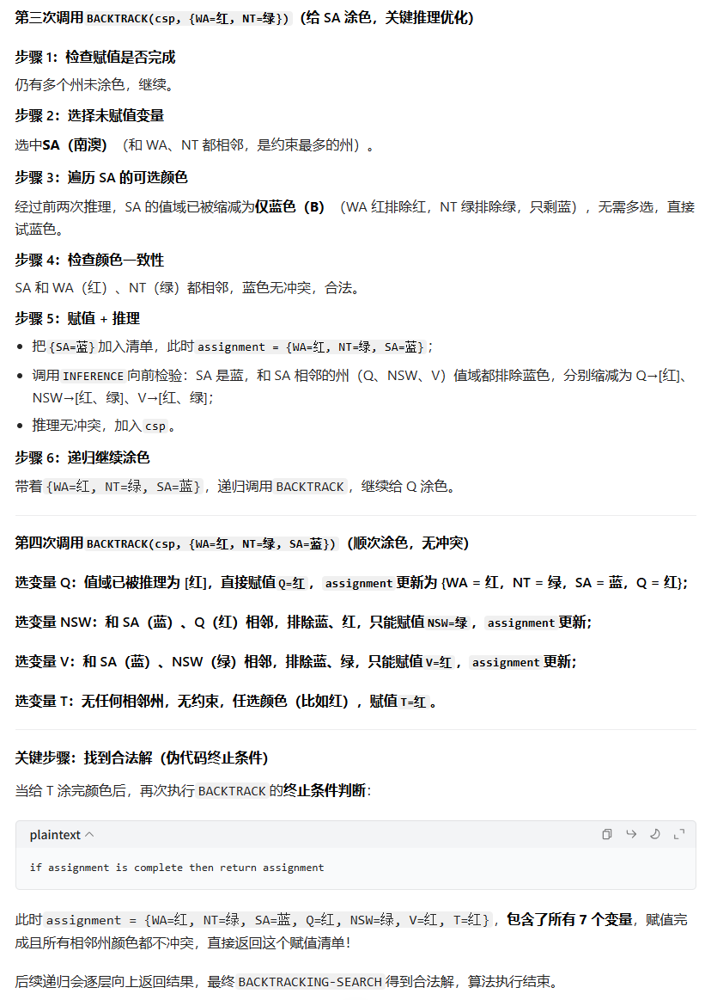
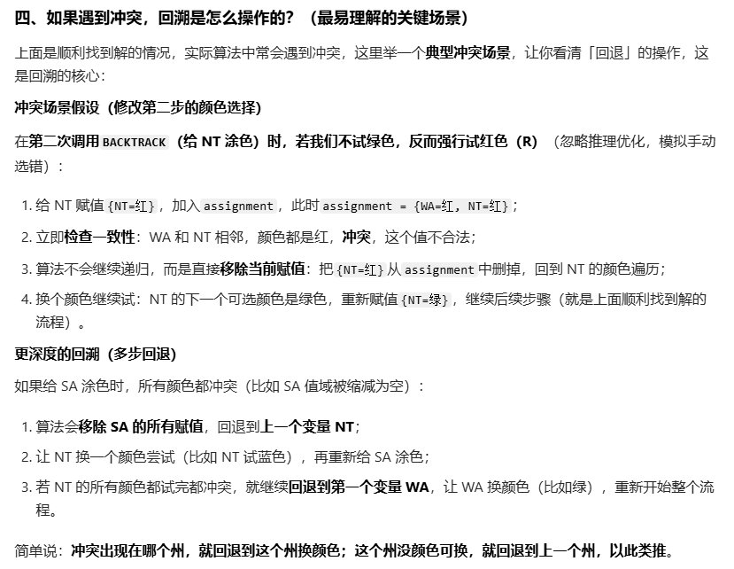
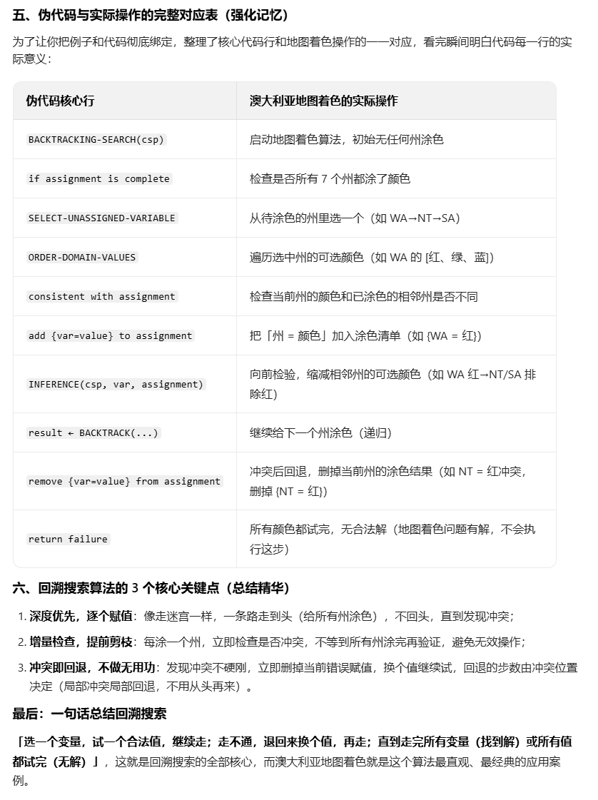

---

# 5 向前检验（Forward Checking）
## 5.1 核心优化思路
**1. 问题背景**
纯回溯搜索的低效源于 “冲突发现太晚”—— 往往需要深入搜索多层后，才发现当前路径存在冲突，导致大量无效计算。
**2. 优化目标**
提前检测不可避免的失败，在搜索早期就剪枝无效路径，减少冗余探索。
**3. 两种核心技术**
- 向前检验（Forward Checking, FC）：基础的动态值域维护技术。
- 约束传播（Constraint Propagation, 如 AC-3 算法）：更强的约束推理技术，可发现更隐蔽的冲突。

## 5.2 过滤技术与向前检验
1. 过滤（Filtering）的本质
过滤是一类动态维护值域的技术，核心逻辑是：
跟踪所有未赋值变量的值域，主动划掉那些与当前赋值冲突的 “无效选项”，持续缩小后续搜索的空间。
它的作用是让冲突更早暴露，避免后续尝试无效的值。

2. 向前检验（Forward Checking）的定义
向前检验是最常用的过滤技术之一，具体操作是：
每当为一个变量赋值后，立即检查所有与它直接相邻的未赋值变量，并从这些变量的值域中，划掉会与当前赋值冲突的值。

3. 结合澳大利亚地图着色的直观演示
PPT 中的表格和地图展示了向前检验的完整执行过程（以 WA→NT→Q 的赋值顺序为例）：

| 步骤	| 赋值操作	| 向前检验的动作	| 值域变化（表格对应行）|
| --- | ---------- | ------------- | ------------------- |
| 1	| 为 WA（西澳）赋值红色	| 检查 WA 的相邻变量（NT、SA），从它们的值域中划掉红色	| NT、SA 的值域从 {红、绿、蓝} 变为 {绿、蓝}（表格第 2 行：NT、SA 的红色块被划掉） |
| 2	| 为 NT（北领地）赋值绿色	| 检查 NT 的相邻变量（SA、Q），从它们的值域中划掉绿色	| SA 的值域从 {绿、蓝} 变为 {蓝}；Q 的值域从 {红、绿、蓝} 变为 {红、蓝}（表格第 3 行：SA 的绿色块被划掉，Q 的绿色块被划掉） |
| 3	| 为 Q（昆士兰）赋值蓝色	| 检查 Q 的相邻变量（SA、NSW），从它们的值域中划掉蓝色	| SA 的值域从 {蓝} 变为空集（表格第 4 行：SA 的蓝色块被划掉，无剩余可选值） |


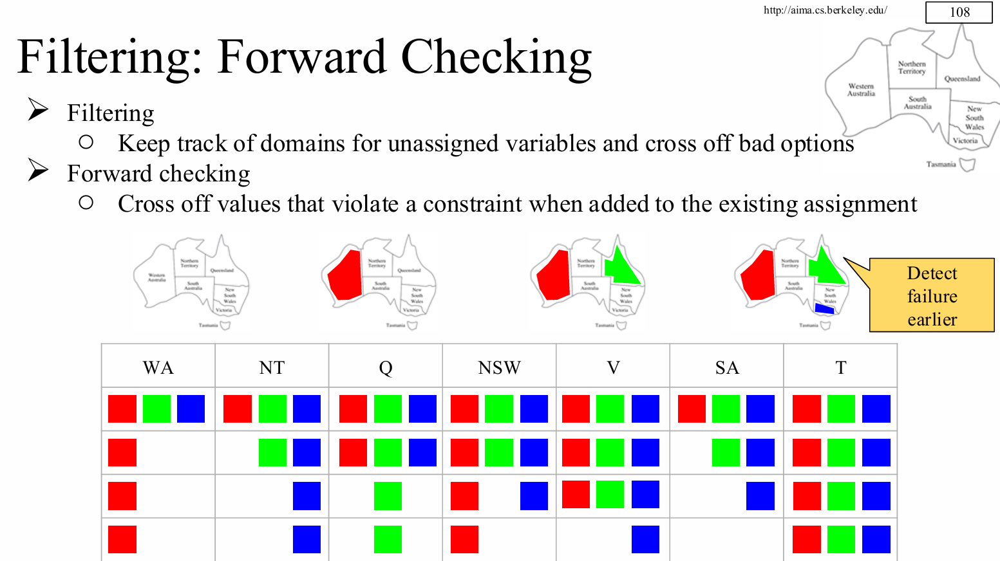
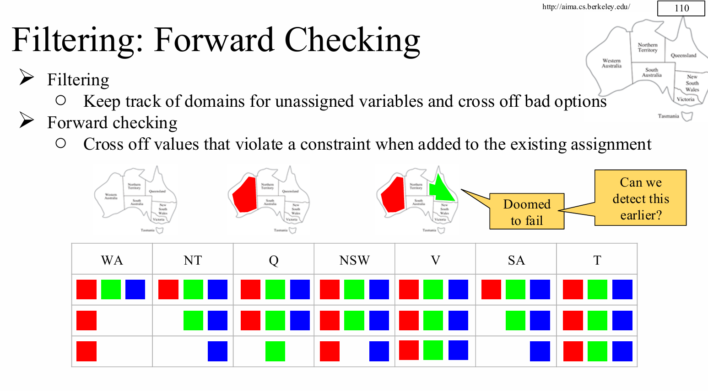

## 5.3 关键价值与局限性
**1. 向前检验的核心价值**
- 提前剪枝：在第 3 步赋值后，SA 的值域被清空，算法立即发现 “Doomed to fail（注定失败）”，无需继续深入搜索，直接触发回溯，大幅减少无效计算。
- 动态维护值域：通过持续缩小未赋值变量的值域，让后续变量的可选值更少，冲突更容易被发现。

**2. 向前检验的局限性**
它仅处理直接相邻变量的约束，对于间接约束冲突（如通过多个变量传递的冲突）无法提前发现。例如，若 SA 的值域未被清空，但后续赋值仍会引发冲突，向前检验无法提前识别，此时需要更强的约束传播技术（如 AC-3）

---

# 6 弧一致性（AC-3）算法
## 6.1 弧一致性（Arc Consistency）
**1. 核心定义**
对于一条弧 X → Y（代表变量 X 与 Y 之间的约束关系），弧一致性的条件是：
对于尾部变量 X 的每一个可能值 x，在头部变量 Y 的值域中，都存在至少一个值 y，使得 (x, y) 的组合不违反 X 与 Y 之间的约束。
直观理解：如果 X 选了值 x，Y 必须有合法的值可以选，否则 x 就是无效的，需要从 X 的值域中删除（对应 PPT 中的 “Delete from tail!”）。
示例（地图着色）：
以弧 WA → NT 为例：
WA 的值域包含红色，那么 NT 的值域中必须存在与红色不冲突的值（如绿色、蓝色），这条弧才是一致的。
如果 WA 的值域中有一个值（如红色），但 NT 的值域中没有任何合法值与之匹配，那么红色就会被从 WA 的值域中删除。
**2. 提出背景**
弧一致性由 Alan Mackworth 教授提出，是约束传播技术的理论基础，它通过动态维护变量值域的合法性，提前剪枝无效值。

## 6.2 约束传播（Constraint Propagation）
**1. 核心逻辑**
约束传播的本质是反复强制所有弧保持一致性的过程：
初始时，检查所有弧的一致性，删除尾部变量中的无效值。
当一个变量的值域被修改（如删除了某个值），它的所有邻居变量的弧都需要重新检查一致性（因为这些弧可能变得不一致）。
重复上述过程，直到没有更多值可以从任何变量的值域中删除。

**2. 关键特性**

**① 弧可能变得不一致（Arcs can become inconsistent）**
当变量 X 的值域被删减（比如删掉一个值），所有以 X 为 “头（head）” 的弧（即 Z → X，Z 是 X 的邻居），它们的一致性可能被破坏。
通俗例子：假设之前弧 NT → Q 是一致的（NT 的绿可以匹配 Q 的红），但如果 Q 的值域里的红被删掉了，现在 NT 的绿在 Q 里找不到合法匹配，这条弧就变得不一致了，需要重新处理。
课件里的箭头就是弧，当某个变量（如 WA）的值变化，所有和它相连的弧（如 WA→NT、NT→WA）都要重新检查。
**② 弧一致性比前向检查更早检测失败**
前向检查：只检查 “已赋值变量 ↔ 相邻未赋值变量” 的约束，容易漏检深层死路；
弧一致性（约束传播）：检查所有变量对的约束，能更早发现某个变量值域为空的情况，直接判定当前路径无解，不用走到最后才回溯。
**③ 运行时机：预处理 or 每次赋值后**
约束传播有两种典型用法：
预处理（Preprocessor）：在开始回溯搜索前，先对整个问题做一次完整的弧一致性检查，大幅剪枝无效选项，减少后续搜索空间；
增量式（After each assignment）：每次给变量赋值后，先更新值域，再运行约束传播，进一步剪枝，提前发现死路。

**3. 约束传播的完整流程（初学者版）**
我们用地图着色问题，模拟约束传播的迭代过程：
- 初始化：把所有变量对的弧（如 WA→NT、NT→WA、NT→Q…）加入队列。
- 取出弧：从队列中取出一条弧 X → Y。
- 检查一致性：对于 X 值域里的每个值 x，是否存在 Y 值域里的 y，使得 (x, y) 满足 “颜色不同” 的约束。
处理不一致：
  - 如果 X 的某个值 x，在 Y 里找不到合法匹配，就删掉 x（从 X 的值域中移除）；
  - 如果 X 的值域被清空，说明问题无解，直接返回失败；
  - 如果 X 的值域有变化，把所有以 X 为头的弧（即 Z → X，Z 是 X 的邻居）重新加入队列，因为这些弧的一致性可能被破坏了。
- 迭代：重复步骤 2-4，直到队列为空（所有弧都一致），或者检测到失败。

## 6.3 AC-3 算法

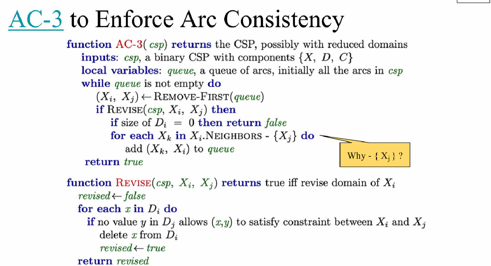
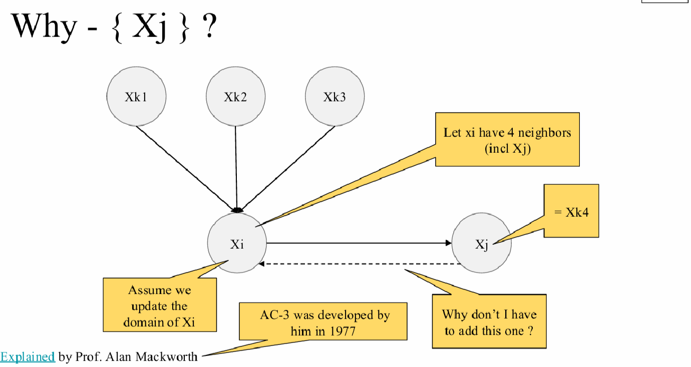
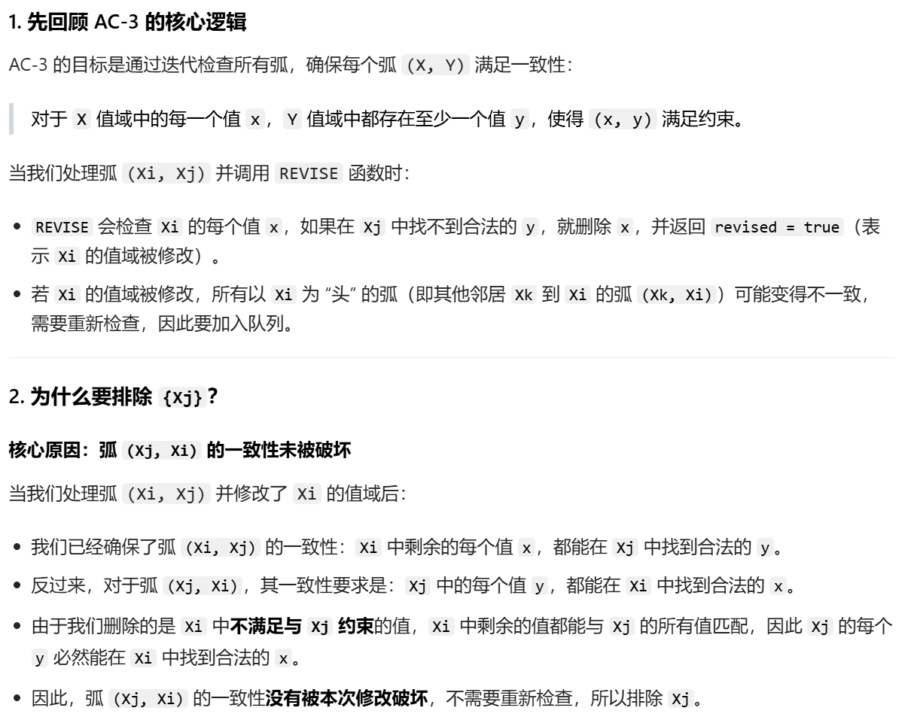
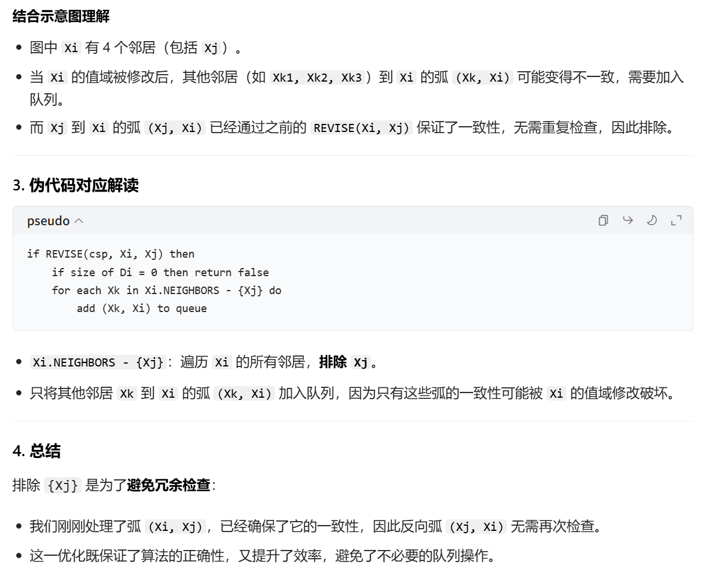

---

# 7 回溯搜索的进阶优化
**核心背景：为什么需要排序策略？**
纯回溯 + 前向检查的缺陷：若随机选择 “下一个赋值的变量” 或 “变量的赋值顺序”，极易进入无效搜索分支，导致大量回溯。排序策略的目标是：主动选择最 “高效” 的变量和值，提前规避死路，最小化搜索空间。

## 7.1 变量排序（Variable Ordering）
变量排序解决的问题：在每一步回溯中，优先给哪个未赋值变量赋值？ 课件提供了 “MRV 主策略 + Degree 平局策略” 的组合方案。

### 7.1.1 最小剩余值（MRV）
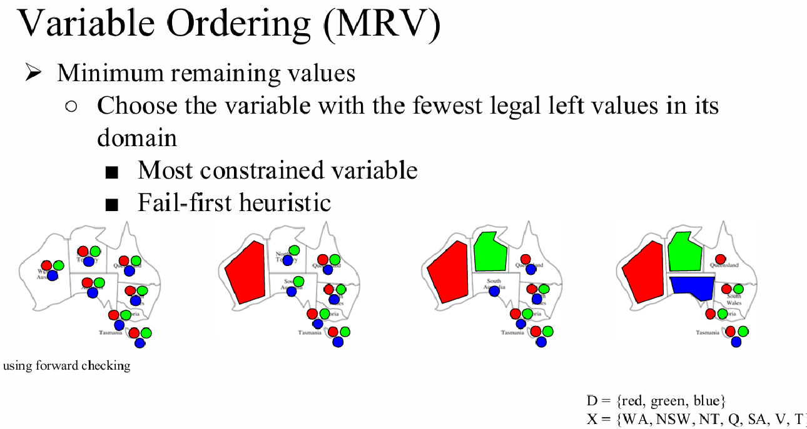
**定义（课件原文）**
选择值域中合法值数量最少的未赋值变量（也叫 “最受约束变量”），属于 **“失败优先（Fail-first）” 启发式 **。
**核心逻辑（为什么有效？）**
值域越小的变量，越容易快速发现 “无解” 的情况，从而提前回溯，避免在无效路径上浪费计算资源；
若某变量值域只剩 1 个值，优先赋值可直接确定结果，减少分支。
**课件图示解读（Slide 117）**
图示展示了前向检查下的 MRV 执行过程：
初始状态：所有州的候选颜色（彩色圆点）数量不同；
MRV 选择：优先给候选颜色最少的州（如红色填充的 SA，初始值域可能仅剩 1 种颜色）赋值；
赋值后：通过前向检查剪枝相邻州的冲突颜色，逐步缩小搜索范围。

### 7.1.2 度数启发式（Degree）
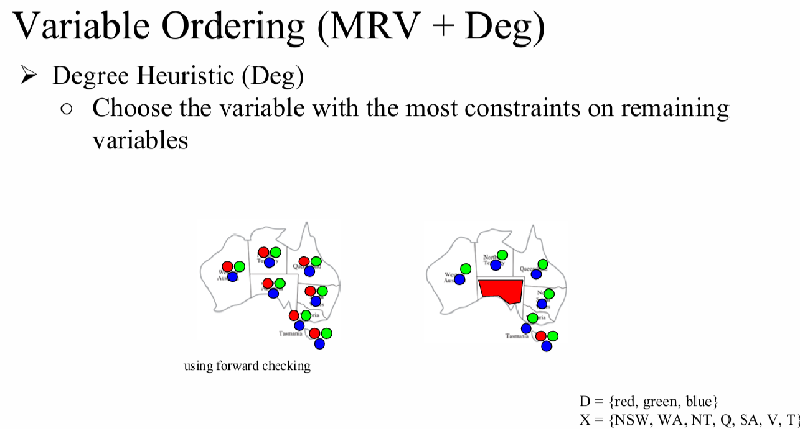
**定义（课件原文）**
当多个变量满足 MRV（剩余值数量相同）时，选择对剩余未赋值变量约束最多的变量（即相邻未赋值变量数量最多的变量）。
**核心逻辑（为什么有效？）**
优先处理 “连接性最强” 的变量，能最大程度地通过前向检查剪枝后续变量的值域，从根源上减少搜索分支。
**课件图示解读（Slide 118）**
图示对比了 MRV 与 MRV+Degree 的效果：
仅用 MRV 时，可能选择约束较少的州；
加入 Degree 后，优先选择了相邻未赋值州最多的 SA（红色填充），赋值后对 NT、Q、NSW、V 等多个州的候选颜色进行剪枝，剪枝效率远高于前者。

## 7.2 值排序（Value Ordering）：最少约束值（LCV）
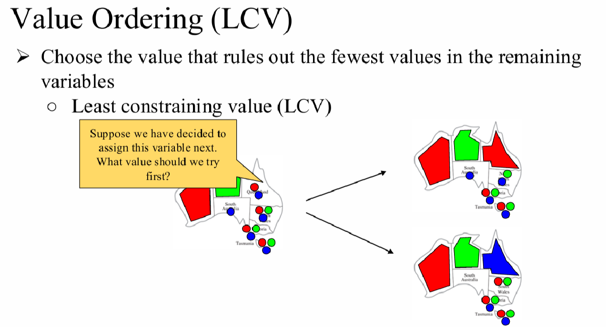
**定义（课件原文）**
选择对剩余未赋值变量的合法值域 “排除最少” 的值。
**核心逻辑（为什么有效？）**
与 MRV 的 “失败优先” 相反，LCV 是“成功优先”：优先选择 “最宽容” 的值，给后续变量留下更多赋值空间，降低后续出现无解的概率，减少回溯次数。
**课件图示解读（Slide 119）**
图示场景：已确定下一个赋值的变量，需要选择初始尝试的颜色：
- 两个候选值（红色 / 蓝色）对应不同的剪枝效果；
- 选择蓝色时，对相邻未赋值州的候选颜色排除更少（剩余彩色圆点更多），即 LCV 选择；
- 优先尝试该值，能最大化后续变量的赋值可能性，避免因过早选择 “严格值” 导致的无效回溯。
