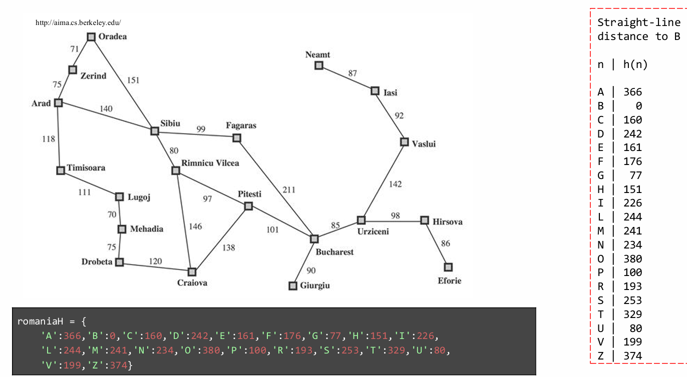
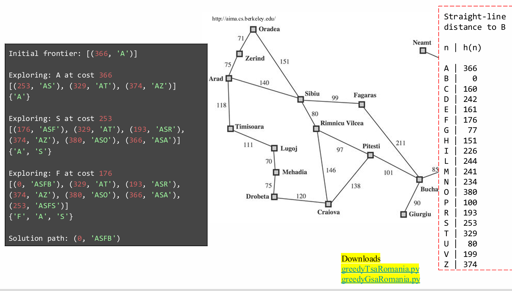
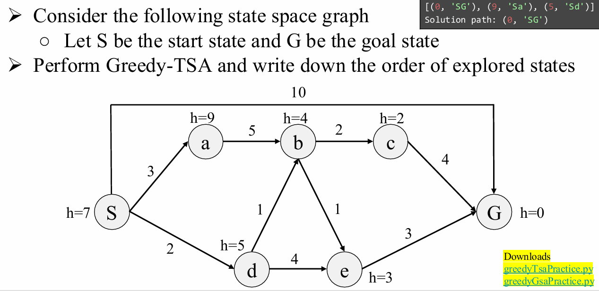
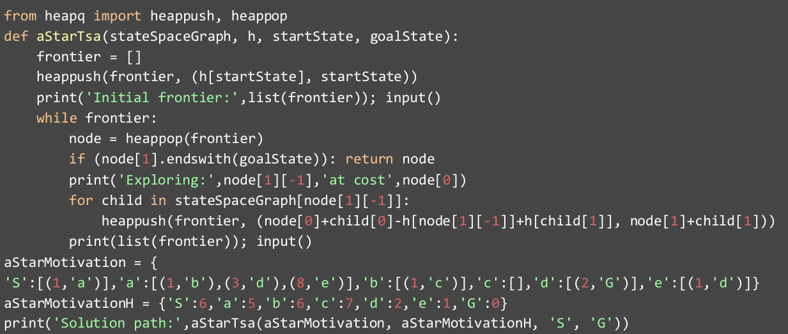
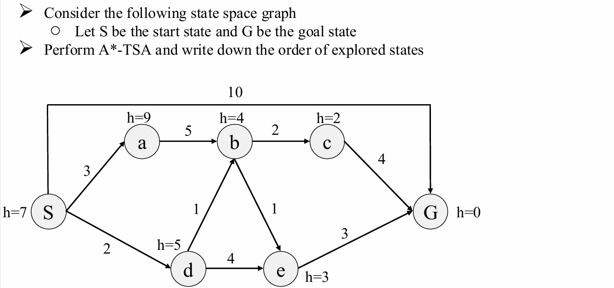
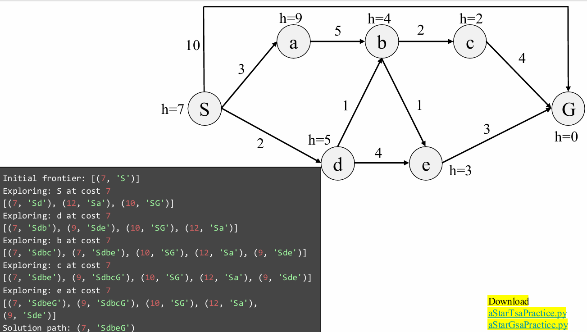

# Informed Search 知识梳理

# 1 启发式搜索

## 1.1 启发式搜索概述

- **启发式搜索**（Informed Search）比无信息搜索策略更高效地找到解。
- 它利用了问题定义之外的**问题特定知识**：
  - **启发函数**（Heuristic Function）
- **常见算法示例**：
  - 贪心最佳优先搜索（Greedy best-first search）
  - A* 搜索（A* search）

## 1.2 启发函数定义与作用

- **启发函数**是一个**估计当前状态到目标状态接近程度**的函数。
- 它是为**特定搜索问题**设计的。
- **表示方式**：\( h(n) \)
  - 表示从节点 \( n \) 所代表的状态到目标状态的**估计最低代价路径**的代价。
  - 若 \( n \) 是目标节点，则 \( h(n) = 0 \)。

**核心要点总结**

| 概念               | 说明                                                 |
| ------------------ | ---------------------------------------------------- |
| 启发式搜索         | 使用启发信息指导搜索方向，提高效率                   |
| 启发函数\( h(n) \) | 问题相关的估计函数，评估到目标的距离                 |
| 应用场景           | 适用于有额外领域知识的问题（如路径规划、拼图问题等） |
| 经典算法           | 贪心最佳优先搜索、A* 搜索等                          |

---

# 2 贪心搜索（Greedy Search）

## 2.1 贪心搜索（Greedy Search）介绍

贪心搜索，也称为最佳优先搜索（Best-first Search），是一种启发式搜索算法。它的核心思想是在每一步都选择当前看起来“最优”的节点进行扩展，而不考虑全局的路径代价。具体来说，它总是扩展启发函数 h(n) 值最小的节点，其中 h(n) 表示从节点 n 到目标节点的估计代价（通常为直线距离、曼哈顿距离等）。

**算法特点：**

- 只关注当前最优：仅根据当前节点的启发式值做决策。
- 不保证最优解：可能找到的是次优路径。
- 可能陷入局部最优：由于只考虑当前估计，可能会被误导。
- 时间复杂度较低：通常比系统化搜索（如 BFS、DFS）更快找到解。

## 2.2 罗马尼亚寻路问题


**Python实现**

```
from heapq import heappush, heappop  # 导入堆队列算法，用于实现优先队列

def greedyTsa(stateSpaceGraph, h, startState, goalState):
    """
    贪心搜索算法实现（仅使用启发函数h(n)）
  
    参数:
    stateSpaceGraph: 状态空间图，字典形式，键为当前状态，值为(边权, 后继状态)列表
    h: 启发函数字典，存储每个状态到目标状态的估计代价
    startState: 起始状态
    goalState: 目标状态
  
    返回:
    包含路径总代价和完整路径的元组
    """
    # 使用优先队列（最小堆）作为边界集（frontier）
    frontier = []
    # 将起始状态加入边界集，优先级为启发函数值h(startState)
    heappush(frontier, (h[startState], startState))
    print('初始边界集:', list(frontier))
    input()  # 暂停，等待用户按回车继续（便于调试观察）
  
    while frontier:
        # 从边界集中弹出启发值最小的节点（贪心选择）
        node = heappop(frontier)
      
        # 检查是否到达目标状态（通过路径字符串的末尾判断当前状态）
        if node[1].endswith(goalState):
            return node  # 返回找到的解决方案
      
        print('正在探索:', node[1][-1], '启发值:', node[0])
      
        # 扩展当前节点的所有子节点
        for child in stateSpaceGraph[node[1][-1]]:
            # child格式: (边权, 子节点状态)
            # 注意：这里完全忽略实际路径代价g(n)，只使用启发值h(n)
            # 将子节点添加到边界集，使用其启发值作为优先级
            heappush(frontier, (h[child[1]], node[1] + child[1]))
      
        print('边界集:', list(frontier))
        input()  # 暂停，等待用户按回车继续（便于调试观察）

# 罗马尼亚地图的状态空间表示
# 格式: '当前状态': [(边权1, '相邻状态1'), (边权2, '相邻状态2'), ...]
romania = {
    'A': [(140, 'S'), (118, 'T'), (75, 'Z')],   # Arad连接到Sibiu, Timisoara, Zerind
    'Z': [(75, 'A'), (71, 'O')],                # Zerind连接到Arad, Oradea
    'O': [(151, 'S'), (71, 'Z')],               # Oradea连接到Sibiu, Zerind
    'T': [(118, 'A'), (111, 'L')],              # Timisoara连接到Arad, Lugoj
    'L': [(70, 'M'), (111, 'T')],               # Lugoj连接到Mehadia, Timisoara
    'M': [(75, 'D'), (70, 'L')],                # Mehadia连接到Drobeta, Lugoj
    'D': [(120, 'C'), (75, 'M')],               # Drobeta连接到Craiova, Mehadia
    'S': [(140, 'A'), (99, 'F'), (151, 'O'), (80, 'R')],  # Sibiu连接到Arad, Fagaras, Oradea, Rimnicu Vilcea
    'R': [(146, 'C'), (97, 'P'), (80, 'S')],    # Rimnicu Vilcea连接到Craiova, Pitesti, Sibiu
    'C': [(120, 'D'), (138, 'P'), (146, 'R')],  # Craiova连接到Drobeta, Pitesti, Rimnicu Vilcea
    'F': [(211, 'B'), (99, 'S')],               # Fagaras连接到Bucharest, Sibiu
    'P': [(101, 'B'), (138, 'C'), (97, 'R')],   # Pitesti连接到Bucharest, Craiova, Rimnicu Vilcea
    'B': []                                      # Bucharest是目标状态，没有出边
}

# 各城市到Bucharest的直线距离（启发函数h(n)）
# 这些值来自课件中的表格
romaniaH = {
    'A': 366, 'B': 0, 'C': 160, 'D': 242, 'E': 161, 'F': 176, 'G': 77, 'H': 151, 'I': 226,
    'L': 244, 'M': 241, 'N': 234, 'O': 380, 'P': 100, 'R': 193, 'S': 253, 'T': 329, 'U': 80,
    'V': 199, 'Z': 374
}

# 执行贪心搜索，从Arad到Bucharest
print('解决方案路径:', greedyTsa(romania, romaniaH, 'A', 'B'))


```

**算法执行过程说明:**

1. 从起始状态'A'开始，h(A)=366
2. 每次选择边界集中h(n)最小的节点扩展
3. 路径记录在node[1]中，如'A' -> 'AS' -> 'ASF'等
4. 当找到包含'B'的路径时，算法终止

注意：这是一个纯贪心算法：

- 完全忽略实际路径代价（边权）
- 仅使用启发值h(n)做决策
- 可能不是最优解，也不保证能找到解（虽然在这个例子中能）
- 可能陷入无限循环（如果状态空间有环且没有适当处理）

示例运行的可能路径:
A -> S (h=253) -> F (h=176) -> B (h=0)
最终返回: (0, 'ASFB')



## 2.3 练习



```
from heapq import heappush, heappop
def greedyTsa(stateSpaceGraph, h, startState, goalState): 
    frontier = []
    heappush(frontier, (h[startState], startState))
    print('Initial frontier:',list(frontier)); input()
    while frontier:
        node = heappop(frontier)
        if (node[1].endswith(goalState)): return node
        print('Exploring:',node[1][-1],'at cost',node[0])
        for child in stateSpaceGraph[node[1][-1]]:
            heappush(frontier, (h[child[1]], node[1]+child[1]))
        print(list(frontier)); input()
practice = {
    'S':[(3,'a'),(2,'d'),(10,'G')],'a':[(5,'b')],
    'd':[(1,'b'),(4,'e')],'G':[],'b':[(1,'e'),(2,'c')],
    'e':[(3,'G')],'c':[(4,'G')]}
practiceH = {'S':7,'a':9,'b':4,'c':2,'d':5,'e':3,'G':0}
print('Solution path:',greedyTsa(practice, practiceH, 'S', 'G'))

```

---

# 3 A* 搜索

## 3.1 A* 搜索介绍


## 3.2 罗马尼亚寻路问题

**Python实现**


```
from heapq import heappush, heappop  # 导入堆队列模块，用于实现优先队列

def aStarTsa(stateSpaceGraph, h, startState, goalState):
    """
    A* 搜索算法实现
  
    参数:
    stateSpaceGraph: 状态空间图，字典格式 {状态: [(代价, 下一状态), ...]}
    h: 启发函数字典，存储每个状态到目标的估计代价
    startState: 起始状态
    goalState: 目标状态
  
    返回:
    包含总代价和完整路径的元组 (f_cost, path_string)
    """
    frontier = []  # 边界集（优先队列），存储待探索节点
    # 将起始状态加入边界集，初始f(n) = g(n) + h(n) = 0 + h[startState]
    heappush(frontier, (h[startState], startState))
    print('初始边界集:', list(frontier))
    input()  # 暂停，便于观察执行过程
  
    while frontier:
        # 从边界集中弹出f(n)最小的节点（A*核心：选择f值最小的节点）
        node = heappop(frontier)
      
        # 检查是否到达目标状态（通过路径字符串末尾判断）
        if node[1].endswith(goalState):
            return node  # 返回解决方案 (总代价, 路径)
      
        # 输出当前探索的节点
        print('正在探索:', node[1][-1], '代价为', node[0])
      
        # 扩展当前节点的所有子节点
        for child in stateSpaceGraph[node[1][-1]]:
            # child格式: (g_cost, next_state)，其中g_cost是到下一状态的实际代价
          
            # 核心计算公式推导：
            # 已知：当前节点 node 的 f(n) = g(node) + h(node)
            # 现在要计算子节点 child 的 f(child) = g(child) + h(child)
            # 而 g(child) = g(node) + child[0] (node到child的实际代价)
          
            # 从 node[0] = f(node) = g(node) + h(node) 可得：
            # g(node) = node[0] - h(node)
            # 因此：g(child) = (node[0] - h(node)) + child[0]
            # 最终：f(child) = g(child) + h(child) 
            #              = (node[0] - h(node) + child[0]) + h(child)
            #              = node[0] + child[0] - h(node) + h(child)
          
            current_state = node[1][-1]  # 当前状态（路径字符串最后一个字符）
            new_f_cost = node[0] + child[0] - h[current_state] + h[child[1]]
          
            # 将子节点加入边界集，使用新的f值作为优先级
            heappush(frontier, (new_f_cost, node[1] + child[1]))
      
        print('边界集:', list(frontier))
        input()  # 暂停，便于观察执行过程

# 图例中的状态空间图（A*动机示例）
# 对应图中的结构：
# S → a → d → G
#   ↳ b → c
#   ↳ e
aStarMotivation = {
    'S': [(1, 'a')],        # S 到 a，代价为1
    'a': [(1, 'b'), (3, 'd'), (8, 'e')],  # a 到 b(1), d(3), e(8)
    'b': [(1, 'c')],        # b 到 c，代价为1
    'c': [],                # c 是终点（无后继）
    'd': [(2, 'G')],        # d 到 G，代价为2
    'e': [(1, 'd')]         # e 到 d，代价为1
}

# 各状态到目标G的启发函数值（直线距离估计）
# 注意：这些值来自图中的h(n)标注
aStarMotivationH = {
    'S': 6,   # 图中标注 h=6
    'a': 5,   # 图中标注 h=5
    'b': 6,   # 估计值
    'c': 7,   # 估计值
    'd': 2,   # 图中标注 h=2
    'e': 1,   # 图中标注 h=1
    'G': 0    # 目标状态启发值为0
}

# 执行A*搜索，从S到G
print('解决方案路径:', aStarTsa(aStarMotivation, aStarMotivationH, 'S', 'G'))

```

**算法执行过程详解（对应图中的步骤）：**

1. 初始边界集: [(6, 'S')]

   - f(S) = g(S) + h(S) = 0 + 6 = 6
2. 探索 S (代价6):

   - 扩展 S → a
   - 计算 f(a) = g(a) + h(a) = (0+1) + 5 = 6
   - 新边界集: [(6, 'Sa')]
3. 探索 a (代价6):

   - 扩展 a → b: f(b) = g(b) + h(b) = (1+1) + 6 = 8
   - 扩展 a → d: f(d) = g(d) + h(d) = (1+3) + 2 = 6
   - 扩展 a → e: f(e) = g(e) + h(e) = (1+8) + 1 = 10
   - 新边界集: [(6, 'Sad'), (8, 'Sab'), (10, 'Sae')]
4. 探索 d (代价6):

   - 扩展 d → G: f(G) = g(G) + h(G) = (4+2) + 0 = 6
   - 新边界集: [(6, 'SadG'), (10, 'Sae'), (8, 'Sab')]
5. 找到目标 G (代价6):

   - 返回: (6, 'SadG')

路径: S → a → d → G
总代价: 6

**关键点说明：**

1. 这个例子展示了A*如何结合g(n)和h(n)进行搜索
2. 公式 node[0] + child[0] - h[node[1][-1]] + h[child[1]] 等价于:
   f(child) = g(child) + h(child)
   = (g(parent) + edge_cost) + h(child)
   = (f(parent) - h(parent) + edge_cost) + h(child)
3. 算法优先扩展f值最小的节点，平衡了实际代价和估计代价

## 3.3 练习



```
from heapq import heappush, heappop  
def aStarGsa(stateSpaceGraph, h, startState, goalState): 
    frontier = []
    heappush(frontier, (h[startState], startState))
    exploredSet = set()
    print('Initial frontier:',list(frontier)); input()
    while frontier:
        node = heappop(frontier)
        if (node[1].endswith(goalState)): return node
        if node[1][-1] not in exploredSet:
            print('Exploring:',node[1][-1],'at cost',node[0])
            exploredSet.add(node[1][-1])
            for child in stateSpaceGraph[node[1][-1]]:
                heappush(frontier, (node[0]+child[0]-h[node[1][-1]]+h[child[1]], node[1]+child[1]))
            print(list(frontier)); print(exploredSet); input()
practice = {
    'S':[(3,'a'),(2,'d'),(10,'G')],'a':[(5,'b')],
    'd':[(1,'b'),(4,'e')],'G':[],'b':[(1,'e'),(2,'c')],
    'e':[(3,'G')],'c':[(4,'G')]}
practiceH = {'S':7,'a':9,'b':4,'c':2,'d':5,'e':3,'G':0}
print('Solution path:',aStarGsa(practice, practiceH, 'S', 'G'))

```



## 3.4 A* 的最优性

### 3.4.1 可采纳性（Admissibility）

- **定义**：启发函数 \( h(n) \) 是可采纳的（也称为“乐观估计”），当满足：
  \[
  0 \leq h(n) \leq h^*(n)
  \]
  其中 \( h^*(n) \) 是从节点 \( n \) 到最近目标节点的真实代价。
- **含义**：

  - 可采纳启发式永远不会高估到达目标的代价。
  - 它是“乐观的”，意味着它估计的代价总是小于或等于实际最优代价。

### 3.4.2 一致性（Consistency）

- **定义**：启发函数 \( h \) 是一致的，如果对于图中的每一条弧 \( (a \rightarrow c) \)，满足：
  \[
  h(a) - h(c) \leq \text{cost}(a \text{ to } c)
  \]
  等价形式：
  \[
  h(a) \leq \text{cost}(a \text{ to } c) + h(c)
  \]
- **一致性带来的性质**：

  - 沿任何路径的 \( f \) 值（\( f(n) = g(n) + h(n) \)）是**非递减**的。
  - 一致性是可采纳性的**更强条件**，所有一致的启发式都是可采纳的（在目标节点 \( h=0 \) 时）。
- **思考题**：

  - 如果 \( f \) 值沿路径从不减少，能否证明 A* 图搜索算法（GSA）是最优的？
  - 答：是的，这是 A* 最优性的关键保证之一。

### 3.4.3 A* 搜索的最优性（Optimality of A*）


