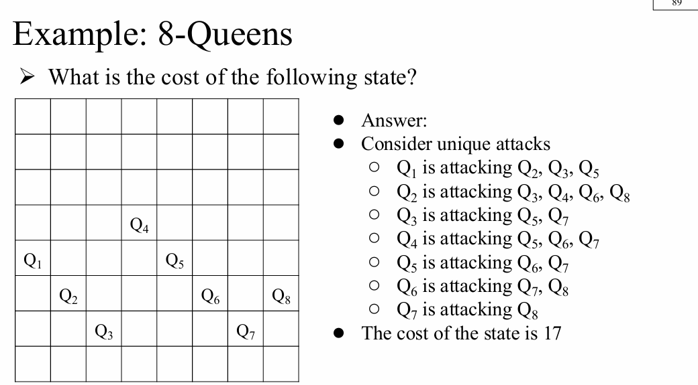
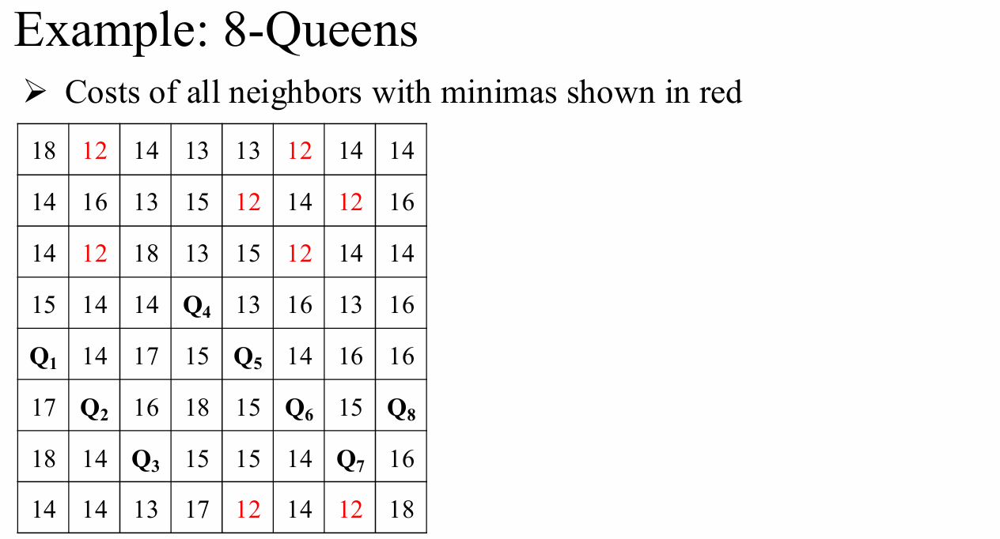
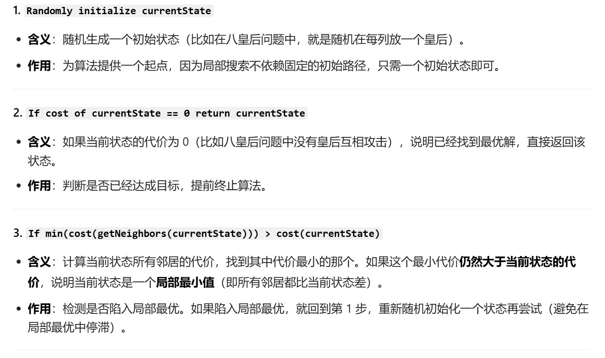
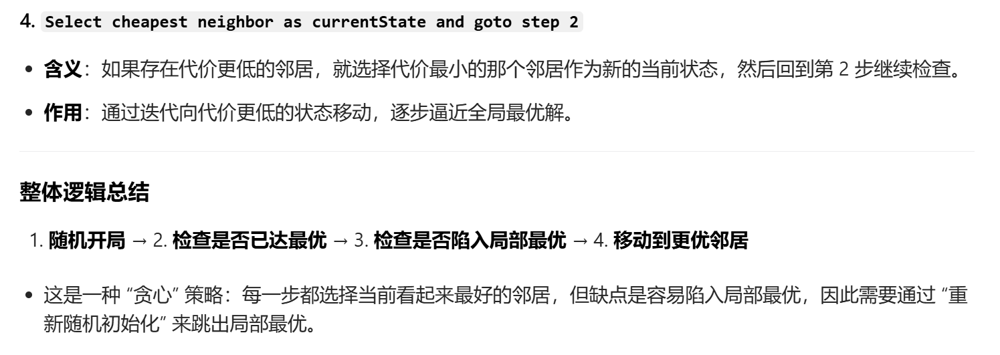

# Local Search 知识梳理

# 1 规划（Planning）与识别（Identification）

## 1.1 规划（Planning）

- **定义**：聚焦于**动作的序列**，核心是找到从初始状态到目标状态的完整路径。
- **关键特点**：
  - 通往目标的**路径本身是核心**，不同路径会有不同的成本（Cost）和深度（Depth）。
  - 通常需要借助**启发式（Heuristics）**来引导搜索方向，并通过**边界集（Frontier）**保留备选路径作为回溯备份。
- **典型场景**：机器人导航、路径寻路（如A*算法），这类问题中“如何一步步到达终点”和路径代价同样重要。

## 1.2 识别（Identification）

- **定义**：聚焦于**变量的赋值**，核心是找到满足条件的目标状态本身。
- **关键特点**：
  - 目标状态本身是重点，**路径无关紧要**——只要能找到符合约束的解，不需要关心是如何找到的。
- **典型场景**：数独求解、图着色问题，这类问题只需要最终的正确赋值，无需记录推导过程。

## 1.3 两者的核心区别

| 维度       | 规划               | 识别               |
| ---------- | ------------------ | ------------------ |
| 关注重点   | 动作序列与路径代价 | 目标状态的变量赋值 |
| 路径重要性 | 高                 | 无                 |
| 典型算法   | A*、Dijkstra       | 局部搜索、爬山法   |

---

# 2 局部搜索（Local Search）

## 2.1 核心思想

- **定义**：局部搜索算法不会系统性地探索从初始状态出发的所有路径，而是**仅评估和修改当前状态**，通过迭代优化来逼近目标。
- **适用场景**：适用于**只关心解的状态、不关心路径代价**的识别类问题。

## 2.2 核心优势

1. **内存占用极低**
   - 不需要维护整个搜索树或路径历史，只需存储当前状态，在大规模问题中优势明显。
2. **在大状态空间中效率高**
   - 无需遍历所有可能路径，通过局部迭代快速找到可行解，适合处理数独、图着色等状态空间极大的问题。

## 2.3 补充说明

- 局部搜索的“非系统性”意味着它无法保证找到全局最优解，也可能陷入局部最优，但在实际应用中，它通常能在合理时间内找到满足需求的解，是识别类问题的高效工具。

---

# 3 八皇后问题（8-Queens）

## 3.1 问题建模

**1. 状态（States）**
每个状态对应棋盘上的一种皇后布局，每列恰好放置 1 个皇后。
这种设定可以减少问题的复杂度，因为我们只需在列内调整皇后的位置。
**2. 后继状态（Successors）**
后继状态指：将任意一个皇后在其所在列内移动到其他任意空位后得到的新布局。
例如，移动第 1 列的皇后到该列的其他 7 个空位，就会产生 7 个新的后继状态。
**3. 代价函数（Cost function）**
定义为互相攻击的皇后对的数量（包括直接攻击和间接攻击）。
攻击的判定标准：同一行、同一对角线的皇后都会互相攻击。
目标是让代价函数的值降至 0，即实现所有皇后互不攻击。

## 3.2 代价计算示例

以图中的状态为例，我们逐一统计攻击对：
Q₁ 攻击 Q₂、Q₃、Q₅ → 3 对
Q₂ 攻击 Q₃、Q₄、Q₆、Q₈ → 4 对
Q₃ 攻击 Q₅、Q₇ → 2 对
Q₄ 攻击 Q₅、Q₆、Q₇ → 3 对
Q₅ 攻击 Q₆、Q₇ → 2 对
Q₆ 攻击 Q₇、Q₈ → 2 对
Q₇ 攻击 Q₈ → 1 对
将所有攻击对相加：3+4+2+3+2+2+1 = 17因此，该状态的代价为 17。


## 3.3 后继状态数量（邻居数量）

- 每个皇后所在的列有 8 个位置，而它当前占据 1 个，所以每个皇后有 7 种移动选择。
- 棋盘上共有 8 个皇后，因此总的后继状态数量为：7 × 8 = 56 个。

## 3.4 邻居状态的代价评估

- 图中表格展示了所有 56 个邻居状态的代价。
- 其中，代价为 12 的状态是当前的局部最优解，已用红色标出。
- 局部搜索算法会选择代价最小的邻居状态，进入下一步迭代，直到找到代价为 0 的全局最优解。
  

## 3.5 伪代码

```
Randomly initialize currentState
If cost of currentState == 0 return currentState
If min(cost(getNeighbors(currentState))) > cost(currentState)
  goto step 1 (we have reached a local minimum)
Select cheapest neighbor as currentState and goto step 2
```




## 3.6 局部搜索的表现分析

**一、核心实验结论**
从随机生成的初始状态出发，局部搜索算法在八皇后问题上的表现如下：

- 成功率仅 14%：有 86% 的概率会陷入局部最优解，无法找到全局最优（即代价为 0 的状态）。
- 迭代步数极少：
  - 成功找到解时，平均只需要 4 步
  - 陷入局部最优时，平均仅需要 3 步

**二、关键解读**
这个结果非常值得关注：

- 高失败率的原因：局部搜索（如爬山法）是贪心策略，容易陷入局部最优。在八皇后问题中，大量的局部最优解会阻碍算法找到全局最优。
- 效率的亮点：尽管成功率低，但只要算法开始迭代，就能在几步内快速收敛（无论成功还是失败）。这在百万级别的状态空间里是相当高效的表现。
- 改进方向：为了提升成功率，通常会引入 ** 随机重启（Random Restart）** 策略：一旦陷入局部最优，就重新随机初始化状态再次尝试。多次尝试后，整体成功率可以接近 100%。
