# Uninformed Search 知识梳理

**由宇宙无敌帅Hyperloop汇总**

# 1 引入

## 1.1 搜索类型（Types of Search）

1. **无信息搜索（Uninformed Search）**

   - 除了问题定义外，不提供任何额外信息
2. **有信息搜索（Informed Search）**

   - 使用启发式信息，以提升到达目标状态的总体性能
3. **局部搜索（Local Search）**

   - 评估并修改当前状态，逐步接近目标状态
4. **约束满足问题（Constraint Satisfaction Problems, CSP）**

   - 通过更好地理解状态，可以更快地搜索解
5. **对抗搜索（Adversarial Search）**

   - 在有对手存在的情况下进行搜索

## 1.2 搜索问题定义（Search Problem Definition）

- **状态（States）**：描述一个状态的构成内容
- **初始状态（Initial State）**：智能体开始时的状态
- **动作与转移模型（Actions and Transition Model）**
  - 描述可用的可能动作
  - 描述每个动作的效果
- **目标测试（Goal Test）**：判断给定状态是否为目标状态
- **路径代价（Path Cost）**：为每条路径分配一个零或正数值成本的函数

**解（Solution）**：是一系列动作（即一个计划），将初始状态转换为目标状态

## 1.3 N皇后问题示例（N Queens Puzzle - An Example Problem）

### 问题定义 A

- **状态**：棋盘上任意摆放 0 到 n 个皇后
- **初始状态**：棋盘上没有皇后
- **动作与转移模型**：在空位放置一个皇后
- **目标测试**：棋盘上有 n 个皇后，且互不攻击

### 问题定义 B

- **状态**：每列一个皇后，且互不攻击
- **初始状态**：棋盘上没有皇后
- **动作与转移模型**：在一个空列中放置一个皇后，且不与其他皇后冲突
- **目标测试**：棋盘上有 n 个皇后

### 思考问题（Task）

- **任务**：比较两种 N 皇后问题的状态空间大小
  - 问题定义 A 的状态空间
  - 问题定义 B 的状态空间
- 问题定义 B 通过限制每列只放一个皇后且不冲突，显著减少了状态空间的大小，搜索效率更高。

## 1.4 状态空间（State Space）

- 状态空间是从初始状态出发，通过任意动作序列可达的所有状态的集合。
  - 通常以图的形式表示
  - 可能的动作序列构成一棵搜索树
- **节点**表示状态，**节点间的连接**表示动作
- **解**是从初始状态到目标状态的一条动作序列（即路径）

## 1.5 状态空间图 vs. 搜索树（State Space Graph vs. Search Tree）

### 状态空间图（State Space Graph）

- 搜索问题的数学表示
  - **节点**：表示（抽象的）世界配置
  - **弧**：表示后继状态（动作的结果）
  - **目标测试**：是一组目标节点
- **关键特性**：
  - 每个状态只出现一次（无重复状态）

### 搜索树（Search Tree）

- **根节点**：表示起始状态
- **节点**：表示可能的动作序列（即路径）
- **关键特性**：
  - 同一个状态可能在树的不同分支中多次出现

## 1.6 状态与状态序列（States vs. State Sequences）

- 巨大的状态空间会导致状态序列的数量极其庞大
  - 例如，搜索树中的节点数量会非常巨大
- **示例：国际象棋**
  - 克劳德·香农在其 1950 年论文《编程计算机下棋》中估算：
    - 可能的状态数量：约 \(10^{43}\) 个
    - 可能的状态序列数量：约 \(10^{120}\) 个

> “世界上所有人头上的头发总数约为 \(10^{15}\) 根，地球上的沙粒总数约为 \(10^{23}\) 颗，宇宙中的原子总数约为 \(10^{81}\) 个。而一盘典型的国际象棋对局数比所有这些数字相乘还要大得多——对于 32 个木制棋子在棋盘上的排列来说，这是一个令人印象深刻的数字。”

---

# 2 无信息搜索（Uninformed Search）

## 2.1 搜索策略

### 2.1.1 定义 (Search Strategy)

搜索策略决定了**节点扩展（Node Expansion）**的顺序，即在搜索树中发现节点的先后次序。

### 2.1.2 评估搜索策略的四个维度

评估一个搜索算法的性能，通常从以下四个方面衡量：

* **完备性 (Completeness)**：如果问题存在解，算法是否保证能找到？
* **最优性 (Optimality)**：算法是否总能找到代价最小（最优）的解？
* **时间复杂度 (Time Complexity)**：算法生成节点所需的总数。
* **空间复杂度 (Space Complexity)**：算法执行过程中在内存中存储节点的最高数量。

### 2.1.3 复杂度度量指标

算法的复杂度通常由以下三个关键参数决定：

* **$b$ (Maximum branching factor)**：搜索树的最大分支因子（即每个节点的最大子节点数）。
* **$d$ (Distance to root of the shallowest solution)**：从根节点到最浅解的距离（深度）。
* **$m$ (Maximum length of any path in the state space)**：状态空间中任何路径的最大长度。

### 2.1.4 无启发式搜索 (Uninformed Search / Blind Search)

此类策略仅使用问题定义中提供的信息，而不具备任何关于目标距离的额外感知（即“盲目”搜索）。

**常见示例：**

1. **宽度优先搜索 (BFS - Breadth-first search)**
2. **深度优先搜索 (DFS - Depth-first search)**
3. **代价一致搜索 (UCS - Uniform-cost search)**

### 2.1.5 搜索算法的两种基本形式

搜索算法在具体实现时通常分为两种主要的“风格”：

* **树搜索算法 (Tree Search Algorithm, TSA)**：不记录已访问的状态，可能会导致重复访问。
* **图搜索算法 (Graph Search Algorithm, GSA)**：维护一个“已探索集”（Closed List），记录已访问过的节点，避免陷入循环。

## 2.2 罗马尼亚寻路问题 (Romania Problem)

### 问题背景

罗马尼亚寻路问题是一个经典的**形式化搜索问题**。其目标是找到从初始城市到目标城市（布加勒斯特）的最短路径。
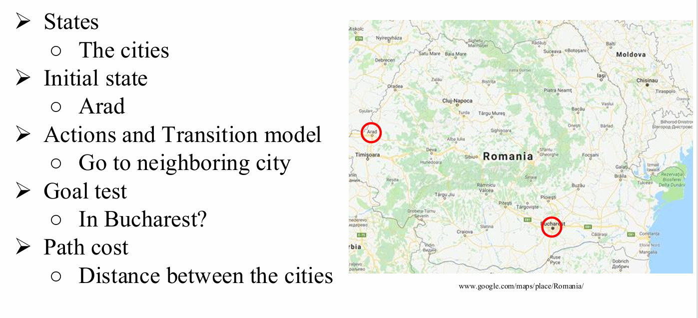

### 问题定义的五个组成部分 (Problem Definition)

根据图片内容，该问题可以形式化为以下五个要素：

* **状态 (States)**：地图上的各个城市。
* **初始状态 (Initial state)**：起始点，即 **阿拉德 (Arad)**。
* **动作与转移模型 (Actions and Transition model)**：从当前城市移动到相邻的城市。
* **目标测试 (Goal test)**：判断当前是否已到达 **布加勒斯特 (Bucharest)**？
* **路径代价 (Path cost)**：城市之间的道路距离（即图中边上的权重数字）。

### 状态空间 (State Space)

状态空间通常以**图 (Graph)** 的形式展示，其中：

* **节点 (Nodes)**：代表各个城市。
* **边 (Edges)**：代表城市间的连接道路。
* **权重 (Weights)**：边上的数字代表两城之间的实际公里数（例如：Arad 到 Sibiu 的代价是 140）。

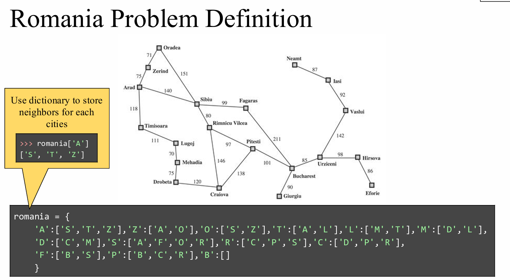

### 程序化实现 (Data Representation)

在实际编程（如 Python）中，通常使用**字典（Dictionary）**或**邻接表**来存储地图数据：

* **存储方式**：将每个城市作为键（Key），将其邻居城市组成的列表作为值（Value）。
* **代码示例**：
  ```python
  romania = {
      'A': ['S', 'T', 'Z'], # 阿拉德的邻居是 Sibiu, Timisoara, Zerind
      'Z': ['A', 'O'],      # Zerind 的邻居是 Arad, Oradea
      # ... 以此类推
  }
  ```

---

# 3 广度优先搜索 (Breadth-first search)

## 3.1 树搜索算法（TSA）——广度优先搜索版本

### 3.1.1 Python 中的队列

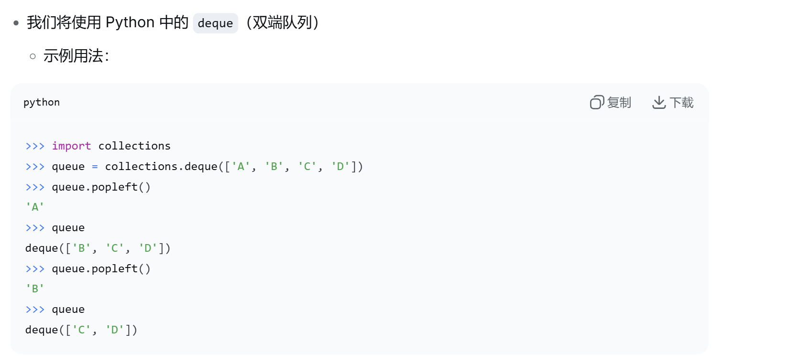
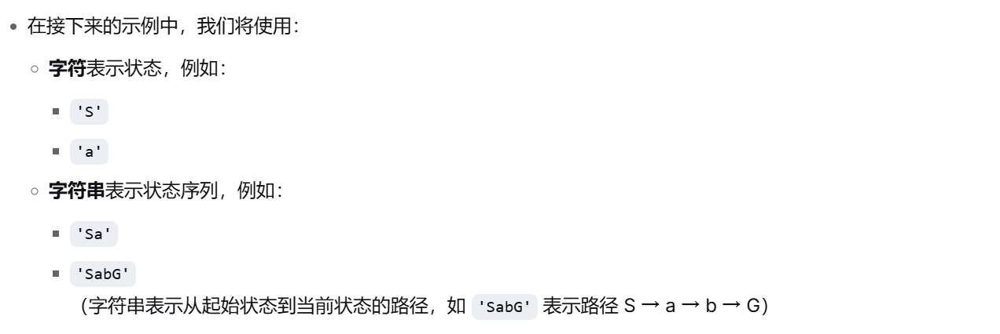

### 3.1.2 BFS-TSA 实现

**伪代码**

```
function TSA(problem) returns solution
   initialize frontier using initial state of problem
   while frontier is not empty
      choose a node and remove it from frontier
      if node contains a goal state then return corresponding solution
      explore the node, adding the resulting nodes to the frontier
```

```
函数 TSA(问题) 返回 解：
    使用问题的初始状态初始化边界集合
    当边界集合不为空时：
        选择一个节点并从边界集合中移除它
        如果该节点包含目标状态，则返回对应解
        扩展该节点，将其生成的子节点加入边界集合
```

**Python实现**

```
import collections

def bfsTsa(stateSpaceGraph, startState, goalState):
    frontier = collections.deque([startState])  # 将初始状态加入队列
    while frontier:
        node = frontier.popleft()               # 从队列左侧取出节点（FIFO）
        if node.endswith(goalState):            # 如果节点路径以目标状态结尾
            return node                         # 返回该路径（即解）
        for child in stateSpaceGraph[node[-1]]: # 扩展当前节点的最后一个状态
            frontier.append(node + child)       # 将新路径加入队列
```

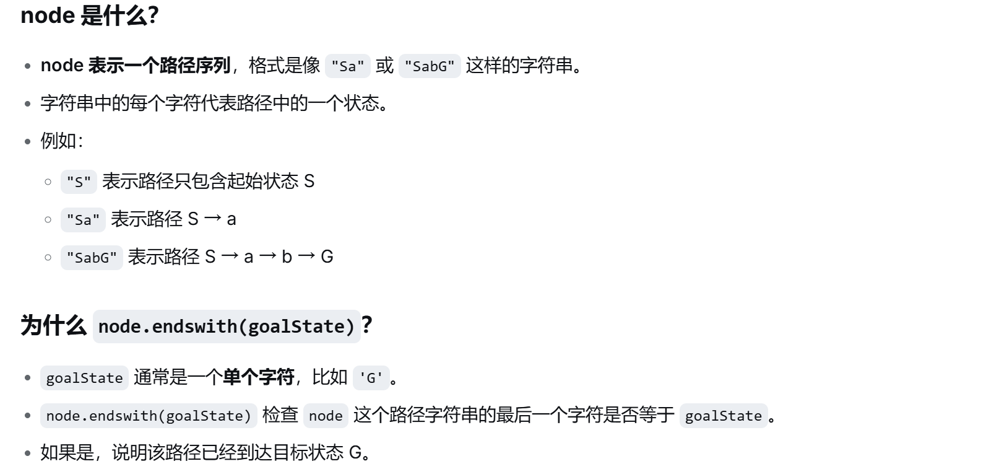
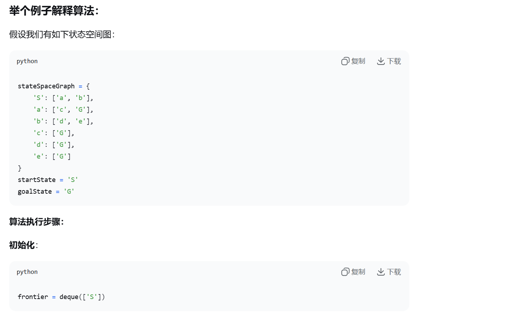
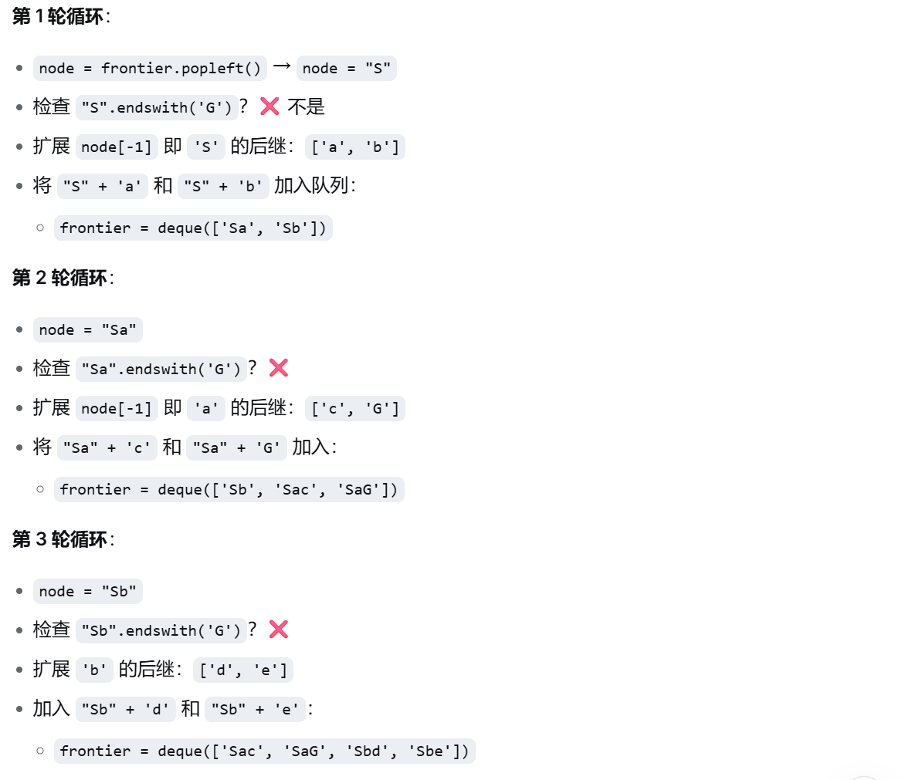
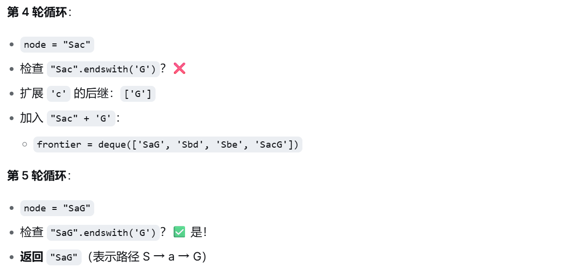

### 3.1.3 罗马尼亚寻路问题

**BFS-TSA 罗马尼亚问题代码**

```
import collections

def bfsTsa(stateSpaceGraph, startState, goalState):
    frontier = collections.deque([startState])  # 初始化边界队列，包含起始状态
    print('初始边界:', list(frontier))
    input()  # 暂停，按回车继续
    while frontier:
        node = frontier.popleft()  # 从队列左侧取出节点（FIFO）
        if (node.endswith(goalState)):  # 如果路径以目标状态结束
            return node  # 返回该路径
        print('正在探索:', node[-1], '...')  # 显示当前正在探索的状态
        # 扩展当前状态的最后一个字符（即当前状态）的所有后继
        for child in stateSpaceGraph[node[-1]]:
            frontier.append(node + child)  # 将新路径加入边界
        print(list(frontier))  # 显示当前边界中的所有路径
        input()  # 暂停

# 罗马尼亚地图的状态空间图（邻接表表示）
romania = {
    'A': ['S', 'T', 'Z'], 'Z': ['A', 'O'], 'O': ['S', 'Z'], 'T': ['A', 'L'], 
    'L': ['M', 'T'], 'M': ['D', 'L'], 'D': ['C', 'M'], 'S': ['A', 'F', 'O', 'R'], 
    'R': ['C', 'P', 'S'], 'C': ['D', 'P', 'R'], 'F': ['B', 'S'], 
    'P': ['B', 'C', 'R'], 'B': []  # B没有后继，是终点
}

print('解路径:', bfsTsa(romania, 'A', 'B'))
```

**Will bfsTsa(romania, 'A', 'B') terminate?**
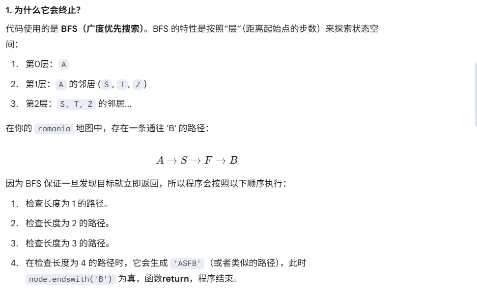
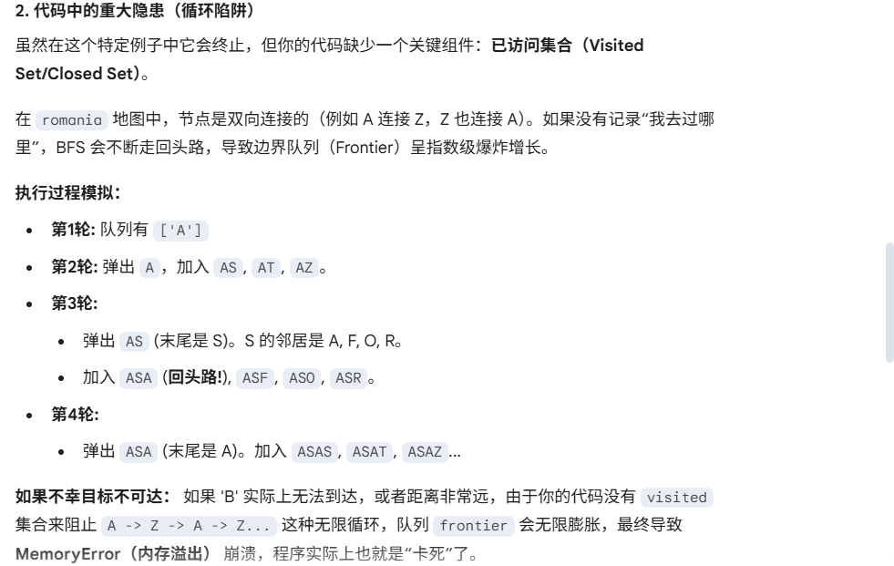

## 3.2 图搜索算法（GSA）——广度优先搜索版本

### 3.2.1 BFS-GSA 实现

**伪代码**

```
function GSA(problem) returns solution
    initialize frontier using initial state of problem
    initialize explored set to be empty
    while frontier is not empty
        choose a node and remove it from frontier
        if node contains a goal state then return corresponding solution
        if node is not in explored set
            add node to explored set
            explore the node, adding the resulting nodes to the frontier
```


**Python实现**

```
import collections

def gsaGfs(stateSpaceGraph, startState, goalState):
    frontier = collections.deque([startState])  # 边界队列
    explored = set()  # 已探索集合
  
    while frontier:
        node = frontier.popleft()  # 从队列取出节点
        current_state = node[-1]   # 获取当前状态
      
        if current_state == goalState:
            return node  # 找到解
          
        if current_state not in explored:
            explored.add(current_state)  # 标记为已探索
          
            # 扩展当前状态
            for child in stateSpaceGraph[current_state]:
                if child not in explored:
                    frontier.append(node + child)  # 将新路径加入边界
  
    return None  # 无解
```


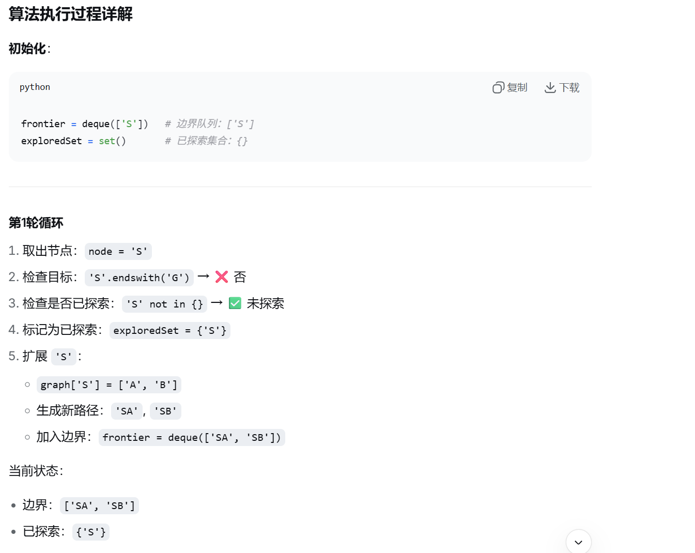

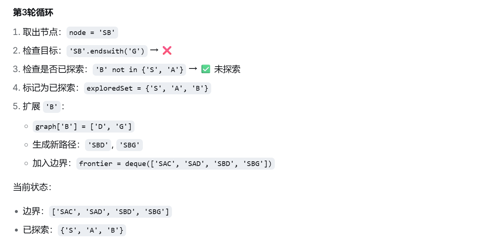
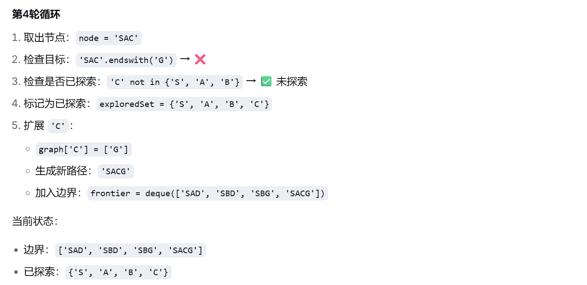
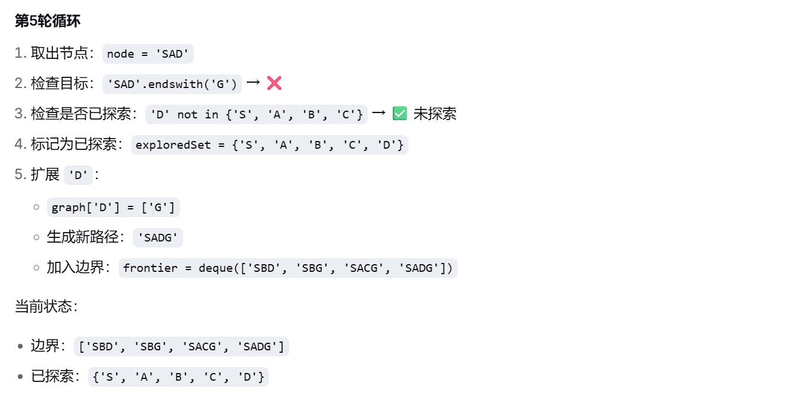
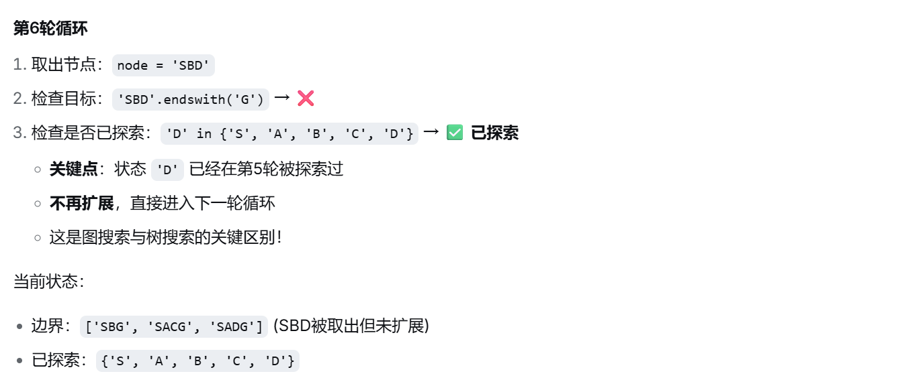


### 3.2.3 罗马尼亚寻路问题

**BFS-GSA 罗马尼亚问题代码**

```
import collections

def bfsGsa(stateSpaceGraph, startState, goalState):
    frontier = collections.deque([startState])
    exploredSet = set()
    print('Initial frontier:', list(frontier))
    input()
  
    while frontier:
        node = frontier.popleft()
        if (node.endswith(goalState)): 
            return node
      
        if node[-1] not in exploredSet:
            print('Exploring:', node[-1], '...')
            exploredSet.add(node[-1])
            for child in stateSpaceGraph[node[-1]]: 
                frontier.append(node + child)
      
        print(list(frontier))
        print(exploredSet)
        input()

romania = {
    'A':['S','T','Z'], 'Z':['A','O'], 'O':['S','Z'],
    'T':['A','L'], 'L':['M','T'], 'M':['D','L'],
    'D':['C','M'], 'S':['A','F','O','R'],
    'R':['C','P','S'], 'C':['D','P','R'],
    'F':['B','S'], 'P':['B','C','R'], 'B':[]
}

print('Solution path:', bfsGsa(romania, 'A', 'B'))
```

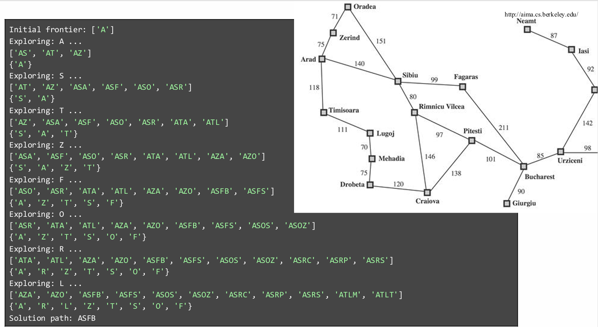

## 3.3 BFS的性质

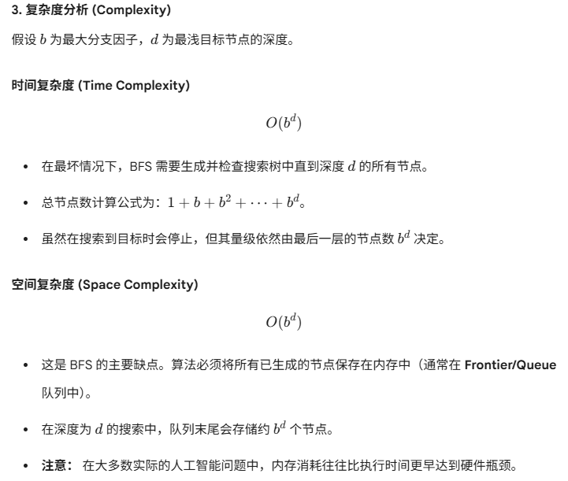

---

# 4 深度优先搜索 (Depth-first search)

## 4.1 Stack in Python


## 4.2 罗马尼亚问题 DFS-GSA 实现

```
import collections
def dfsGsa(stateSpaceGraph, startState, goalState): 
    frontier = collections.deque([startState])
    exploredSet = set()
    print('Initial frontier:',list(frontier))
    input()
    while frontier: 
        node = frontier.pop()
        if (node.endswith(goalState)): return node
        if node[-1] not in exploredSet:
            print('Exploring:',node[-1],'...')
            exploredSet.add(node[-1])
            for child in stateSpaceGraph[node[-1]]: frontier.append(node+child)
            print(list(frontier))
            print(exploredSet)
            input()
romania = {
    'A':['S','T','Z'],'Z':['A','O'],'O':['S','Z'],
    'T':['A','L'],'L':['M','T'],'M':['D','L'],
    'D':['C','M'],'S':['A','F','O','R'],
    'R':['C','P','S'],'C':['D','P','R'],
    'F':['B','S'],'P':['B','C','R'],'B':[]
    }
print('Solution path:',dfsGsa(romania, 'A', 'B'))
```

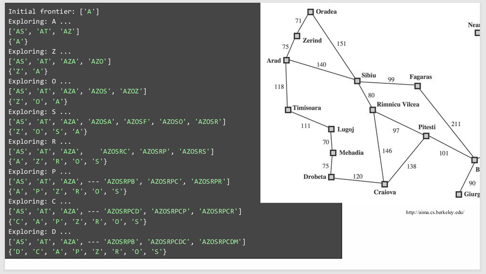
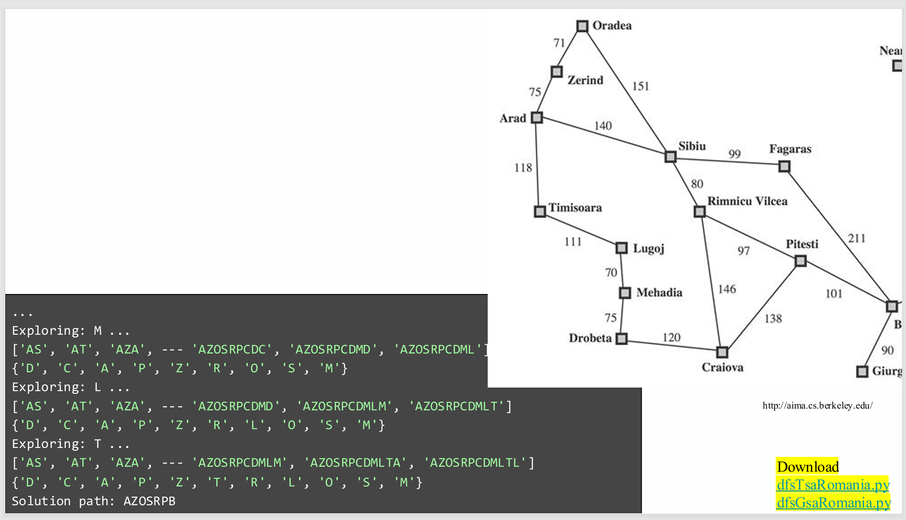

## 4.3 DFS的性质
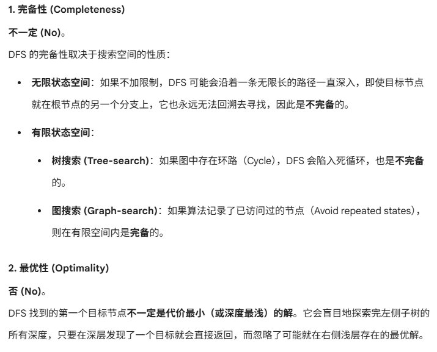
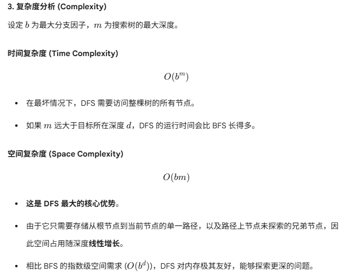

## 4.4 GSA/TSA 比较

**GSA（图搜索算法，Graph Search Algorithm）**

- **优点**：

  - 避免无限循环（infinite loops）
  - 消除大量冗余路径（避免指数级重复探索）
- **缺点**：

  - 需要与运行时间成比例的内存空间
- **适用场景**：当解靠近搜索树的根节点时，BFS 表现更优
- **原因**：BFS 按层探索，能较快找到较浅的解

**TSA（树搜索算法，Tree Search Algorithm）**

- **优点**：
  - 内存需求较小
  - 实现较简单
- **缺点**：
  - 可能陷入无限循环
  - 会探索冗余路径（同一状态可能被多次访问）
- **适用场景**：当所有解都位于搜索树深处时，DFS 表现更优
- **原因**：DFS 深入某一分支探索，可能更快找到深层解

**对比总结：**

| 特性       | GSA（图搜索）            | TSA（树搜索）   |
| ---------- | ------------------------ | --------------- |
| 防循环     | ✅ 避免无限循环          | ❌ 可能陷入循环 |
| 冗余路径   | ✅ 消除冗余              | ❌ 可能重复探索 |
| 内存需求   | 较大（与运行时间成正比） | 较小            |
| 实现复杂度 | 较高                     | 较低            |

- BFS 适合**解较浅**的问题，能保证找到最短路径（在无权图中）。
- DFS 适合**解较深**或需要**深入探索某一分支**的问题，内存消耗通常更小。
- 实际选择需考虑问题结构、解的位置、内存限制等因素。

---

# 5 一致代价搜索 UCS（Uniform Cost Search）

## 5.1 Python中的优先队列

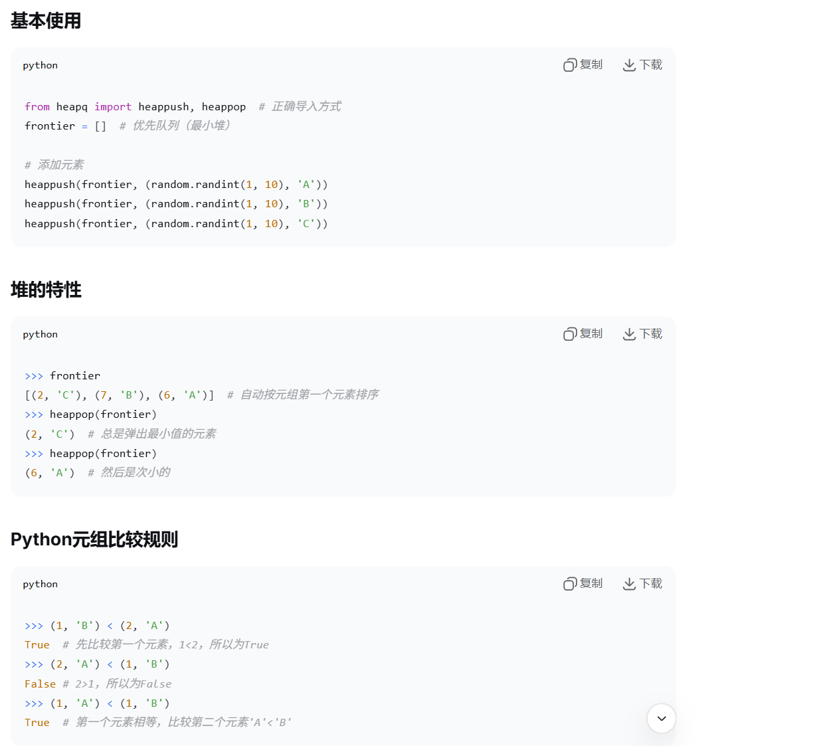

## 5.2 更新后的罗马尼亚问题定义

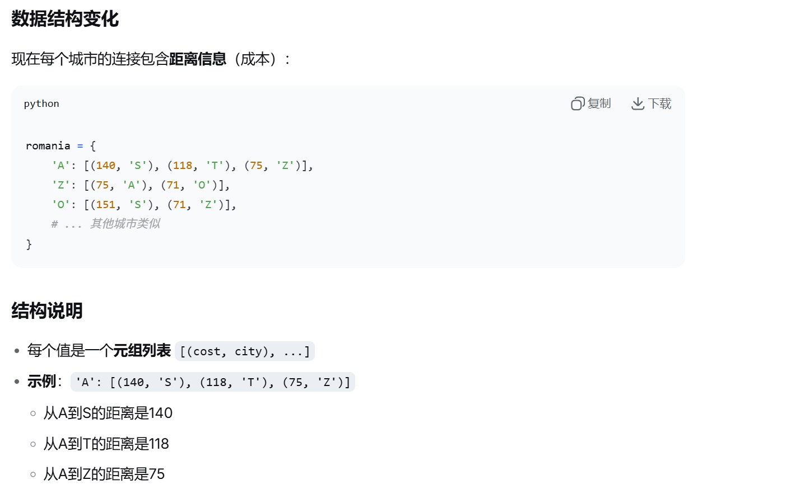

## 5.3 罗马尼亚问题 USC-GSA 实现

**伪代码**

```
1. 初始化：将起点加入优先队列（成本0）
2. 循环直到队列为空：
   a. 弹出成本最小的节点
   b. 如果是目标节点，返回路径
   c. 否则，扩展该节点的所有邻居
   d. 计算新路径成本 = 当前成本 + 边成本
   e. 将新节点加入优先队列
```

**Python实现**

```
from heapq import heappush, heappop
def ucsGsa(stateSpaceGraph, startState, goalState): 
    frontier = []
    heappush(frontier, (0, startState))
    exploredSet = set()
    print('Initial frontier:',list(frontier)); input()
    while frontier:
        node = heappop(frontier)
        if (node[1].endswith(goalState)): return node
        if node[1][-1] not in exploredSet:
            print('Exploring:',node[1][-1],'at cost',node[0])
            exploredSet.add(node[1][-1])
            for child in stateSpaceGraph[node[1][-1]]:
                heappush(frontier, (node[0]+child[0], node[1]+child[1]))
            print(list(frontier)); print(exploredSet); input()
romania = {
    'A':[(140,'S'),(118,'T'),(75,'Z')],'Z':[(75,'A'),(71,'O')],'O':[(151,'S'),(71,'Z')],
    'T':[(118,'A'),(111,'L')],'L':[(70,'M'),(111,'T')],'M':[(75,'D'),(70,'L')],
    'D':[(120,'C'),(75,'M')],'S':[(140,'A'),(99,'F'),(151,'O'),(80,'R')],
    'R':[(146,'C'),(97,'P'),(80,'S')],'C':[(120,'D'),(138,'P'),(146,'R')],
    'F':[(211,'B'),(99,'S')],'P':[(101,'B'),(138,'C'),(97,'R')],'B':[]
    }
print('Solution path:',ucsGsa(romania, 'A', 'B'))
```

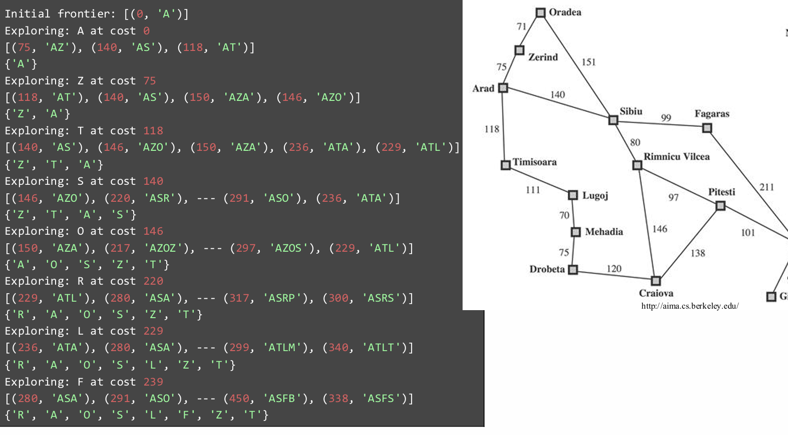
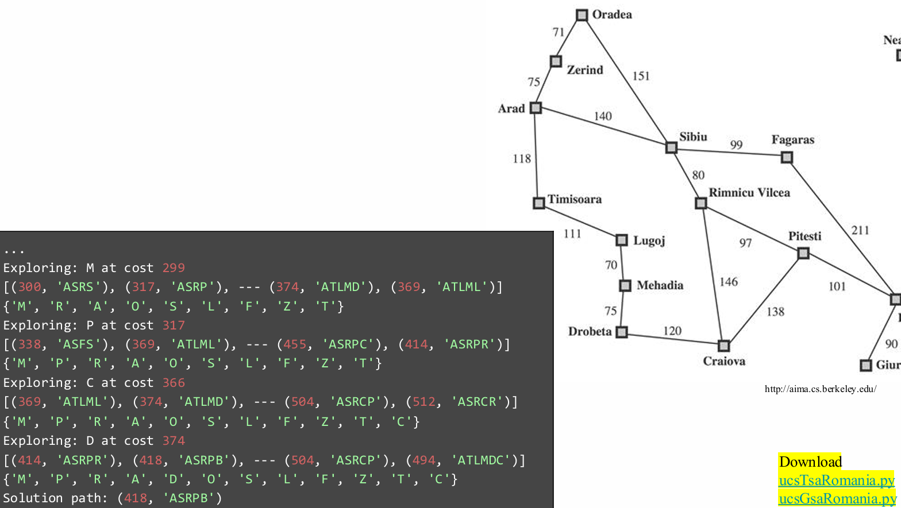

## 5.4 练习

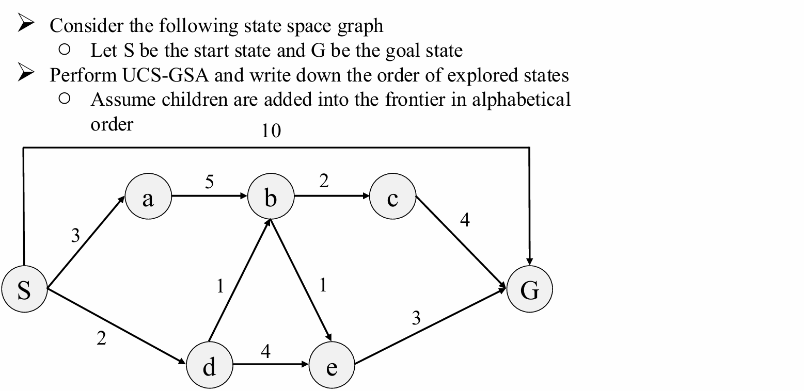
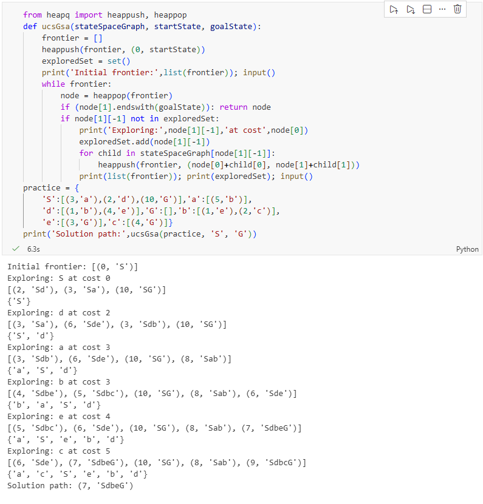

## 5.5 UCS算法特点
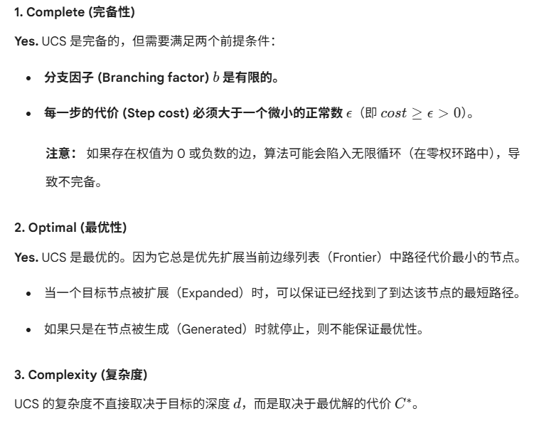
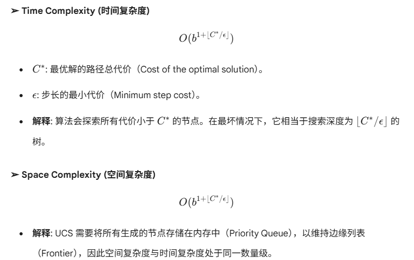