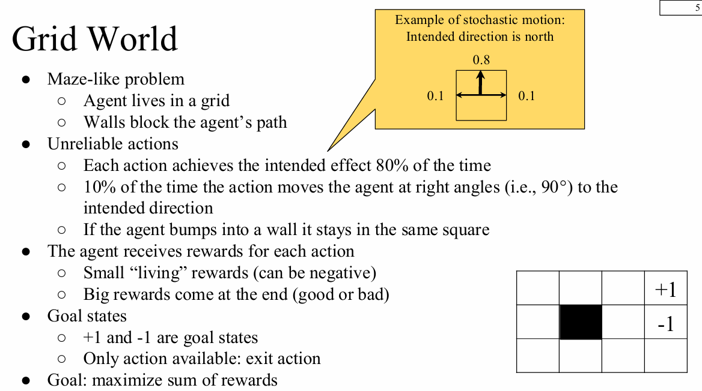
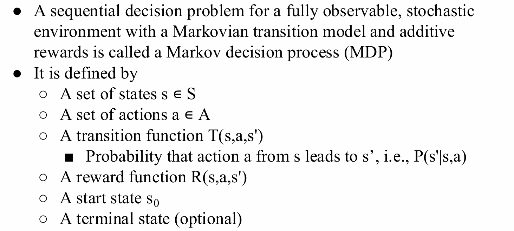
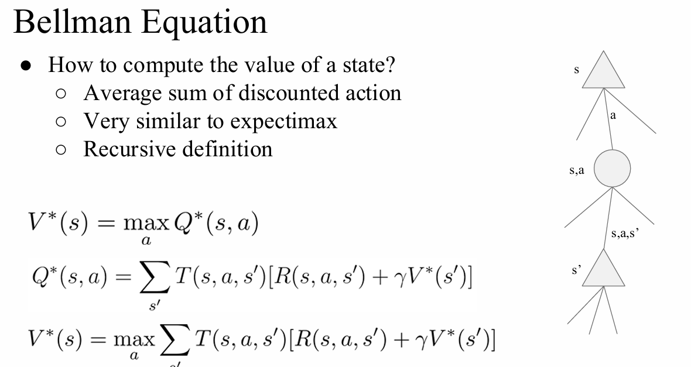
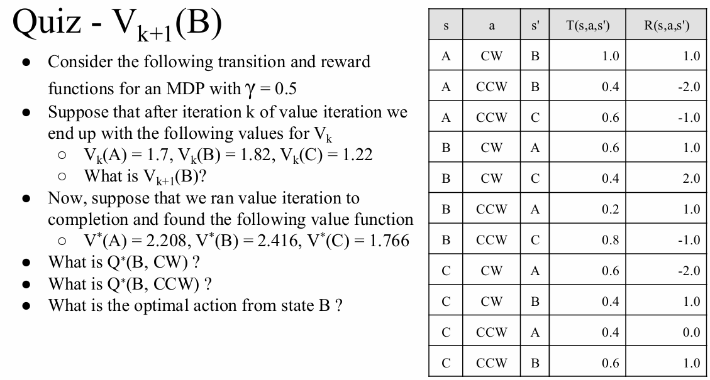
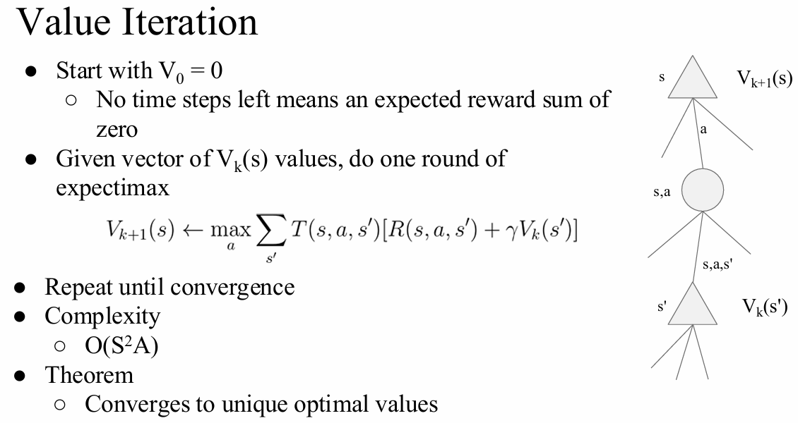
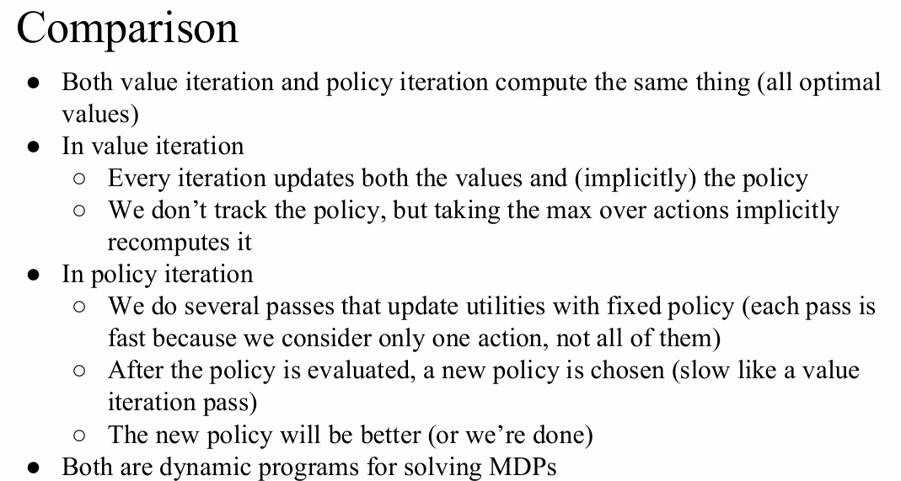
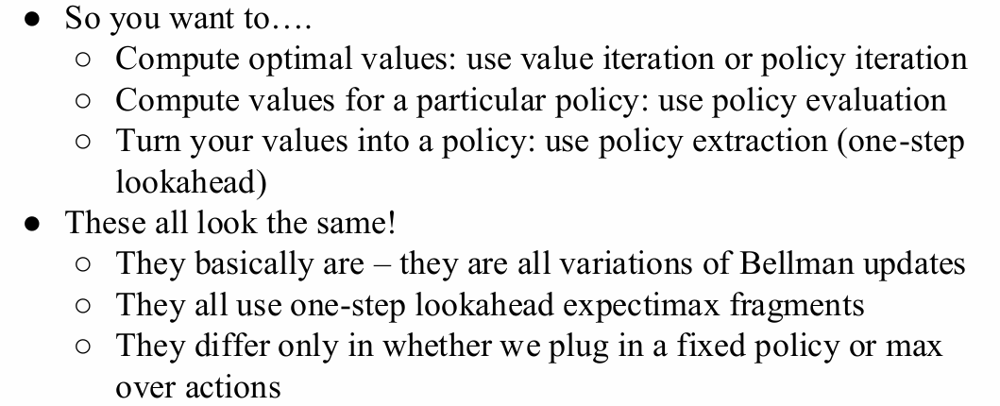

# Markov Decision Processes

# 1 MDP的引入与基础概念
## 1.1 序列决策问题 (Sequential Decision Problem)
  * 智能体 (agent) 的效用取决于一系列连续的决策。
  * 该问题综合了效用 (utilities)、不确定性 (uncertainty) 以及感知 (sensing)。
  * 最优行为需要在不确定的环境中平衡风险与回报。

## 1.2 网格世界示例 (Grid World)
  * **环境设定**：类似迷宫的问题，智能体位于网格中，网格中的墙壁会阻挡智能体的行进路径。
  * **动作不可靠性 (Unreliable actions/Stochastic motion)**：
    * 每次行动有 80% 的概率达到预期方向。
    * 有 20% 的概率产生偏移（其中 10% 向预期方向的左侧直角偏移，10% 向右侧直角偏移）。
    * 如果智能体撞到墙壁，它将停留在原方格内。
  * **奖励机制 (Rewards)**：
    * 每次行动都会获得较小的“生存”奖励（通常为负数，促使智能体尽快找到出口）。
    * 结束时会获得大额奖励（好或坏，例如 +1 和 -1 的目标状态）。
    * 在目标状态下，唯一可用的动作是“退出 (exit)”。
  * **最终目标**：最大化总奖励之和。

## 1.3 转移模型 (Transition Model)
  * 转移模型 $T(s,a,s')$ 描述了在每种状态下执行各个动作的具体结果。
  * 由于结果是随机的 (stochastic)，我们使用 $P(s'|s,a)$ 来表示在状态 $s$ 下执行动作 $a$ 后，到达状态 $s'$ 的概率。
  * **马尔可夫假设 (Markovian)**：从状态 $s$ 转移到状态 $s'$ 的概率**仅取决于当前状态 $s$**，而与之前的历史状态无关。（此属性以俄罗斯数学家 Andrey Markov 命名）。

* **马尔可夫决策过程 (Markov Decision Processes, MDP)**
  * **核心概念**：一个具备完全可观测性 (fully observable)、随机环境 (stochastic environment)、马尔可夫转移模型 (Markovian transition model) 以及加性奖励 (additive rewards) 的序列决策问题，被称为马尔可夫决策过程 (MDP)。
  * **MDP 的组成定义**：
    * 一组状态集合 (States)：$s \in S$
    * 一组动作集合 (Actions)：$a \in A$
    * 转移函数 (Transition function)：$T(s,a,s')$，即在状态 $s$ 执行动作 $a$ 导致转移到状态 $s'$ 的概率 $P(s'|s,a)$
    * 奖励函数 (Reward function)：$R(s,a,s')$
    * 初始状态 (Start state)：$s_0$
    * 终止状态 (Terminal state)：（可选配置）

## 1.4 策略与效用

**策略 (Policy, $\pi$)**
  * **MDP的解**：由于环境存在随机性，固定的动作序列无法解决问题（智能体可能会偏离目标到达其他状态）。因此，解决方案必须为智能体可能到达的**任意状态**都指定一个动作。
  * 这种条件映射被称为策略 $\pi$。其中 $\pi(s)$ 表示策略 $\pi$ 推荐在状态 $s$ 下执行的具体动作。

**最优策略 (Optimal Policy, $\pi^*$)**
  * 每次执行给定策略时，环境的随机性可能会导致产生不同的状态历史轨迹。
  * 策略的质量由该策略生成的所有可能历史轨迹的**期望效用 (expected utility)** 来衡量。
  * 产生最高期望效用的策略被称为最优策略 $\pi^*$。

**状态序列的效用 (Utility of State Sequences)**
  * 如何计算状态序列的效用？这取决于智能体对奖励序列的偏好：
    * **多与少 (More or less)**：倾向于总数值更大的奖励（例如 $[2, 3, 4]$ 优于 $[1, 2, 2]$）。
    * **早与晚 (Now or later)**：倾向于更早获得奖励（例如 $[1, 0, 0]$ 优于 $[0, 0, 1]$）。
  * **折扣 (Discounting)**：虽然最大化总奖励是合理的，但“现在的奖励胜过未来的奖励”也是一种合理的偏好。一种标准的解决方案是让未来奖励的价值呈指数级衰减。

**平稳偏好 (Stationary Preferences)**
  * 假设智能体对状态序列的偏好是平稳的。即如果两个序列以相同的状态 $r$ 开头，那么这两个序列的偏好排序应该与去掉 $r$ 后的序列偏好排序完全一致：
    $[r, s_1, s_2, \dots] \succ [r, s'_1, s'_2, \dots] \iff [s_1, s_2, \dots] \succ [s'_1, s'_2, \dots]$
  * 平稳性推导出了两种连贯的序列效用计算方式：
    1. **加性奖励 (Additive rewards)**: $U([s_0, s_1, s_2, \dots]) = R(s_0) + R(s_1) + R(s_2) + \dots$
    2. **折扣奖励 (Discounted rewards)**: $U([s_0, s_1, s_2, \dots]) = R(s_0) + \gamma R(s_1) + \gamma^2 R(s_2) + \dots$

**无穷效用 (Infinity Utilities)**
  * 如果环境不包含终止状态，或者智能体永远无法到达终止状态怎么办？
  * 如果使用**无折扣的加性奖励**，无限序列的效用将会趋于无穷大。
  * 引入**折扣奖励**后，无限序列的效用可以被限制在一个有限值内（几何级数求和）：
    $U([s_0, s_1, s_2, \dots]) = \sum_{t=0}^{\infty} \gamma^t R(s_t) \le \sum_{t=0}^{\infty} \gamma^t R_{max} = \frac{R_{max}}{1 - \gamma}$

## 1.5 最优量/核心价值定义 (Optimal Quantities)
  * **$V^*(s)$**：状态 $s$ 的最优价值 (Value/Utility)。代表从状态 $s$ 开始，并始终采取**最优行动**所能获得的期望效用。
  * **$Q^*(s,a)$**：q-状态 $(s,a)$ 的价值。代表在状态 $s$ 首先执行动作 $a$，并且**此后**始终采取最优行动所能获得的期望效用。
  * **$\pi^*(s)$**：状态 $s$ 的最优策略。即在状态 $s$ 下应该采取的最优动作。

---

# 2 贝尔曼方程 (Bellman Equation)

**核心问题**：如何计算一个状态的价值（Value of a state）？
* **物理意义**：它是折扣后的动作奖励总和的期望（Average sum of discounted action）。
* **思想来源**：与期望最大化搜索树（Expectimax）非常相似。
* **定义方式**：一种递归定义（Recursive definition）。

### 核心公式

1. **最优状态价值函数 $V^*(s)$**：
   状态 $s$ 的最优价值等于在该状态下采取最优动作所能带来的最大 Q 价值。
   $$V^*(s) = \max_a Q^*(s, a)$$

2. **最优状态-动作价值函数 $Q^*(s, a)$**：
   在状态 $s$ 采取动作 $a$ 的 Q 价值，等于所有可能的下一状态 $s'$ 的加权期望（转移概率 $\times$ [即时奖励 $+$ 折扣后的下一状态价值]）。
   $$Q^*(s, a) = \sum_{s'} T(s, a, s')[R(s, a, s') + \gamma V^*(s')]$$

3. **贝尔曼最优方程（组合形式）**：
   将 Q 值的定义代入 V 值的公式中，得到完整的递归方程：
   $$V^*(s) = \max_a \sum_{s'} T(s, a, s')[R(s, a, s') + \gamma V^*(s')]$$

---

# 3 价值迭代与策略迭代

## 3.1 价值迭代 (Value Iteration)

为了求解贝尔曼方程并得出各个状态的最优价值，我们引入了**价值迭代**算法。它将贝尔曼方程转化为了一个迭代更新的规则。

### 3.1.1 算法步骤

1. **初始化**：
   从 $V_0 = 0$ 开始。
   *理解*：当剩余时间步为 0 时，期望的奖励总和显然为 0。

2. **迭代更新**：
   给定当前的价值向量 $V_k(s)$，执行一轮“期望最大化”（expectimax）来计算下一步的价值 $V_{k+1}(s)$：
   $$V_{k+1}(s) \leftarrow \max_a \sum_{s'} T(s, a, s')[R(s, a, s') + \gamma V_k(s')]$$

3. **终止条件**：
   重复上述更新步骤，直到价值收敛（即 $V_{k+1}$ 和 $V_k$ 的差异极小）。

### 算法特性
* **时间复杂度**：每一轮迭代的复杂度为 $\mathcal{O}(S^2A)$，其中 $S$ 是状态数量，$A$ 是动作数量。
* **收敛性定理**：该算法保证最终会收敛到**唯一的最优价值**（Unique optimal values）。

### 3.1.2 赛跑式搜索树与时间限制价值

在基础的 MDP 展开树中，直接进行深度优先或广度优先搜索会遇到以下挑战：
* **状态重复**：相同的状态会在树的不同分支甚至相同深度被反复评估，导致计算冗余。
* **无限深度**：如果没有明确的终止状态，搜索树会无限延伸。

**解决方案（价值迭代的核心思想）**：
* 避免重复计算：每个状态的所需值只计算一次。
* **深度限制计算**：设定一个逐渐增加的深度限制进行计算，直到价值的变化量非常小（收敛）。
* **折扣因子的作用**：如果折扣因子 $\gamma < 1$，树的极深处所带来的未来奖励在经过多次折扣后将趋近于 0，因此“未来的未来”对当前决策的影响微乎其微。

为了实现上述的“深度限制计算”，我们引入 $V_k(s)$ 的概念：
* **定义**：$V_k(s)$ 表示如果游戏（或过程）在 $k$ 个时间步后结束（即只能再获得 $k$ 次奖励），状态 $s$ 的最优价值。
* **等价理解**：它等同于从状态 $s$ 出发，执行深度为 $k$ 的 Expectimax 搜索所得到的结果。这正是上一节中“价值迭代”算法每一轮 $k$ 所计算出的实际物理意义。

### 3.1.3 核心对比：贝尔曼方程 vs. 价值迭代

这两者的公式看起来非常相似，但它们的侧重点和作用不同：

* **贝尔曼方程 (Bellman Equations)**：用于 **表征 (Characterize)** 最优价值。它是一个等式，描述了最优状态应该满足的数学关系（它本身是一个定义）。
    $$V^*(s) = \max_a \sum_{s'} T(s, a, s')[R(s, a, s') + \gamma V^*(s')]$$

* **价值迭代 (Value Iteration)**：用于 **计算 (Computes)** 最优价值。它是一个赋值操作（Update Rule），通过不断的动态规划迭代，从 $V_k$ 逼近 $V^*$。
    $$V_{k+1}(s) \leftarrow \max_a \sum_{s'} T(s, a, s')[R(s, a, s') + \gamma V_k(s')]$$

> **复习Tips**：注意公式中的符号差异。贝尔曼方程中两边都是 $V^*$，表示一种已经达到最优的平衡状态；而价值迭代方程中左边是第 $k+1$ 步的 $V_{k+1}$，右边使用的是第 $k$ 步的 $V_k$，体现了时间步的推移和计算的过程。

### 3.1.4 隋唐小测试

**已知条件**：
* 折扣因子 $\gamma = 0.5$
* 关于状态 B 的转移概率 $T$ 和奖励 $R$ 如下表提取：
  * $s=B, a=CW, s'=A$: $T=0.6, R=1.0$
  * $s=B, a=CW, s'=C$: $T=0.4, R=2.0$
  * $s=B, a=CCW, s'=A$: $T=0.2, R=1.0$
  * $s=B, a=CCW, s'=C$: $T=0.8, R=-1.0$

### 问题 1：已知 $V_k$ 的值，求 $V_{k+1}(B)$
**前置条件**：$V_k(A) = 1.7$, $V_k(B) = 1.82$, $V_k(C) = 1.22$

**计算步骤**：
根据价值迭代公式：$V_{k+1}(s) = \max_a \sum_{s'} T(s,a,s')[R(s,a,s') + \gamma V_k(s')]$，我们需要分别计算在状态 B 采取动作 CW 和 CCW 的期望价值（即 Q 值），然后取最大值。

1. **计算采取动作 CW 的期望价值 $Q_{k+1}(B, CW)$**：
   $$
   \begin{aligned}
   Q_{k+1}(B, CW) &= T(B, CW, A) \times [R(B, CW, A) + 0.5 \times V_k(A)] \\
                  &\quad + T(B, CW, C) \times [R(B, CW, C) + 0.5 \times V_k(C)] \\
                  &= 0.6 \times [1.0 + 0.5 \times 1.7] + 0.4 \times [2.0 + 0.5 \times 1.22] \\
                  &= 0.6 \times [1.0 + 0.85] + 0.4 \times [2.0 + 0.61] \\
                  &= 0.6 \times 1.85 + 0.4 \times 2.61 \\
                  &= 1.11 + 1.044 = 2.154
   \end{aligned}
   $$

2. **计算采取动作 CCW 的期望价值 $Q_{k+1}(B, CCW)$**：
   $$
   \begin{aligned}
   Q_{k+1}(B, CCW) &= T(B, CCW, A) \times [R(B, CCW, A) + 0.5 \times V_k(A)] \\
                   &\quad + T(B, CCW, C) \times [R(B, CCW, C) + 0.5 \times V_k(C)] \\
                   &= 0.2 \times [1.0 + 0.5 \times 1.7] + 0.8 \times [-1.0 + 0.5 \times 1.22] \\
                   &= 0.2 \times [1.0 + 0.85] + 0.8 \times [-1.0 + 0.61] \\
                   &= 0.2 \times 1.85 + 0.8 \times (-0.39) \\
                   &= 0.37 - 0.312 = 0.058
   \end{aligned}
   $$

3. **取最大值得到 $V_{k+1}(B)$**：
   $$V_{k+1}(B) = \max(2.154, 0.058) = 2.154$$

### 问题 2 & 3 & 4：已知最优价值 $V^*$，求最优 Q 值及最优动作
**前置条件**：假设算法已收敛，得出 $V^*(A) = 2.208$, $V^*(B) = 2.416$, $V^*(C) = 1.766$

**计算 $Q^*(B, CW)$**：
根据公式：$Q^*(s,a) = \sum_{s'} T(s,a,s')[R(s,a,s') + \gamma V^*(s')]$
$$
\begin{aligned}
Q^*(B, CW) &= 0.6 \times [1.0 + 0.5 \times V^*(A)] + 0.4 \times [2.0 + 0.5 \times V^*(C)] \\
           &= 0.6 \times [1.0 + 0.5 \times 2.208] + 0.4 \times [2.0 + 0.5 \times 1.766] \\
           &= 0.6 \times [1.0 + 1.104] + 0.4 \times [2.0 + 0.883] \\
           &= 0.6 \times 2.104 + 0.4 \times 2.883 \\
           &= 1.2624 + 1.1532 \\
           &= 2.4156 \approx 2.416
\end{aligned}
$$
*(注：这里的结果 2.416 刚好等于已知的 $V^*(B)$，这侧面印证了 CW 是最优动作，因为 $V^*(s) = \max_a Q^*(s, a)$)*

**计算 $Q^*(B, CCW)$**：
$$
\begin{aligned}
Q^*(B, CCW) &= 0.2 \times [1.0 + 0.5 \times V^*(A)] + 0.8 \times [-1.0 + 0.5 \times V^*(C)] \\
            &= 0.2 \times [1.0 + 0.5 \times 2.208] + 0.8 \times [-1.0 + 0.5 \times 1.766] \\
            &= 0.2 \times [1.0 + 1.104] + 0.8 \times [-1.0 + 0.883] \\
            &= 0.2 \times 2.104 + 0.8 \times (-0.117) \\
            &= 0.4208 - 0.0936 \\
            &= 0.3272
\end{aligned}
$$

**状态 B 的最优动作 (Optimal action from state B)**：
比较两个 Q 值，因为 $Q^*(B, CW) > Q^*(B, CCW)$ ($2.416 > 0.3272$)，所以使得状态 B 价值最大化的**最优动作是 CW**。

---

## 3.2 策略评估 (Policy Evaluation)

在 MDP 中，除了求解最优价值之外，我们还需要评估一个给定策略的好坏，以及如何从已知的价值函数中提取出具体的行动指南。

### 3.2.1 基础概念

**核心问题**：如果我遵循一个固定的策略 $\pi$（通常是非最优的），我的表现会怎样？即如何计算该策略下各个状态的价值 $V^\pi(s)$？

### 概念与公式
* **搜索树对比**：
  * 最优动作（Value Iteration）：在状态节点和动作节点之间需要取 `max`。
  * 固定策略 $\pi$：没有选择权，动作由 $\pi(s)$ 唯一确定，**去掉了 `max` 算子**。
* **固定策略下的状态效用 $V^\pi(s)$**：
  从状态 $s$ 出发并遵循策略 $\pi$ 的预期总折扣奖励。
  $$V^\pi(s) = \sum_{s'} T(s, \pi(s), s')[R(s, \pi(s), s') + \gamma V^\pi(s')]$$

### 计算方法
如何计算出这个 $V^\pi(s)$？课件给出了两种思路：
1. **迭代法 (类似于价值迭代)**：
   将递归的贝尔曼方程转化为更新规则。
   * 初始化：$V_0^\pi(s) = 0$
   * 迭代更新：$V_{k+1}^\pi(s) \leftarrow \sum_{s'} T(s, \pi(s), s')[R(s, \pi(s), s') + \gamma V_k^\pi(s')]$
   * **效率**：每次迭代的时间复杂度为 $\mathcal{O}(S^2)$（因为去掉了对动作 $A$ 的遍历，比纯粹的价值迭代更快）。
2. **线性方程组求解法**：
   因为方程中没有了非线性的 `max` 操作，这实际上变成了一个标准的线性方程组，可以直接使用线性系统求解器（Linear system solver）一步求出精确解。

### 3.2.2 策略提取 (Policy Extraction)

**核心问题**：假设我们已经通过某种方法知道了最优价值，我们该如何根据这些价值来决定当前应该采取什么动作？（即如何得到 $\pi^*(s)$）

#### 场景一：已知最优状态价值 $V^*(s)$
如果我们手里只有每个状态的最优价值表（V-values），提取策略需要进行一次“单步向前看”（mini-expectimax）。
我们必须遍历当前状态下所有可能的动作，计算它们的期望回报，并选出最大值对应的动作：
$$\pi^*(s) = \arg\max_a \sum_{s'} T(s, a, s')[R(s, a, s') + \gamma V^*(s')]$$
*缺点*：需要知道转移模型 $T$ 和奖励函数 $R$，并且每次做决策都要重新计算一遍期望。

#### 场景二：已知最优状态-动作价值 $Q^*(s, a)$
如果我们手里有 Q 价值表（即在状态 $s$ 下采取动作 $a$ 的价值），策略提取将变得极其简单。
直接在当前状态的所有 Q 值中挑最大的那个即可：
$$\pi^*(s) = \arg\max_a Q^*(s, a)$$

### 总结
**从 Q 价值中选择动作，比从 V 价值中选择动作要容易得多。** 这也是为什么在后续的无模型强化学习（如 Q-Learning）中，算法倾向于直接学习 Q 值而不是 V 值的原因。

---

## 3.3 对比与总结

### 3.3.1 价值迭代的局限性 (Properties of Value Iteration)

在引入策略迭代之前，我们先回顾一下价值迭代（Value Iteration）的缺点：
* **计算缓慢 (Slow)**：每一次迭代的时间复杂度为 $\mathcal{O}(S^2A)$（其中 S 是状态数，A 是动作数），因为在每一个状态下都要遍历所有可能的动作求 `max`。
* **策略早熟 (Max at each state rarely changes)**：在价值迭代的过程中，各个状态的最佳动作（即策略）往往在**状态价值 $V(s)$ 真正收敛之前很久就已经确定不变了**。
  * *启发*：既然策略早就收敛了，我们还有必要在每次迭代中都盲目地计算 `max` 吗？这就是策略迭代的动机。

### 3.3.2 策略迭代 (Policy Iteration)

策略迭代是求解最优价值的另一种方法。它的核心思想是将“评估当前策略”和“改进当前策略”这两个过程交替进行，直到策略不再改变。

#### 算法流程
策略迭代包含两个不断循环的步骤：

1. **策略评估 (Policy Evaluation)**：
   给定当前的固定策略 $\pi_i$，计算该策略下各个状态的价值（注意：这些不是最优价值，只是当前策略的价值）。一直迭代计算直到价值收敛：
   $$V_{k+1}^{\pi_i}(s) \leftarrow \sum_{s'} T(s, \pi_i(s), s')[R(s, \pi_i(s), s') + \gamma V_k^{\pi_i}(s')]$$

2. **策略改进 (Policy Improvement)**：
   使用刚刚评估得到的收敛价值 $V^{\pi_i}$ 作为未来价值，通过**单步向前看 (one-step look-ahead, 即策略提取)** 来更新策略，得到一个更好的新策略 $\pi_{i+1}$：
   $$\pi_{i+1}(s) = \arg\max_a \sum_{s'} T(s, a, s')[R(s, a, s') + \gamma V^{\pi_i}(s')]$$

3. **重复**上述两个步骤，直到策略不再发生变化（即 $\pi_{i+1} = \pi_i$）。

#### 算法特性
* 最终仍然能找到**最优策略和最优价值**。
* 在某些条件下，它比普通的价值迭代**收敛得快得多**（因为每次策略评估由于没有 `max` 操作，可以通过解线性方程组等方式快速完成）。

### 3.3.3 算法对比：价值迭代 vs. 策略迭代

两者都是用于求解 MDP 的动态规划（Dynamic Programming）方法，最终都会算出相同的最优价值，但计算路径不同：

| 特性 | 价值迭代 (Value Iteration) | 策略迭代 (Policy Iteration) |
| :--- | :--- | :--- |
| **更新方式** | 每次迭代同时更新价值，并通过取 `max` 隐式地更新策略。 | 明确分为多轮“快跑”（固定策略更新价值）和一轮“慢跑”（通过策略提取更新策略）。 |
| **速度特点** | 每一轮迭代都很慢（因为要算 `max`）。 | 策略评估阶段很快（只需考虑一个动作），策略更新阶段较慢（类似价值迭代的一轮）。 |
| **收敛目标** | 盯着价值（Values）直到收敛。 | 盯着策略（Policy）直到收敛，策略一旦不变就直接结束。 |

### 3.3.4 MDP 算法全局总结 (Summary: MDP Algorithms)

无论我们要解决什么问题，其实底层的数学结构是非常统一的。

#### 需求与对应方法：
1. **想求出最优价值？** $\rightarrow$ 使用 **价值迭代 (Value Iteration)** 或 **策略迭代 (Policy Iteration)**
2. **想知道某个特定策略有多好？** $\rightarrow$ 使用 **策略评估 (Policy Evaluation)**
3. **已知价值，想知道该怎么行动？** $\rightarrow$ 使用 **策略提取 (Policy Extraction)** (即单步向前看)

> **💡 核心顿悟 (The Big Picture)**：
> 所有这些算法看起来**本质上都是一样的**！
> * 它们都是 **贝尔曼更新 (Bellman updates)** 的变体。
> * 它们都使用了 **单步向前看的 expectimax 树片段**。
> * 它们之间**唯一的区别**仅仅在于：你是代入了一个**固定的策略 (fixed policy)**，还是在所有动作中取了**最大值 (max over actions)**。

