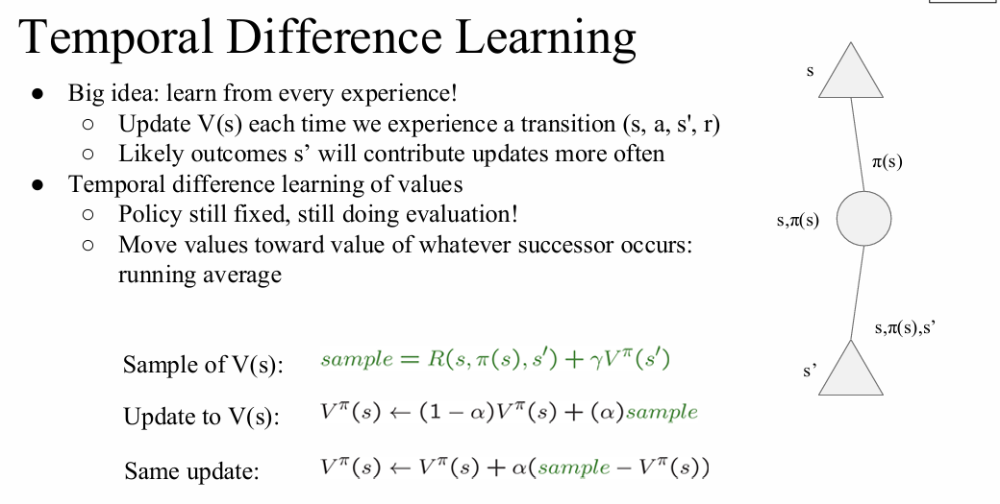
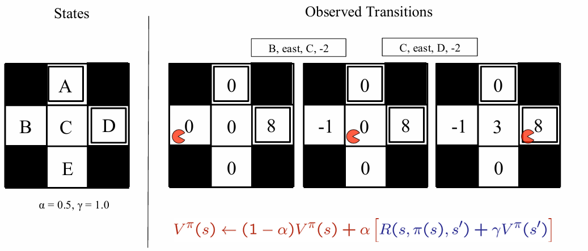
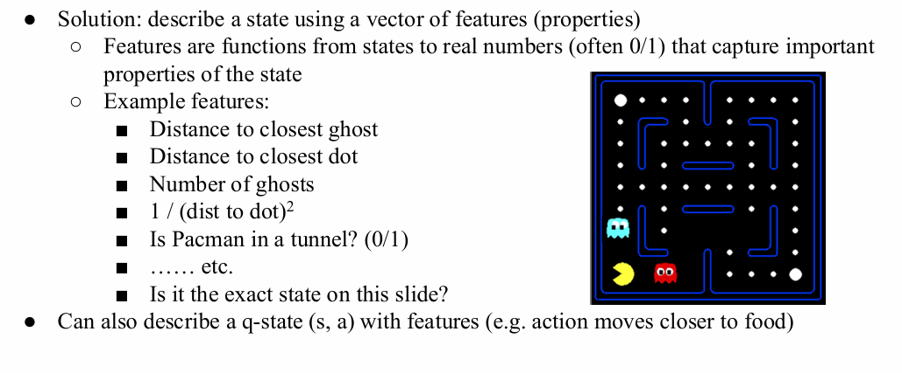

# 强化学习 Reinforcement Learning

本节课件宣告了从经典的马尔可夫决策过程（MDP）向强化学习（RL）的跨越，并介绍了第一种强化学习框架：基于模型的学习（Model-Based Learning）。

# 1 基础概念
## 1.1 强化学习与马尔可夫决策过程
### 1.1.1 强化学习的核心思想 (Reinforcement Learning - Idea)

强化学习描述了一个智能体（Agent）在未知环境中不断试错并学习的过程。

* **交互闭环**：智能体在环境中执行动作（Actions: $a$），环境基于该动作反馈新的状态（State: $s$）和奖励（Reward: $r$）。
* **基本准则**：
  * 反馈以**奖励（Rewards）**的形式呈现。
  * 智能体的效用（Utility）完全由奖励函数定义。
  * 目标：必须学会采取最优行动，以**最大化期望的总奖励**。
  * 限制：所有的学习都必须建立在**实际观察到的结果样本（observed samples of outcomes）**之上，没有“上帝视角”。

### 1.1.2 强化学习与传统 MDP 的异同

强化学习在底层仍然依赖于 MDP 的数学框架，但面临着更严苛的现实条件。

* **相同点 (It's just the same...)**：
  * 依然假设问题是一个 MDP 过程：包含状态集合 $S$、动作集合 $A$、转移模型 $T(s,a,s')$、奖励函数 $R(s,a,s')$。
  * 终极目标依然是寻找一个最优的策略（Policy）$\pi(s)$。

* **不同点 (New - The Catch!)**：
  * **未知环境**：我们**不知道**转移概率 $T$（动作会导致什么后果）和奖励函数 $R$（做什么是好是坏）。
  * **必须去试**：不能再像以前那样在脑海中做推演（Offline Planning），必须在现实中实际尝试动作并经历状态（Online Learning）才能收集信息。

## 1.2 基于模型的学习 (Model-Based Learning)

面对未知的 $T$ 和 $R$，第一种直观的解决思路是：**先建立模型，再求解模型**。

### 核心步骤

* **Step 1: 学习一个经验 MDP 模型 (Learn empirical MDP model)**
  * **探索环境**：在环境中随机游走或执行某种策略，收集大量的经验数据（即 $(s, a, s', r)$ 的转移记录）。
  * **估计转移概率 $\hat{T}(s, a, s')$**：通过统计频次来逼近真实概率。统计在状态 $s$ 执行动作 $a$ 后到达各个状态 $s'$ 的次数，然后进行归一化（Normalize）计算出概率。
  * **发现奖励 $\hat{R}(s, a, s')$**：当我们实际经历某次状态转移时，直接记录下所获得的奖励数值。

* **Step 2: 求解这个学习到的 MDP (Solve the learned MDP)**
  * 一旦我们有了估计出来的 $\hat{T}$ 和 $\hat{R}$，环境对我们来说就变成了“已知”的。
  * 此时，直接套用之前学过的 MDP 算法（如价值迭代或策略迭代）来计算价值和提取策略。
  * *例如课件中的策略评估公式变为*：
    $$V_{k+1}^{\pi_i}(s) \leftarrow \sum_{s'} \hat{T}(s, \pi_i(s), s')[\hat{R}(s, \pi_i(s), s') + \gamma V_k^{\pi_i}(s')]$$
    *(注意公式中带有小帽子的 $\hat{T}$ 和 $\hat{R}$，代表这是基于经验估算出来的经验模型，而非真实的客观规律)*。

## 1.3 无模型强化学习 (Model-Free Learning)

在真实的强化学习场景中，我们往往不知道环境的转移概率 $T$ 和奖励函数 $R$。本节讨论在这种情况下，如何评估一个给定策略的表现。

### 1.3.1 被动强化学习 (Passive Reinforcement Learning)

**定义**：被动强化学习是一个简化的任务。在这个任务中，智能体**没有选择动作的自由**。
* **输入**：一个固定的策略 $\pi(s)$。
* **未知条件**：不知道转移模型 $T(s, a, s')$ 和奖励函数 $R(s, a, s')$。
* **目标**：学习并计算出在这个给定策略下的状态价值 $V^\pi(s)$（即策略评估）。
* **特点**：智能体只是“顺风车乘客（along for the ride）”，它只能机械地执行策略 $\pi$ 给定的动作，从实际的经验中学习。这**不是**离线规划，而是必须在真实世界中采取行动。

### 1.3.2 直接评估 (Direct Evaluation)

既然不知道环境模型，最直观的方法就是直接去试，然后统计结果。

**核心思想**：
* 遵循策略 $\pi$ 行动。
* 每次访问到一个状态 $s$ 时，记录下从这个状态开始直到回合结束所获得的“折扣奖励总和”。
* 将同一个状态在多次尝试中得到的“折扣奖励总和”进行**平均**。

**直接评估的优缺点**：
* **优点 (Positives)**：
  * 非常容易理解。
  * 完全不需要知道 $T$ 和 $R$。
  * 只要尝试次数足够多，最终一定能计算出正确的价值。
* **缺点 (Negatives)**：
  * **忽略了状态之间的联系**：例如，状态 B 和 E 在当前策略下都会转移到状态 C。但在直接评估中，B 和 E 的价值是完全独立学习的。在学习初期，它们对 C 的价值一无所知，导致学习效率极低。
  * 必须分别单独学习每一个状态。
  * 收敛速度非常慢。

### 1.3.3 基于样本的策略评估 (Sample-Based Policy Evaluation)

为了克服直接评估“忽略状态间联系”的缺点，我们自然会想到用之前学过的**策略评估 (Policy Evaluation)**，因为它通过贝尔曼方程完美地利用了状态间的递推关系：
$$V_{k+1}^\pi(s) \leftarrow \sum_{s'} T(s, \pi(s), s')[R(s, \pi(s), s') + \gamma V_k^\pi(s')]$$
**致命问题**：我们不知道 $T$ 和 $R$，算不了期望！

**解决思路：用真实样本代替概率期望**
既然算不出所有可能结果的加权平均（期望），我们就通过**真实执行动作**来获取结果样本 $s'$，并计算该样本的价值：
$$sample_i = R(s, \pi(s), s_i') + \gamma V_k^\pi(s_i')$$
如果我们能在一个状态 $s$ 下收集到足够多的样本 $sample_1, sample_2, \dots, sample_n$，我们就可以直接对它们求平均来更新价值：
$$V_{k+1}^\pi(s) \leftarrow \frac{1}{n} \sum_i sample_i$$

**现实困境（能行得通吗？）**：
* **理论上几乎可以，但现实中不行**。因为我们**无法让时间倒流（cannot rewind time）**。
* 在真实的 MDP 环境中，当你在状态 $s$ 执行动作到达 $s_1'$ 后，你就已经身处 $s_1'$ 了。你无法瞬间传送回 $s$ 再执行一次动作去获取 $s_2'$。
* 因此，我们无法在同一个状态停留并连续获取 $n$ 个独立样本来求平均。

> **复习预警**：这个“无法时间倒流连续采样求平均”的困境，正是引出下一节核心算法 **时序差分学习（Temporal Difference Learning, TD Learning）** 的关键动机！TD 算法将解决如何利用单个样本即时更新价值的问题。

---

# 2 时序差分学习 (TD Learning)

在被动强化学习中，我们面临着无法在同一状态重复采样求平均的困境。**时序差分学习（Temporal Difference Learning）** 巧妙地解决了这个问题。

## 2.1 核心思想：从每一次经验中学习 (Learn from every experience)

* **大思路**：不再苦等所有样本收集齐了再去算平均，而是**每经历一次状态转移 $(s, a, s', r)$，就立刻更新一次 $V(s)$**。
* **物理意义**：依然是在做策略评估（Policy Evaluation，策略 $\pi$ 是固定的），但我们利用刚刚发生的后继状态 $s'$ 的价值，来“拉动”当前状态 $s$ 的价值，使其朝着真实期望逼近。

## 2.2 更新规则：指数移动平均 (Exponential Moving Average)

为了在不断接收新样本的同时平滑地更新价值，TD Learning 采用了**指数移动平均**的方法。

### 核心公式
每次经历一步转移 $(s, a, s', r)$ 后：
1. **计算当前样本的估计值 (Sample)**：
   $$sample = R(s, \pi(s), s') + \gamma V^\pi(s')$$
2. **用新样本更新原有价值 (Update)**：
   $$V^\pi(s) \leftarrow (1 - \alpha)V^\pi(s) + \alpha(sample)$$

**等价更新形式（更常用，体现“误差/差分”的概念）**：
$$V^\pi(s) \leftarrow V^\pi(s) + \alpha(sample - V^\pi(s))$$

### 学习率 $\alpha$ (Learning Rate) 的作用
* **近期偏好**：这种插值更新方式使得系统更看重**最近**的样本，而逐渐遗忘久远的过去（因为远古时期的价值估计本来就是错的）。
* **收敛性**：随着学习的进行，如果逐渐减小学习率 $\alpha$，最终价值估计会收敛到真实的平均值。

## 2.3 吃豆人实例解析

课件中给出了一个具体的吃豆人网格例子，参数设置：$\alpha = 0.5, \gamma = 1.0$。初始时，除了目标终点 D 价值为 8 以外，其余状态价值为 0。

* **观测到转移 1：从 B 向东走到 C，获得奖励 -2**
  * $sample = -2 + 1.0 \times V(C) = -2 + 0 = -2$
  * $V(B) \leftarrow (1 - 0.5) \times 0 + 0.5 \times (-2) = -1$
  * *结果*：$V(B)$ 更新为 -1。

* **接着观测到转移 2：从 C 向东走到 D，获得奖励 -2**
  * $sample = -2 + 1.0 \times V(D) = -2 + 8 = 6$
  * $V(C) \leftarrow (1 - 0.5) \times 0 + 0.5 \times (6) = 3$
  * *结果*：$V(C)$ 更新为 3。

> **结论**：吃豆人只需要走一遍，就能沿途实时更新经过的所有状态的价值，完全不需要“时光倒流”。

## 2.4 TD 价值学习的局限性与终极启示

TD Learning 提供了一种非常优雅的**无模型（Model-free）策略评估**方法，它用运行时的样本平均完美模拟了贝尔曼更新。

**但是，我们遇到了一个新的致命瓶颈：**
我们费尽心机求出了各个状态的 $V$ 值，最终目的是为了找出一个更好的新策略（即做策略提取）。
回顾策略提取公式：
$$\pi(s) = \arg\max_a Q(s, a)$$
$$Q(s, a) = \sum_{s'} T(s, a, s')[R(s, a, s') + \gamma V(s')]$$

**痛点发现**：即使我们知道了所有的 $V(s)$，要从中提取动作，我们**依然需要知道环境的转移模型 $T$ 和奖励模型 $R$**！这直接违背了我们做无模型强化学习的初衷。

**终极解决方案（Idea）**：
既然从 $V$ 推导动作需要模型，那我们为什么不**直接学习 Q 价值（Q-values）**呢？
只要学会了 $Q(s,a)$，我们在选择动作时只需要无脑比较哪个 Q 值大就行了（完全实现 Model-free 的动作选择）。这正是下一节核心算法（Q-Learning）的起点！

---

# 3 Q-Learning 算法与离轨学习

在上一节的时序差分（TD）学习中，我们发现即便完美评估了状态价值 $V(s)$，在没有环境模型 $T$ 和 $R$ 的情况下，依然无法从中提取出具体的动作策略。为了实现真正的**无模型（Model-free）** 控制，我们必须直接去学习 Q 价值（状态-动作价值）。

## 3.1 Q 价值迭代 (Q-Value Iteration)

在我们真正进入基于样本的 Q-Learning 之前，先回顾一下如果在已知模型的 MDP 中，如何直接对 Q 值进行迭代（这与价值迭代非常相似）：

* **价值迭代 (Value Iteration)**：
  $$V_{k+1}(s) \leftarrow \max_a \sum_{s'} T(s, a, s')[R(s, a, s') + \gamma V_k(s')]$$
* **Q 价值迭代 (Q-Value Iteration)**：
  既然 Q 值更有用，我们就把递推的主体换成 Q。初始化 $Q_0(s,a) = 0$，然后根据深度的增加不断更新：
  $$Q_{k+1}(s, a) \leftarrow \sum_{s'} T(s, a, s')[R(s, a, s') + \gamma \max_{a'} Q_k(s', a')]$$

> **核心思路**：Q-Learning 的本质，就是把上面这个需要知道 $T$ 和 $R$ 才能算的期望公式，变成**基于真实样本 (Sample-based)** 的实时更新！

## 3.2 Q-Learning：基于样本的 Q 价值学习

Q-Learning 结合了 TD Learning 的“实时小步更新”思想和 Q 价值迭代的“求最优”思想。它让我们可以在环境中边走边学。

### 算法核心步骤

每当智能体在环境中执行了一步操作，收到一个经验样本 $(s, a, s', r)$ 时：

1. **审视旧估计**：查表得出当前状态下该动作的已有 Q 值估算：$Q(s, a)$
2. **计算新样本的估计值 (Sample)**：
   这是 Q-Learning 最精髓的一步。到达新状态 $s'$ 后，假设我们在未来会采取**最优**的动作（即取 $\max$），以此来估算这趟旅程的收益：
   $$sample = R(s, a, s') + \gamma \max_{a'} Q(s', a')$$
3. **纳入滑动平均进行更新 (Update)**：
   使用和 TD Learning 完全一样的指数移动平均方法，用新样本去修正旧估计：
   $$Q(s, a) \leftarrow (1 - \alpha)Q(s, a) + \alpha[sample]$$

## 3.3 Q-Learning 的属性 (Q-Learning Properties)

Q-Learning 之所以伟大，在于它拥有一个极其强大的理论保证：**离轨学习 (Off-policy learning)**。

### 核心优势 (Amazing Result)
* **无论你怎么瞎走，最终都能学会最优策略！**
* 即使智能体在收集经验时采取的是次优的、甚至是完全随机的动作策略（Behavior Policy），只要它不断地更新 Q 值表，这个 Q 表最终**必然会收敛到最优策略**对应的 $Q^*$。
* 这种“收集经验的策略”和“正在学习的目标策略”可以分离的特性，就叫做**离轨学习 (Off-policy)**。

### 收敛的前提限制 (Limitations / Requirements)
虽然 Q-Learning 很神奇，但它的收敛也是有严格条件的：
1. **充分探索 (You have to explore enough)**：你必须保证每个状态和每个动作都被访问过足够多次。如果你永远不去尝试某个动作，你自然永远不知道它好不好。
2. **学习率的衰减 (Learning rate $\alpha$)**：
   * 学习率最终必须趋近于足够小（使得最后的值能够稳定下来）。
   * 但又不能衰减得太快（必须给算法足够的时间去学习和纠正早期的错误）。
   * *(注：在严谨的数学定义中，这通常要求学习率满足 Robbins-Monro 条件：$\sum \alpha = \infty$ 且 $\sum \alpha^2 < \infty$)*。

**总结**：在极限情况下，不管你怎么选择动作去探索世界（只要你什么都愿意去试），Q-Learning 都能帮你找到通往胜利的最优解！

## 3.4 探索与利用 (Exploration vs. Exploitation)

在 Q-Learning 中我们提到，智能体必须“充分探索”才能保证最终收敛到最优策略。但这引出了强化学习中最经典的困境：我们应该花多少时间去尝试新事物，又该花多少时间去享受已经发现的好成果？

### 3.4.1 核心困境：探索 vs. 利用

* **探索 (Exploration)**：放弃当前已知能带来确定奖励的动作，去尝试未知的动作，目的是为了**进一步了解环境**（也许未知的动作背后藏着更大的奖励）。
* **利用 (Exploitation)**：充分利用当前已经确知的信息，选择已知能带来最大收益的动作，以**最大化当前的奖励**。

**生活中的直观例子**：
* **选餐厅**：利用 = 去你最爱的老地方吃；探索 = 冒着踩雷的风险去尝试一家新开的餐厅。
* **网页广告展示**：利用 = 展示历史点击率最高的广告；探索 = 展示一个全新的广告测测效果。
* **打游戏**：利用 = 按照你认为必胜的套路出招；探索 = 尝试一种极其诡异的新打法。

### 3.4.2 如何进行探索？(How to Explore?)

#### 方法一：最简单的策略 —— $\epsilon$-贪婪 ($\epsilon$-greedy)
这是最直观的强制探索机制。在每个时间步，智能体像“抛硬币”一样做决定：
* 以一个较小的概率 $\epsilon$：完全**随机**选择一个动作（进行探索）。
* 以较大的概率 $1-\epsilon$：遵循当前的贪婪策略，选择当前 Q 值最大的动作（进行利用）。

**存在的问题与改进**：
* **痛点 (Thrashing)**：$\epsilon$-greedy 会盲目地在整个空间里一直随机乱撞，即使学习已经完成、找到了最优策略，它依然会以 $\epsilon$ 的概率做出愚蠢的随机动作。
* **简单解法**：随着时间的推移，逐渐降低 $\epsilon$ 的值（Lower $\epsilon$ over time），让智能体在初期多探索，后期多利用。

#### 方法二：更聪明的策略 —— 探索函数 (Exploration Functions)
与其盲目地瞎随机，不如“有目的地”探索。
* **核心思想（乐观面对未知）**：去探索那些 **“还未被证明是坏选项”** 的区域。一旦一个区域被探索得足够多，就停止探索它。
* **探索函数 $f(u, n)$**：
    它接收一个价值估计 $u$ (utility) 和该状态动作对的访问次数 $n$ (visit count)，返回一个**乐观的效用值**。
    常见的形式例如：$f(u, n) = u + k/n$
    *(其中 $k$ 是一个常数，代表探索奖励。访问次数 $n$ 越小，$k/n$ 就越大，赋予未知的动作一个极高的人为“加成”，吸引智能体去尝试它。)*

**修改后的 Q-Learning 更新公式**：
普通的 Q-Learning 在计算新样本时是寻找未来状态 $s'$ 下真实的最大的 $Q(s', a')$。现在我们用探索函数来替代它：
$$Q(s, a) \leftarrow (1 - \alpha)Q(s, a) + \alpha \left[ R(s, a, s') + \gamma \max_{a'} f(Q(s', a'), N(s', a')) \right]$$
*(注：这种方法会将探索的“奖励分 $k$”也反向传播，使得通向未知区域的路径本身也变得具有吸引力。)*

### 3.4.3 学习的代价：遗憾 (Regret)

即使你最终通过探索找到了完美的“最优策略”，在这个学习和摸索的过程中，你依然不可避免地犯下过许多错误（踩过坑）。

* **什么是遗憾 (Regret)?**
    遗憾衡量的是你**犯错的总代价**。它是你在这个过程中“实际得到的总期望奖励”与“如果你一开始就知道最优策略并一直执行它所能得到的总期望奖励”之间的**差值**。
* **为何要最小化遗憾？**
    光是“最终学得好”还不够，我们更希望**“用最优的方式去学习如何变得最优 (optimally learning to be optimal)”**。
* **算法对比示例**：
    随机探索（$\epsilon$-greedy）和探索函数（Exploration functions）如果在极限情况下都能收敛到最优策略。但是，由于盲目的随机探索会在学习过程中做出大量极其糟糕的尝试，它的**遗憾值 (Regret) 会比探索函数高得多**。

## 3.5 状态泛化与近似 Q-Learning

在基础的 Q-Learning 中，我们为每一个状态-动作对 $(s, a)$ 都维护了一个表格里的条目（Q-Table）。但在真实世界中，这根本行不通。

### 3.5.1 跨状态泛化 (Generalizing Across States)

* **核心痛点**：在现实或稍微复杂一点的游戏（如吃豆人）中，状态的数量是天文数字。
  * **时间不够**：我们不可能在训练中访问到每一个状态。
  * **空间不够**：计算机内存存不下那么大的 Q 表。
* **解决思路：泛化 (Generalization)**：
  * 我们希望智能体能做到“举一反三”。
  * 通过在**少量**训练状态中积累经验，将这些经验**泛化**到未见过但**相似**的新情况中。这也是整个机器学习领域的最基础思想。

### 3.5.2 基于特征的表示 (Feature-Based Representations)

为了实现泛化，我们需要一种方法来描述状态之间的“相似性”。我们不再把状态看作一个个孤立的无意义符号，而是用一组**特征 (Features)** 来描述它。

* **什么是特征？**
  * 特征是提取状态重要属性的函数，通常将状态映射为实数（很多时候是 0 或 1，表示有或没有）。
* **吃豆人示例特征**：
  * 到最近幽灵的距离（Distance to closest ghost）
  * 到最近豆子的距离（Distance to closest dot）
  * 周围幽灵的数量（Number of ghosts）
  * 是否身处死胡同/隧道中（Is Pacman in a tunnel? 0/1）
* **Q 状态的特征表示**：
  * 我们同样可以用特征来描述一个动作在特定状态下的影响，比如：动作 $a$ 是否让吃豆人离食物更近了？

### 3.5.3 线性价值 / Q 函数 (Linear Value / Q Functions)

有了特征表示后，我们不再用查表法，而是用一个**线性数学公式**来近似计算 Q 值。我们为每一个特征分配一个**权重 (Weights, $w_i$)**。

* **线性 Q 函数公式**：
  $$Q(s, a) = w_1f_1(s, a) + w_2f_2(s, a) + \dots + w_nf_n(s, a)$$
* **优势 (Advantage)**：
  * **极度降维**：我们所有的经验都被浓缩在几个强大的“权重数字”中。即使状态有上亿个，只要特征只有 10 个，我们就只需要学习 10 个参数！
* **劣势 (Disadvantage)**：
  * **表达能力受限**：两个状态可能因为具有相同的特征而被赋予相似的价值，但它们在真实游戏中的实际价值可能完全不同（线性模型无法捕捉极其复杂的非线性关系，这也是后来为什么我们要用神经网络代替线性函数的原因）。

既然 Q 值变成了由权重计算出来的公式，我们在学习时的更新目标就变了：**不再是更新表格里的 Q 值，而是更新特征的权重 $w_i$**。

#### 更新推导步骤：
当经历一次状态转移 $(s, a, r, s')$ 时：

1. **计算差分 (Difference / TD Error)**：
   这是我们获得的“真实回报信号”与“当前 Q 值估计”之间的差距：
   $$difference = [r + \gamma \max_{a'} Q(s', a')] - Q(s, a)$$

2. **精确 Q-Learning 的更新方式 (回顾)**：
   直接修改具体的 Q 值：
   $$Q(s, a) \leftarrow Q(s, a) + \alpha [difference]$$

3. **近似 Q-Learning 的更新方式 (核心)**：
   把这个误差按比例分配给各个活跃的特征，**更新权重**：
   $$w_i \leftarrow w_i + \alpha [difference] f_i(s, a)$$

#### 直观解释 (Intuitive interpretation)：
* 算法的核心思想是“分锅”和“论功行赏”。
* 调整的是**活跃特征（active features）**的权重。
* **举例**：如果发生了一件出乎意料的糟糕事情（比如吃豆人死了，导致 `difference` 是个巨大的负数），算法就会去“责怪”在那个状态下开启的特征（比如“离幽灵距离为 1”）。它的权重 $w_i$ 会大幅降低。
* **泛化效果**：由于“离幽灵距离为 1”这个特征的权重变低了，以后无论吃豆人走到地图的哪个角落，只要遇到了“离幽灵距离为 1”的情况，整体的 Q 值计算结果都会很低，从而避免重蹈覆辙！