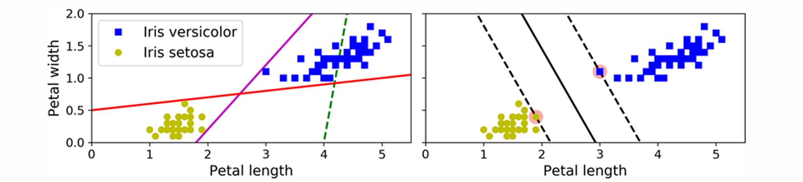
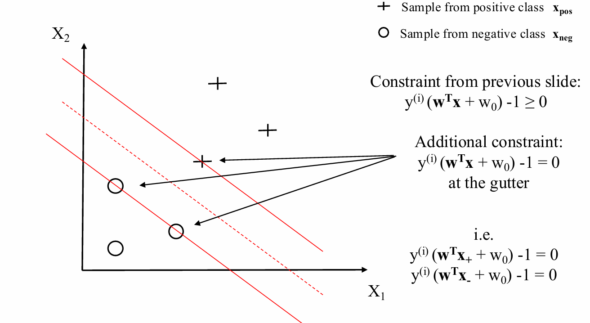
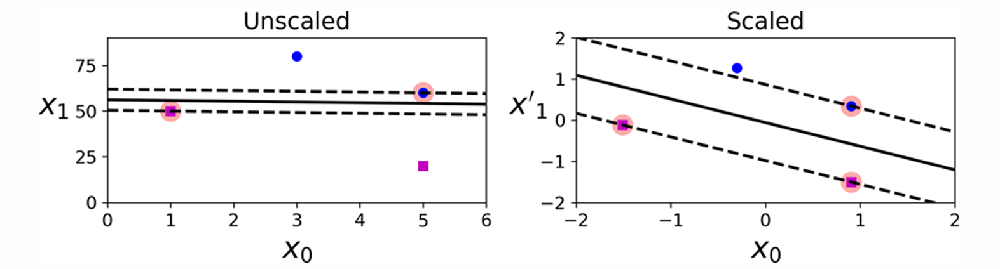
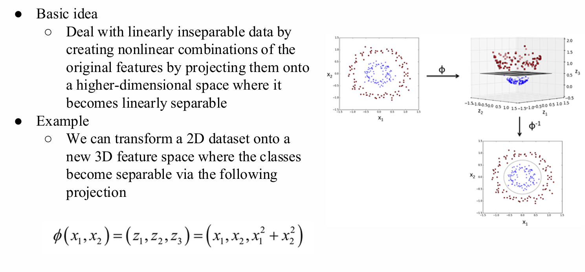

# Basic Machine Learning Algorithm

# 1 逻辑回归 (Logistic Regression)

## 1.1 直观理解与基础概念 (Intuition)

### 算法定位
* 尽管名字里带有“回归”，但逻辑回归是一种广泛用于**二分类任务 (Binary Classification)** 的算法，**不能**用于回归预测。

### 对数几率函数 (Logit Function)
* Logit 函数定义为**几率的对数 (logarithm of odds)**。
    $$logit(p) = \log \frac{p}{(1-p)}$$
* **作用**：它接收 $0$ 到 $1$ 之间的输入值（通常代表概率 $p$），并将其转换为整个实数范围内的值。

### 线性关系表示
* 我们可以用 logit 函数的输出来表达特征值 $\mathbf{x}$ 和对数几率之间的**线性关系**：
    $$logit(p(y=1|\mathbf{x})) = w_0x_0 + w_1x_1 + \dots + w_mx_m = \sum_{i=0}^m w_ix_i = \mathbf{w}^T\mathbf{x}$$
* 其中，$p(y=1|\mathbf{x})$ 表示在给定特征 $\mathbf{x}$ 的前提下，该样本属于类别 $1$ 的**条件概率**。

## 1.2 Sigmoid 函数与预测输出

### Sigmoid 激活函数
* 为了将线性模型的输出（净输入 $z$）映射回 $0$ 到 $1$ 之间的概率值，我们使用 logit 函数的反函数，即 **Sigmoid 函数**：
    $$\phi(z) = \frac{1}{1+e^{-z}}$$
* 其中，净输入为：$z = \mathbf{w}^T\mathbf{x} = w_0x_0 + w_1x_1 + \dots + w_mx_m$

### 概率解释与预测
* Sigmoid 函数的输出 $\phi(z)$ 被直接解释为**样本属于正类（类别 $1$）的概率**：
    $$\phi(z) = P(y=1|\mathbf{x};\mathbf{w})$$
* **示例**：如果对某个花卉样本计算得出 $\phi(z) = 0.8$，则该样本是变色鸢尾 (Iris-versicolor, 类标 $1$) 的概率为 80%。相应地，它是山鸢尾 (Iris-setosa, 类标 $0$) 的概率为 $1 - 0.8 = 0.2$。
* **二值化输出**：最终可以通过一个阈值函数（通常阈值设为 $0.5$）将预测概率转换为二进制分类结果：
    $$\hat{y} = \begin{cases} 1 & \text{if } \phi(z) \ge 0.5 \\ 0 & \text{otherwise} \end{cases}$$

## 1.3 模型训练与代价函数 (Learning $\mathbf{w}$)

### 从误差平方和到似然函数
* 在 Adaline 模型中，我们最小化的是误差平方和 (SSE)：$J(\mathbf{w}) = \sum_i \frac{1}{2}(\phi(z^{(i)}) - y^{(i)})^2$
* 在逻辑回归中，我们转而定义一个**似然函数 (Likelihood Function, $L$)**，我们的目标是**最大化**这个函数：
    $$L(\mathbf{w}) = P(\mathbf{y}|\mathbf{x};\mathbf{w}) = \prod_{i=1}^n P(y^{(i)}|\mathbf{x}^{(i)};\mathbf{w}) = \prod_{i=1}^n (\phi(z^{(i)}))^{y^{(i)}} (1-\phi(z^{(i)}))^{1-y^{(i)}}$$

### 对数似然 (Log-Likelihood)
* 在实际应用中，由于连乘容易导致数值下溢，最大化上述方程的**自然对数**会更容易，这就是**对数似然函数**：
    $$l(\mathbf{w}) = \log L(\mathbf{w}) = \sum_{i=1}^n \left[ y^{(i)} \log(\phi(z^{(i)})) + (1-y^{(i)})\log(1-\phi(z^{(i)})) \right]$$

### 逻辑回归代价函数 (Cost Function)
* 为了能够使用**梯度下降 (Gradient Descent)** 来寻找最优解，我们需要一个可以被**最小化**的代价函数 $J(\mathbf{w})$。
* 我们只需将对数似然函数乘以负号即可得到代价函数：
    $$J(\mathbf{w}) = \sum_{i=1}^n \left[ -y^{(i)} \log(\phi(z^{(i)})) - (1-y^{(i)})\log(1-\phi(z^{(i)})) \right]$$

### 单个样本的代价分析
* 针对数据集中单一训练样本的代价计算公式为：
    $$J(\phi(z), y; \mathbf{w}) = -y \log(\phi(z)) - (1-y)\log(1-\phi(z))$$
* **分段理解**：因为真实的标签 $y$ 只能是 $0$ 或 $1$，所以这个代价函数可以被看作是一个分段函数。当 $y=0$ 时第一项消掉；当 $y=1$ 时第二项消掉：
    $$J(\phi(z), y; \mathbf{w}) = \begin{cases} -\log(\phi(z)) & \text{if } y=1 \\ -\log(1-\phi(z)) & \text{if } y=0 \end{cases}$$

## 1.4 模型的泛化问题 (Overfitting and Underfitting)

当一个模型在训练数据上表现很好，但在未见过的新数据（测试数据）上泛化能力差时，通常面临以下两类主要问题：

### 过拟合 (Overfitting / High Variance)
* **表现**：高方差 (High variance)。模型对训练数据“死记硬背”，甚至学习到了数据中的噪声。
* **原因**：通常是因为模型参数过多，导致**模型过于复杂 (too complex)**。

### 欠拟合 (Underfitting / High Bias)
* **表现**：高偏差 (High bias)。模型不仅在测试集上表现差，在训练集上也没法很好地拟合数据。
* **原因**：**模型复杂度不够 (not complex enough)**，无法很好地捕捉训练数据中的底层模式和特征。

## 1.5 正则化基础 (Regularization)

### 什么是正则化？
* 正则化是通过**调整模型复杂度**来寻找良好的“偏差-方差权衡 (bias-variance tradeoff)”的一种方法。
* **主要作用**：
  1. 处理共线性 (Collinearity) 问题（即特征之间存在高度相关性）。
  2. 过滤掉数据中的噪声。
  3. 最终达到**防止过拟合**的目的。

### 正则化的重要前提
* **必须进行特征缩放 (Feature Scaling)**：例如标准化 (Standardization)。我们需要确保所有的特征都处于可比较的尺度上，否则正则化对较大尺度的特征惩罚会产生偏差。

## 1.6 L2 正则化 (L2 Regularization)

### 核心概念
* 正则化的基本思想是引入额外的信息（偏差），来**惩罚极端的参数（权重）值**。
* L2 正则化（有时也称为 L2 收缩 / L2 shrinkage 或 权重衰减 / weight decay）是最常用的一种形式。

### L2 惩罚项公式
L2 正则化项可以写成权重向量的 L2 范数的平方，乘以正则化参数：
$$\frac{\lambda}{2} \|\mathbf{w}\|^2 = \frac{\lambda}{2} \sum_{j=1}^m w_j^2$$
* $\lambda$：**正则化参数 (Regularization parameter)**，用于控制正则化的强度。

## 1.7 逻辑回归的正则化与 Scikit-Learn 实现

### 更新后的代价函数 (Updated Cost Function)
为了对逻辑回归模型进行正则化，我们只需在原有的代价函数后面加上这个简单的 L2 正则化项。在模型训练期间，这个项会迫使权重缩小：
$$J(\mathbf{w}) = \sum_{i=1}^n \left[ -y^{(i)} \log(\phi(z^{(i)})) - (1-y^{(i)})\log(1-\phi(z^{(i)})) \right] + \frac{\lambda}{2} \|\mathbf{w}\|^2$$

### 正则化强度控制
* 通过调节参数 $\lambda$，我们可以控制“拟合训练数据”与“保持权重较小”之间的平衡。
* **增加 $\lambda$ 的值** $\rightarrow$ **增加正则化强度**（权重会被压缩得更小，模型变简单）。

### Scikit-Learn 中的参数 `C`
在 `scikit-learn` 库的 `LogisticRegression` 类中，控制正则化的参数叫做 `C`。
* **反比关系**：参数 `C` 与我们在数学公式中使用的正则化参数 $\lambda$ 是**成反比**的关系。
* **规则**：**减小 `C` 的值** $\rightarrow$ 等同于增大 $\lambda$ $\rightarrow$ **增加正则化强度**。

---

# 2 支持向量机 (SVM)

## 2.1 SVM 核心思想与直觉 (Intuition)

### 算法定位
* SVM 是一种强大且广泛使用的学习算法，可以被视为**感知机 (Perceptron)** 的延伸。
* **核心区别**：
  * 感知机：目标是最小化误分类误差。
  * SVM：目标是**最大化间隔 (Maximize margin)**。

### 间隔 (Margin) 与支持向量 (Support Vectors)
* **间隔**：指分离超平面（决策边界）与距离该超平面最近的训练样本之间的距离。
* **支持向量**：那些恰好落在间隔边界（"street" 的边缘）上的训练样本。
* **大间隔分类 (Large Margin Classification)**：拟合出尽可能宽的“街道”。
* **关键特性**：在边界之外（"off the street"）添加更多的训练实例完全不会影响决策边界。决策边界仅仅由支持向量完全决定。

## 2.2 数学约束 (Mathematical Constraints)

为了用数学语言描述“街道”的边界，我们设定正类和负类的标签分别为 $y^{(i)} \in \{1, -1\}$。

### 基础不等式约束
对于所有样本，我们要求它们正确分类且位于间隔边界之外或边界上：
* 对于正类样本 $\mathbf{x}_{pos}$：$$\mathbf{w}^T\mathbf{x}_{pos} + w_0 \ge 1$$
* 对于负类样本 $\mathbf{x}_{neg}$：$$\mathbf{w}^T\mathbf{x}_{neg} + w_0 \le -1$$

将这两个式子通过真实标签 $y^{(i)}$ 统一起来，得到**全局约束条件**：
$$y^{(i)}(\mathbf{w}^T\mathbf{x}^{(i)} + w_0) \ge 1$$
*(等价于 $y^{(i)}(\mathbf{w}^T\mathbf{x}^{(i)} + w_0) - 1 \ge 0$)*

### 边界上的主动约束 (Active Constraints)
对于刚好落在边界（gutter）上的支持向量 $\mathbf{x}_+$ 和 $\mathbf{x}_-$，不等式取等号：
$$y^{(i)}(\mathbf{w}^T\mathbf{x} + w_0) - 1 = 0$$
即：
$$\mathbf{w}^T\mathbf{x}_+ + w_0 = 1 \implies \mathbf{w}^T\mathbf{x}_+ = 1 - w_0$$
$$\mathbf{w}^T\mathbf{x}_- + w_0 = -1 \implies \mathbf{w}^T\mathbf{x}_- = -1 - w_0$$

## 2.3 间隔宽度推导 (Margin Derivation)

我们要计算“街道”的宽度，即正负支持向量之间的向量 $\mathbf{x}_+ - \mathbf{x}_-$ 在法向量 $\mathbf{w}$ 方向上的**标量投影**。

* **单位法向量**：$\frac{\mathbf{w}}{\|\mathbf{w}\|}$
* **投影计算（即间隔宽度）**：
  $$\text{Width} = (\mathbf{x}_+ - \mathbf{x}_-)^T \frac{\mathbf{w}}{\|\mathbf{w}\|}$$
  $$= \frac{\mathbf{w}^T\mathbf{x}_+ - \mathbf{w}^T\mathbf{x}_-}{\|\mathbf{w}\|}$$
* **代入主动约束**：
  $$= \frac{(1 - w_0) - (-1 - w_0)}{\|\mathbf{w}\|}$$
  $$= \frac{2}{\|\mathbf{w}\|}$$

结论：SVM 的最大化间隔目标即为最大化 $\frac{2}{\|\mathbf{w}\|}$。

## 2.3 优化目标与二次规划 (Optimization)

### 目标函数的转化
* **原始目标**：最大化间隔 $\frac{2}{\|\mathbf{w}\|}$。
* **等价转化**：这等价于最小化其倒数 $\|\mathbf{w}\|$。
* **数学便利性 (Mathematical Convenience)**：为了方便求导和优化，我们通常加上平方和常数系数 $\frac{1}{2}$，这不会改变最优解的位置。

### 最终优化命题 (Primal Problem)
我们将 SVM 的训练转化为以下带约束的优化问题：
$$\arg \min_{\mathbf{w}} \frac{1}{2} \|\mathbf{w}\|^2$$
**Subject to the constraints:**
$$y^{(i)}(w_0 + \mathbf{w}^T\mathbf{x}^{(i)}) \ge 1 \quad \forall i$$

### 求解与凸性 (Convexity)
* 这是一个经典的**二次规划 (Quadratic Programming, QP)** 问题。
* 由于目标函数是 $\mathbf{w}$ 的严格凸函数（L2 范数平方），且约束条件是线性的，因此整个搜索空间是**凸的 (Convex)**。
* **优势**：这意味着优化算法绝对不会陷入局部极小值 (local minima)，找到的解必定是全局最优解。这也为后续引入拉格朗日乘子法和 KKT 条件求解对偶问题提供了坚实的理论基础。

## 2.4 特征缩放的敏感性 (Feature Scaling)

* **核心痛点**：支持向量机 (SVM) 对特征的尺度（scales）非常敏感。
* **影响**：如果特征未经缩放，数值范围大的特征会在距离计算中占据主导地位，导致决策边界（超平面）严重偏斜，无法得到最佳的分类间隔。
* **解决方案**：在使用 SVM 之前，必须对数据进行特征缩放（例如标准化 Standardization），确保所有特征都在相同的尺度上，从而拟合出真正平衡的“宽阔街道”。

## 2.5 硬间隔 vs. 软间隔 (Hard vs. Soft Margin)

### 硬间隔分类 (Hard Margin Classification)
* **定义**：严格要求所有的训练样本都必须位于“街道”之外，并且完全分在正确的类别一侧。
* **两大致命缺陷**：
  1. **条件苛刻**：只有当数据是**完全线性可分**时才有效。
  2. **对异常值敏感**：极易受到离群点（Outliers）的影响，一个异常值就可能导致间隔极度收缩甚至找不到决策边界。

### 软间隔分类 (Soft Margin Classification)
* **定义**：为了解决硬间隔的问题，引入一种更灵活的模型。
* **优化目标**：在“保持街道尽可能宽”与“限制间隔违规（Margin violations）”之间找到一个良好的平衡。
* **间隔违规**：允许部分样本最终落在街道中间，甚至是决策边界的错误一侧。

## 2.6 松弛变量与惩罚项 (Slack Variables & Penalty)

为了在数学上实现软间隔并处理非线性可分的数据，SVM 引入了**松弛变量 $\xi$** (Slack variable)。

### 松弛变量的定义
* 对于每个样本 $i$，引入一个松弛变量 $\xi^{(i)} \ge 0$。
* 如果样本 $\mathbf{x}^{(i)}$ 位于错误的一侧或街道内部，它将受到大小为 $\xi^{(i)}$ 的惩罚。惩罚的大小取决于它偏离目标边缘的距离。

### 软间隔优化的数学表达
* **更新后的约束条件**：
  $$y^{(i)}(\mathbf{w}^T\mathbf{x}^{(i)} + w_0) \ge 1 - \xi^{(i)}$$
  *(样本不再被严格限制在 $1$ 或 $-1$ 之外，而是允许有 $\xi^{(i)}$ 的让步)*

* **更新后的目标函数**：
  $$\arg \min_{\mathbf{w}, \xi^{(i)}} \frac{1}{2}\|\mathbf{w}\|^2 + C \left( \sum_i \xi^{(i)} \right)$$
* **参数 $C$ 的作用**：超参数 $C$ 控制着对错误的惩罚力度。
  * 较大的 $C$：对错误惩罚重，导致间隔变窄（倾向于硬间隔，容易过拟合）。
  * 较小的 $C$：对错误容忍度高，导致间隔变宽（倾向于软间隔，有助于泛化）。

## 2.7 核支持向量机 (Kernel SVM) 与映射函数 $\phi$

### 处理非线性数据的基本思想
* 当面对在当前维度下**完全线性不可分**的数据（例如环状分布的数据）时，软间隔也无能为力。
* **解决思路**：通过一个映射函数 $\phi$，将原始特征进行非线性组合，**投影到一个更高维度的特征空间**中。在那个高维空间里，数据往往会变得线性可分。

### 映射函数示例 (Mapping Function)
* 假设我们有一个在 2D 空间无法用直线分开的环状数据集 $(x_1, x_2)$。
* 我们可以通过映射函数 $\phi$ 将其转换到 3D 空间：
  $$\phi(x_1, x_2) = (z_1, z_2, z_3) = (x_1, x_2, x_1^2 + x_2^2)$$
* 在这个新的 3D 特征空间中，我们可以用一个二维平面（超平面）轻松将两类数据分开，然后再将这个决策边界投影回 2D 空间，就会得到一个非线性的决策边界（例如一个圆）。

## 2.8 SVM超参数

### 惩罚系数 $C$ (Regularization Parameter)
- **适用场景**：所有 SVM 模型（分类 SVC / 回归 SVR）
- **核心作用**：控制模型对**训练集误差的零容忍程度**，是「寻找最大间隔」与「确保全部分类正确」之间的权衡
- **直觉比喻**：城管的执法严格度
  - $C$ 很大（严厉派）：模型会拼尽全力分对每一个训练样本，哪怕扭曲分界线、压缩间隔；**后果**：过拟合，泛化能力差
  - $C$ 很小（宽容派）：模型优先保证宽间隔、平滑分界线，允许部分样本分类错误；**后果**：容错率高，若过小会欠拟合
  
### $\gamma$ (Gamma)
- **适用场景**：使用 RBF（高斯）核、多项式核或 Sigmoid 核的 SVM
- **核心作用**：控制单个训练样本的**影响力辐射范围**
- **公式回顾**：$K(x, x') = \exp(-\gamma \|x - x'\|^2)$
- **直觉比喻**：近视度数 / 探照灯的光晕
  - $\gamma$ 很大（高度近视 / 聚光灯）：样本影响力仅覆盖极小范围，模型只关注局部特征；**后果**：边界极度复杂，严重过拟合
  - $\gamma$ 很小（视力极佳 / 散光灯）：样本影响力辐射全局，模型综合大范围特征；**后果**：边界过于平滑，容易欠拟合

### $\epsilon$ (Epsilon)
- **适用场景**：SVR (支持向量回归 Support Vector Regression)，**不用于分类问题 (SVC)**
- **核心作用**：定义以预测回归线为中心的**免责管状区域 (Epsilon-Tube)**
- **直觉比喻**：道路的减震带宽度
  - 样本落在宽度为 $2\epsilon$ 的管子内，模型判定预测无误差、不做惩罚
  - $\epsilon$ 很大：管子粗，大量数据落入免责区，模型稀疏、平缓
  - $\epsilon$ 很小：管子细，几乎所有波动数据都会被惩罚，模型紧贴数据波动，**容易过拟合**

---

# 3 决策树学习 (Decision Tree Learning)

## 3.1 核心概念与直观理解 (Core Concepts & Intuition)

### 模型优势：可解释性 (Interpretability)
* 如果实际应用中我们非常看重模型的**可解释性**（即能够清晰地知道模型是如何做出决定的），决策树分类器是一个极具吸引力的模型。
* 决策树通过提出**一系列问题 (a series of questions)** 来进行决策，从而将复杂的数据逐步分解、向下分流。

### 决策树的结构组成
* **内部节点 (Internal node)**：代表对某个特征的测试或提问（例如：“天气如何？”或“直径是否 ≥ 3？”）。
* **分支 (Branch)**：代表提问的输出结果（例如：是/否，True/False，晴天/雨天）。
* **叶节点 (Leaf node)**：树的末端，代表最终的类别预测结果（例如：去跑步、预测为葡萄 100%）。

## 3.2 决策树的构建与学习过程 (Learning Process)

### 预测机制
* 模型的预测完全基于对路径上各个问题的回答。只有走到底部的叶节点，才会输出预测类别或概率。

### 学习机制：应该问什么问题？
* **最大化信息增益 (Information Gain, IG)**：在每一个节点，模型会遍历所有可用的特征，并选择那个能带来**最大信息增益**的特征来进行数据的分裂 (Split)。简单来说，就是找出一个能最好地将不同类别的样本“区分”开来的问题。
* **迭代分裂 (Iterative Splitting)**：模型会不断重复这个基于特征的分裂过程，直到所有的叶节点变得“纯净 (pure)”。
    * **纯净 (Pure/Unmixed)**：指的是该节点下的所有样本都属于同一个类别（例如，经过某个分支后，剩下的样本 100% 都是葡萄）。
    * **混合 (Mixed)**：如果节点中仍包含不同类别的样本，就会继续分裂。如果因为特征完全一样而无法继续分裂，则叶节点会按比例输出概率（例如 50% 苹果，50% 柠檬）。

## 3.3 过拟合与剪枝策略 (Overfitting & Pruning)

### 树的深度与过拟合风险
* 如果不对决策树加以限制，让它一直迭代分裂直到所有叶节点绝对纯净，最终会生成一棵**非常深且包含大量节点**的树。
* 这种死记硬背训练集细节的复杂模型，会极其容易导致**过拟合 (Overfitting)**，使其在面对未知的新数据时表现糟糕。

### 剪枝 (Pruning)
* 为了防止过拟合，提高模型的泛化能力，我们通常需要对决策树进行**剪枝**。
* **最常用的做法**：为树设置一个**最大深度限制 (Maximal depth)**。一旦树的生长达到了这个设定的层数限制，就会强制停止分裂。

## 3.4 决策树分裂标准 (Splitting Criteria)

**核心问题：该问什么问题？何时问？**

在构建决策树时，我们需要量化一个“问题”（特征分裂）在多大程度上有助于将不同类别的标签**“解混” (unmix)**。这通常分为两步：
1. **量化单个节点的“不确定性”**（例如使用基尼不纯度）。
2. **量化一个问题能“减少”多少不确定性**（我们的目标是在每次分裂时**最大化信息增益**）。

## 3.5 量化节点不确定性：基尼不纯度 (Gini Impurity)

### 概念直觉
基尼不纯度用于衡量一个节点中样本类别的“混乱”程度。
* 如果一个节点里所有的样本都属于同一类（完全纯净，unmixed），基尼不纯度为 $0$。
* 如果节点里包含各种不同类别的样本（高度混合，mixed），基尼不纯度会变高。

### 数学公式
对于一个特定节点 $t$，其基尼不纯度 $I_G(t)$ 的计算公式为：
$$I_G(t) = \sum_{i=1}^c p(i|t)(1 - p(i|t)) = 1 - \sum_{i=1}^c p(i|t)^2$$
* $c$：类别的总数。
* $p(i|t)$：在节点 $t$ 中，属于第 $i$ 类的样本所占的**比例 (proportion)**。

## 3.6 量化分裂效果：信息增益 (Information Gain)

### 概念直觉
信息增益衡量的是：**父节点的不纯度** 与 **所有子节点不纯度的加权平均** 之间的差值。信息增益越大，说明这次特征分裂带来的“纯度提升”越明显。决策树算法的核心优化目标就是**在每次分裂时寻找最大化信息增益的特征**。

### 二叉分裂公式 (Binary Split)
当决策树进行二叉分裂（分成左右两个子节点）时，信息增益公式如下：
$$IG(D_p, f) = I(D_p) - \frac{N_{left}}{N_p}I(D_{left}) - \frac{N_{right}}{N_p}I(D_{right})$$

### 通用公式 (General Formula)
对于将父节点分裂为 $m$ 个子节点的通用情况，我们优化的目标函数为：
$$IG(D_p, f) = I(D_p) - \sum_{j=1}^m \frac{N_j}{N_p} I(D_j)$$

**参数详解：**
* $f$：用于执行分裂的特征 (feature)。
* $D_p$：父节点 (parent node) 的数据集。
* $D_j$：第 $j$ 个子节点 (child node) 的数据集。
* $I$：不纯度度量标准（例如基尼不纯度 $I_G$ 或信息熵）。
* $N_p$：父节点中的样本总数。
* $N_j$：第 $j$ 个子节点中的样本总数。
* **注意**：$\frac{N_j}{N_p}$ 实际上是对子节点不纯度的一个**权重惩罚**，样本越多的子节点，在计算平均不纯度时占的权重越大。

## 3.7 二叉决策树 (Binary Decision Tree)

在二叉决策树中，每个父节点 $D_p$ 都会被分裂成两个子节点：左子节点 $D_{left}$ 和右子节点 $D_{right}$。
其信息增益 (Information Gain) 的计算公式简化为：
$$IG(D_p, f) = I(D_p) - \frac{N_{left}}{N_p}I(D_{left}) - \frac{N_{right}}{N_p}I(D_{right})$$

二叉决策树中常用的不纯度度量标准 (Impurity measures) 包括：
1. **基尼不纯度 (Gini impurity, $I_G$)**
2. **熵 (Entropy, $I_H$)**
3. **分类误差 (Classification error, $I_E$)**

### 3.7.1 不纯度度量标准详解

#### 基尼不纯度 (Gini Impurity, $I_G$)
* **物理意义**：可以理解为最小化误分类概率的一种标准。
* **计算公式**：
  $$I_G(t) = \sum_{i=1}^c p(i|t)(1 - p(i|t)) = 1 - \sum_{i=1}^c p(i|t)^2$$
* **极值情况**：与熵类似，当类别完美混合（即各类别数量完全相等）时，基尼不纯度达到最大。在二分类 ($c=2$) 的情况下，最大值为：
  $$I_G(t) = 1 - \sum_{i=1}^2 0.5^2 = 0.5$$

#### 分类误差 (Classification Error, $I_E$)
* **计算公式**：
  $$I_E(t) = 1 - \max\{p(i|t)\}$$
  *(即 1 减去节点中占比最大的那个类别的比例)*
* **应用场景**：这对于决策树的**剪枝 (pruning)** 是一个很有用的标准，但**不推荐用于决策树的生长 (growing)**。因为它对节点中类别概率的变化不够敏感。

### 3.7.2  实例对比：为什么不用分类误差来生长树？

假设父节点包含 80 个样本，两个类别各占 40 个：`[40, 40]`。此时父节点的不纯度为：
* $I_E(D_p) = 1 - 0.5 = 0.5$
* $I_G(D_p) = 1 - (0.5^2 + 0.5^2) = 0.5$

现在考虑两种不同的特征分裂方案 (Case A 和 Case B)：

#### 基于分类误差的计算 ($IG_E$)
* **Case A**：分裂为 `[30, 10]` (N=40) 和 `[10, 30]` (N=40)
  * $I_E(D_{left}) = 1 - 30/40 = 0.25$
  * $I_E(D_{right}) = 1 - 30/40 = 0.25$
  * $IG_E = 0.5 - \frac{40}{80}(0.25) - \frac{40}{80}(0.25) = \mathbf{0.25}$
* **Case B**：分裂为 `[20, 40]` (N=60) 和 `[20, 0]` (N=20)
  * $I_E(D_{left}) = 1 - 40/60 = 0.33$
  * $I_E(D_{right}) = 1 - 20/20 = 0$
  * $IG_E = 0.5 - \frac{60}{80}(0.33) - \frac{20}{80}(0) \approx \mathbf{0.25}$

**结论**：使用分类误差时，Case A 和 Case B 产生的信息增益是一样的 ($0.25$)，模型无法区分哪种分裂更好。

#### 基于基尼不纯度的计算 ($IG_G$)
* **Case A**：分裂为 `[30, 10]` 和 `[10, 30]`
  * $I_G(D_{left}) = 1 - ((30/40)^2 + (10/40)^2) = 0.375$
  * $I_G(D_{right}) = 0.375$
  * $IG_G = 0.5 - \frac{40}{80}(0.375) - \frac{40}{80}(0.375) = \mathbf{0.125}$
* **Case B**：分裂为 `[20, 40]` 和 `[20, 0]`
  * $I_G(D_{left}) = 1 - ((20/60)^2 + (40/60)^2) \approx 0.44$
  * $I_G(D_{right}) = 1 - (1^2 + 0) = 0$
  * $IG_G = 0.5 - \frac{60}{80}(0.44) - \frac{20}{80}(0) = \mathbf{0.16}$

**最终结论**：使用基尼不纯度时，由于 Case B 产生了一个**完全纯净**的子节点 `[20, 0]`，基尼不纯度敏感地捕捉到了纯度的巨大提升，给出了更高的信息增益 ($0.16 > 0.125$)。这就是为什么算法在生长树时更倾向于使用基尼不纯度或熵。

---

# 4 随机森林 (Random Forests)

## 4.1 核心思想 (Core Idea)

* **集成模型**：随机森林可以被视为决策树的**集成 (Ensemble)**。
* **解决高方差问题**：单棵深度较深的决策树往往容易过拟合，具有很高的方差 (high variance)。随机森林的核心思想是通过构建并**平均多棵这样的决策树**，来打造一个更加稳健 (robust) 的模型。
* **优势**：相比于单棵决策树，随机森林具有更好的**泛化性能 (generalization performance)**，且**不易受到过拟合的影响**。

## 4.2 随机森林的构建步骤 (Creation Steps)

构建一个包含 $k$ 棵树的随机森林，需要经历以下 4 个主要步骤：

1. **自助采样 (Bootstrap Sampling)**：
   从原始训练集中，**有放回地 (with replacement)** 随机抽取 $n$ 个样本，形成一个大小为 $n$ 的 Bootstrap 样本集。
2. **生长决策树 (Grow a Decision Tree)**：
   使用第 1 步得到的 Bootstrap 样本集来生长一棵决策树。在树的**每一个节点**进行分裂时：
   * a. 从所有特征中，**无放回地 (without replacement)** 随机选择 $d$ 个特征。
   * b. 根据目标函数（例如：最大化信息增益 Information Gain），在这 $d$ 个特征中选出最佳的特征来对该节点进行分裂。
3. **重复 (Repeat)**：
   重复步骤 1 和步骤 2 共 $k$ 次，从而构建出由 $k$ 棵独立决策树组成的森林。
4. **聚合预测 (Aggregate Prediction)**：
   在预测阶段，让森林中的每一棵树对新样本进行预测，然后通过**多数投票 (Majority vote)** 的方式决定最终的类别标签。

## 4.3 Bootstrap 样本大小 ($n$) 的影响

自助采样的大小 $n$ 是控制随机森林性能和过拟合程度的一个关键超参数。

### 减小样本大小 $n$ (Smaller Bootstrap Samples)
* **增加多样性**：某个特定训练样本被选入 Bootstrap 样本集的概率降低，这增加了单棵树之间的差异性（多样性）。
* **增加随机性**：整个随机森林的随机性增加，这**有助于减少过拟合的影响**。
* **缺点**：较小的样本集通常会导致随机森林的**整体性能下降**。虽然训练集和测试集的性能差距（Gap）变小了（说明没怎么过拟合），但整体的测试性能往往较低（可能陷入欠拟合）。

### 增大样本大小 $n$ (Larger Bootstrap Samples)
* **增加相似性**：抽取的 Bootstrap 样本集之间会变得更加相似，导致生成的个体决策树也越来越像。
* **增加过拟合风险**：由于每棵树都使用了更多原始训练集的信息，它们会更紧密地拟合原始训练数据，从而**增加了过拟合的程度**。

---

# 5 K-最近邻算法 (KNN)

## 5.1 算法核心步骤 (Algorithm Steps)

KNN 是一种非常直观的分类器，它的工作原理可以概括为以下三个步骤：
1. **参数选择**：选择你要考虑的邻居数量 **$k$**，并确定一个计算距离的**度量标准 (distance metric)**。
2. **寻找邻居**：对于你需要分类的未知样本，计算它与训练集中所有样本的距离，并找出离它最近的 **$k$ 个邻居**。
3. **多数投票 (Majority Vote)**：观察这 $k$ 个邻居中哪种类别最多，就把未知样本归类为那个数量最多的类别。

## 5.2 KNN 的优缺点 (Pros & Cons)

KNN 是一种基于内存的方法 (memory-based approach)，也被称为**惰性学习 (lazy learning)**，因为它不涉及显式的训练步骤。

### 优点 (Pros)
* **极强的适应性**：因为没有训练阶段，随着新训练数据的不断收集和加入，分类器可以**立即适应 (immediately adapts)**，无需重新训练模型。

### 缺点 (Cons)
* **计算复杂度高**：在最坏的情况下，对一个新样本进行分类的时间复杂度与训练集中的样本数量成**正比（线性增长）**。每次预测都要计算与所有样本的距离。（*注：如果特征维度很低，可以使用 KD-trees 等高效数据结构来加速*）。
* **存储空间挑战**：因为没有所谓的“训练出的模型参数”，你**不能丢弃任何训练样本**。如果你处理的是海量数据集，存储整个训练集将是一个巨大的挑战。

## 5.3 距离度量 (Distance Metrics)

选择合适的距离度量对于 KNN 至关重要，同时，对数据进行**标准化 (standardization)** 也是必不可少的，这样才能确保每个特征在计算距离时贡献平等。

### 闵可夫斯基距离 (Minkowski Distance)
这是一种广义的距离度量公式：
$$d(\mathbf{x}^{(i)}, \mathbf{x}^{(j)}) = \sqrt[p]{\sum_k |x_k^{(i)} - x_k^{(j)}|^p}$$

* $\mathbf{x}^{(i)}, \mathbf{x}^{(j)}$ 代表两个样本向量，下标 $k$ 表示特征的维度。
* 通过调整参数 $p$，可以衍生出常见的具体距离度量。

### 常见特例
* 当 **$p = 1$** 时，它就是**曼哈顿距离 (Manhattan distance)**（类似于在城市街区中按直角拐弯走的距离）。
* 当 **$p = 2$** 时，它就是最常用的**欧几里得距离 (Euclidean distance)**（即直线距离），常用于测量连续的实数值特征（如长度、宽度等）。

## 5.4 维度灾难 (Curse of Dimensionality)

* **现象描述**：对于一个固定大小的训练数据集，随着特征维度数量的不断增加，特征空间会变得**极其稀疏 (increasingly sparse)**。
* **对 KNN 的致命影响**：在高维空间中，即使是距离你“最近”的那些邻居，实际上在绝对距离上也离你**非常遥远**。这导致“最近邻”失去了意义，无法提供可靠的分类估计，使得 KNN 极易陷入**过拟合 (overfitting)**。
* **解决策略**：在使用 KNN 时，如果特征维度过高，通常需要结合**特征选择 (Feature selection)** 或 **降维技术 (Dimensionality reduction)** 来避免维度灾难。

---

# 6 随堂小测试

### **Q1: SVM 的基本思想**
**英文题目**: What is the fundamental idea behind Support Vector Machines?
**中文题目**: 支持向量机背后的基本思想是什么？

* **English Answer**: 
    The fundamental idea behind SVMs is to fit the widest possible "street" (margin) between different classes. The goal is to find the optimal decision boundary (hyperplane) that maximizes the distance between the decision boundary and the closest training instances of each class. Soft margin classification additionally seeks a balance between maximizing the margin and minimizing margin violations. Kernel SVMs extend this idea by mapping data into higher-dimensional spaces to handle nonlinear decision boundaries.
* **中文解答**: 
    其基本思想是在不同类别之间拟合一条尽可能宽的“街道”（即最大化间隔）。目标是找到一个最优的决策边界（超平面），使得决策边界与各类别的最近训练样本之间的距离最大化。软间隔分类则进一步寻求在最大化间隔和限制间隔违规（误分类）之间取得平衡。核支持向量机 (Kernel SVM) 通过将数据映射到高维空间来处理非线性决策边界，从而扩展了这一思想。

---

### **Q2: 支持向量的概念**
**英文题目**: What is a support vector?
**中文题目**: 什么是支持向量？

* **English Answer**: 
    A support vector is any training instance that is located on the edge of the "street" (the margin boundaries). These are the critical instances that fully determine (or "support") the position of the decision boundary. Any instance added outside the street will not affect the decision boundary at all.
* **中文解答**: 
    支持向量是恰好位于“街道”边缘（即间隔边界）上的训练样本。它们是完全决定（或“支持”）决策边界位置的关键实例。在边界之外（即街道之外）添加的任何样本都完全不会影响决策边界的形状。

---

### **Q3: 特征缩放的重要性**
**英文题目**: Why is it important to scale the inputs when using SVMs?
**中文题目**: 为什么在使用 SVM 时缩放输入特征很重要？

* **English Answer**: 
    SVMs are highly sensitive to the scale of features. Because the algorithm tries to maximize the distance between classes, if one feature has a much larger scale than the others, it will completely dominate the distance calculations. The resulting "street" will be skewed and narrow, and the decision boundary will not be optimal. Feature scaling (e.g., standardization) ensures all features are treated equally.
* **中文解答**: 
    SVM 对特征的尺度（缩放比例）非常敏感。因为该算法试图最大化类别之间的距离，如果某个特征的数值范围比其他特征大得多，它将在距离计算中占据主导地位。这会导致拟合出的“街道”发生严重偏斜，且决策边界无法达到最优。特征缩放（例如标准化）可以确保每个特征对距离计算的贡献是平等的。

---

### **Q4: 置信度分数与概率**
**英文题目**: Can an SVM classifier output a confidence score when it classifies an instance? What about a probability?
**中文题目**: SVM 分类器在对实例进行分类时能否输出置信度分数？那么概率呢？

* **English Answer**: 
    Yes, an SVM classifier can output a confidence score, which is simply the signed distance between the test instance and the decision boundary. However, unlike Logistic Regression, SVMs do not natively output probabilities. To estimate class probabilities, one typically uses techniques like Platt scaling (which trains a logistic regression model on top of the SVM's distance scores).
* **中文解答**: 
    是的，SVM 分类器可以输出置信度分数，这个分数本质上就是测试实例到决策边界的**距离**。距离越远，模型越自信。然而，与逻辑回归不同，SVM 本身并**不直接输出概率**。为了获得概率估计，通常需要使用像 Platt 缩放这样的技术（即利用交叉验证，在 SVM 的距离分数之上再训练一个逻辑回归模型来实现概率映射）。

---

### **Q5: 调整超参数解决欠拟合**
**英文题目**: Say you've trained an SVM classifier with an RBF kernel, but it seems to underfit the training set. Should you increase or decrease $\gamma$ (gamma)? What about C?
**中文题目**: 假设你使用 RBF 核训练了一个 SVM 分类器，但它似乎对训练集欠拟合。你应该增大还是减小 $\gamma$ (gamma)？参数 C 呢？

* **English Answer**: 
    Underfitting means the model is too restricted or simple (high bias). To make it more complex and fit the data better, you should **increase** $\gamma$ and/or **increase** the regularization parameter $C$. 
    * Increasing $\gamma$ makes the bell-shaped RBF curve narrower, so instances have a smaller range of influence, leading to more irregular and complex decision boundaries. 
    * Increasing $C$ reduces the regularization strength (imposing a heavier penalty on margin violations), forcing the model to fit the training data more strictly and narrowing the margin.
* **中文解答**: 
    欠拟合意味着模型过于简单或受限过多（高偏差）。为了增加模型复杂度以更好地拟合数据，你应该**增大** $\gamma$ (gamma) 和/或**增大**超参数 $C$。
    * **增大 $\gamma$**：会使 RBF 核的钟形曲线变得更窄，每个样本的影响范围变小，从而使得决策边界变得更加不规则、更紧紧围绕各个样本点（变得更复杂）。
    * **增大 $C$**：超参数 $C$ 与正则化强度成反比。增大 $C$ 意味着**减弱**正则化（对误分类的惩罚更重），迫使模型更严格地拟合训练数据，从而使得软间隔变窄。

---

### **Q6: 决策树的深度估算**
**英文题目**: What is the approximate depth of a Decision Tree trained (without restrictions) on a training set with one million instances?
**中文题目**: 在包含一百万个实例的训练集上训练（无限制条件）的决策树的近似深度是多少？

* **English Answer**: 
    The depth of a well-balanced binary tree containing $m$ leaves is equal to $\log_2(m)$. Since a decision tree trained without restrictions will likely have one leaf per training instance (perfectly fitting the data), the depth will be roughly $\log_2(10^6) \approx 20$. Actually, it will be a bit more since the tree will generally not be perfectly balanced.
* **中文解答**: 
    一个包含 $m$ 个叶节点的平衡二叉树的深度约等于 $\log_2(m)$。由于无限制训练的决策树往往会为每个训练实例生成一个叶节点（即完美拟合数据），其深度大约为 $\log_2(10^6) \approx 20$。实际上深度可能会稍大一些，因为生成的树通常不会是完美平衡的。

---

### **Q7: 父子节点的基尼不纯度对比**
**英文题目**: Is a node’s Gini impurity generally lower or greater than its parent’s? Is it generally lower/greater, or always lower/greater?
**中文题目**: 一个节点的基尼不纯度通常是比其父节点低还是高？是通常低/高，还是总是低/高？

* **English Answer**: 
    A node's Gini impurity is **generally lower** than its parent's. This is because the CART training algorithm splits nodes in a way that minimizes the weighted sum of its children's Gini impurities (maximizing Information Gain). However, it is **not always lower**; an individual child node can have a higher Gini impurity than its parent, as long as this increase is compensated by a significant decrease in the other child's impurity, resulting in an overall lower weighted average.
* **中文解答**: 
    节点的基尼不纯度**通常低于**其父节点。这是因为决策树的训练算法（如 CART）在分裂节点时的目标是最小化其子节点基尼不纯度的加权和（即最大化信息增益）。但是，它**并不总是**更低；某个子节点的基尼不纯度完全可能会高于其父节点，只要这种增加能被另一个子节点不纯度的显著降低所补偿，从而使得整体的加权平均值变低即可。

---

### **Q8: 决策树过拟合与深度限制**
**英文题目**: If a Decision Tree is overfitting the training set, is it a good idea to try decreasing max_depth?
**中文题目**: 如果决策树对训练集过拟合，尝试减小 `max_depth` 是个好主意吗？

* **English Answer**: 
    **Yes**. Decreasing `max_depth` will constrain the model, effectively regularizing it. This prevents the tree from growing too deep and memorizing the noise in the training data, thereby reducing overfitting and improving generalization.
* **中文解答**: 
    **是的**。减小 `max_depth` 会限制模型的生长，起到正则化的作用。这能防止树长得太深并死记硬背训练数据中的噪声，从而有效减少过拟合，提升模型的泛化能力。

---

### **Q9: 决策树欠拟合与特征缩放**
**英文题目**: If a Decision Tree is underfitting the training set, is it a good idea to try scaling the input features?
**中文题目**: 如果决策树对训练集欠拟合，尝试缩放输入特征是个好主意吗？

* **English Answer**: 
    **No**. Decision Trees do not care whether the training data is scaled or centered; they are completely invariant to feature scaling. To address underfitting, you should decrease regularization hyperparameters (e.g., increase `max_depth`, decrease `min_samples_split`) or provide better/more features to the model.
* **中文解答**: 
    **不是**。决策树根本不关心训练数据是否被缩放或中心化，它们对特征的尺度具有完全的不变性。为了解决欠拟合问题，你应该做的是减少正则化限制（例如，增加 `max_depth`，减小 `min_samples_split`）或者为模型提取/提供更好的特征。

---

### **Q10: 决策树训练时间复杂度计算**
**英文题目**: If it takes one hour to train a Decision Tree on a training set containing 1 million instances, roughly how much time will it take to train another Decision Tree on a training set containing 10 million instances?
**中文题目**: 如果在一个包含 100 万个实例的训练集上训练一棵决策树需要 1 小时，那么在一个包含 1000 万个实例的训练集上训练另一棵决策树大约需要多长时间？

* **English Answer**: 
    The computational complexity of training a Decision Tree is roughly $O(n \times m \log(m))$, where $n$ is the number of features and $m$ is the number of instances. If you multiply the training set size by 10, the training time will be multiplied by $K = \frac{10m \times \log_2(10m)}{m \times \log_2(m)} = 10 \times \frac{\log_2(10m)}{\log_2(m)}$. Given $m = 10^6$, then $K = 10 \times \frac{\log_2(10^7)}{\log_2(10^6)} \approx 10 \times \frac{23.3}{19.9} \approx 11.7$. So it will take roughly **11.7 hours**.
* **中文解答**: 
    训练决策树的计算复杂度大约为 $O(n \times m \log_2(m))$，其中 $n$ 是特征数量，$m$ 是实例数量。如果将训练集大小乘以 10 倍，训练时间将增加的倍数为 $K = \frac{10m \times \log_2(10m)}{m \times \log_2(m)} = 10 \times \frac{\log_2(10m)}{\log_2(m)}$。当 $m = 10^6$ 时，$K = 10 \times \frac{\log_2(10^7)}{\log_2(10^6)} \approx 10 \times \frac{23.3}{19.9} \approx 11.7$。因此，大约需要 **11.7 小时**。